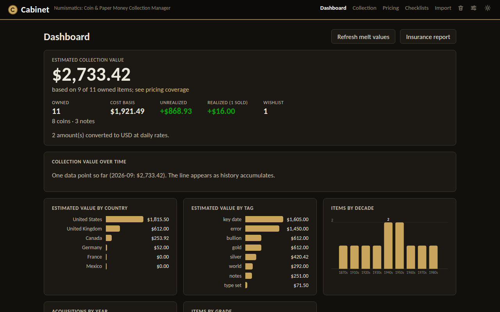
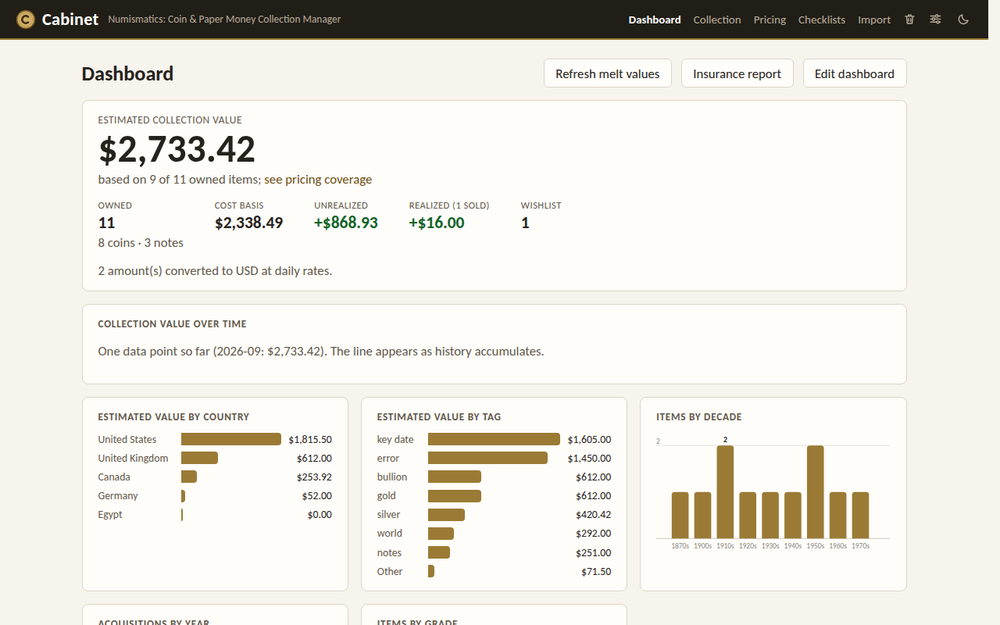
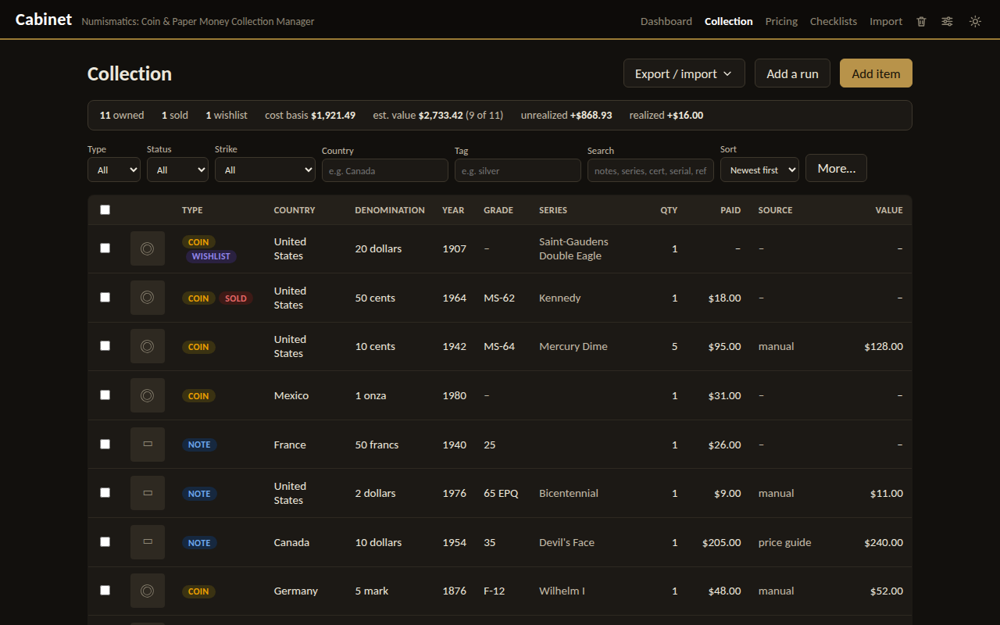
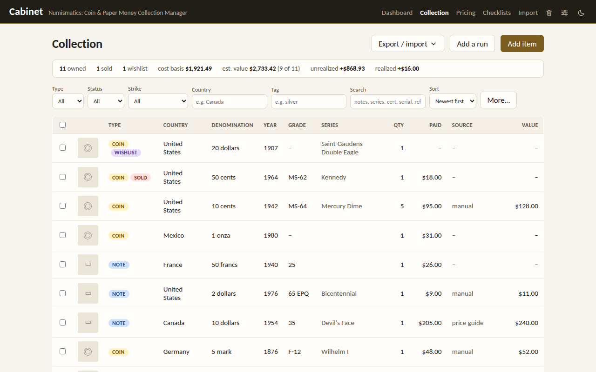
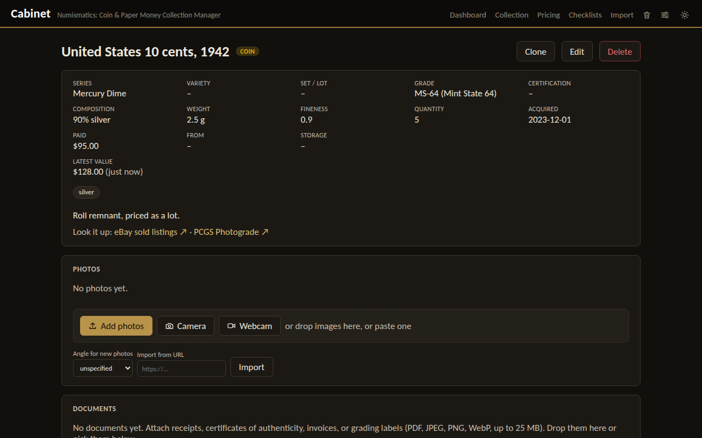
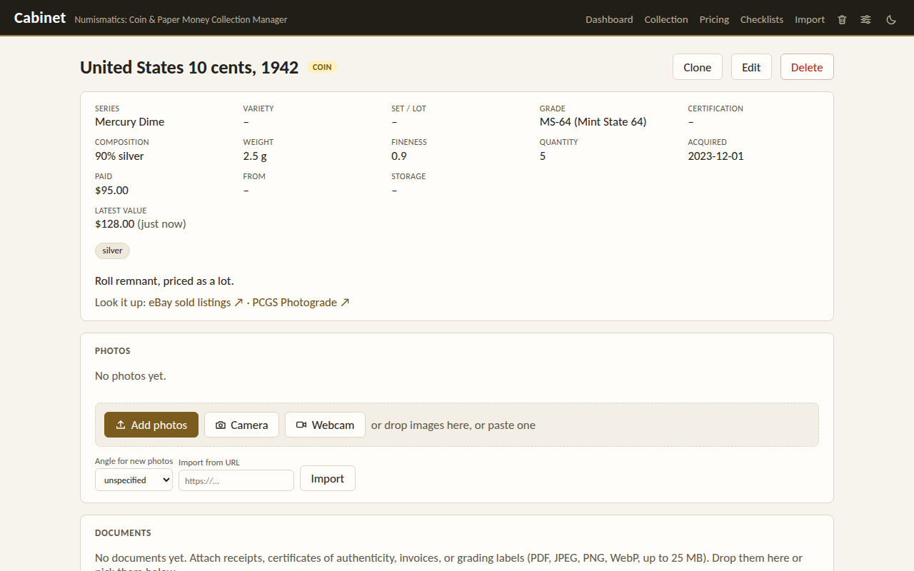
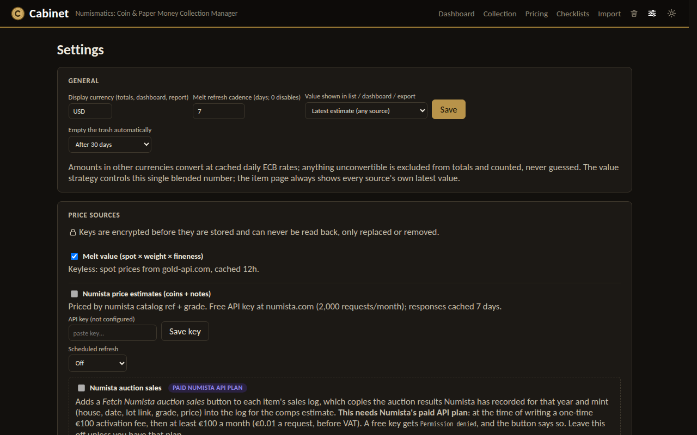
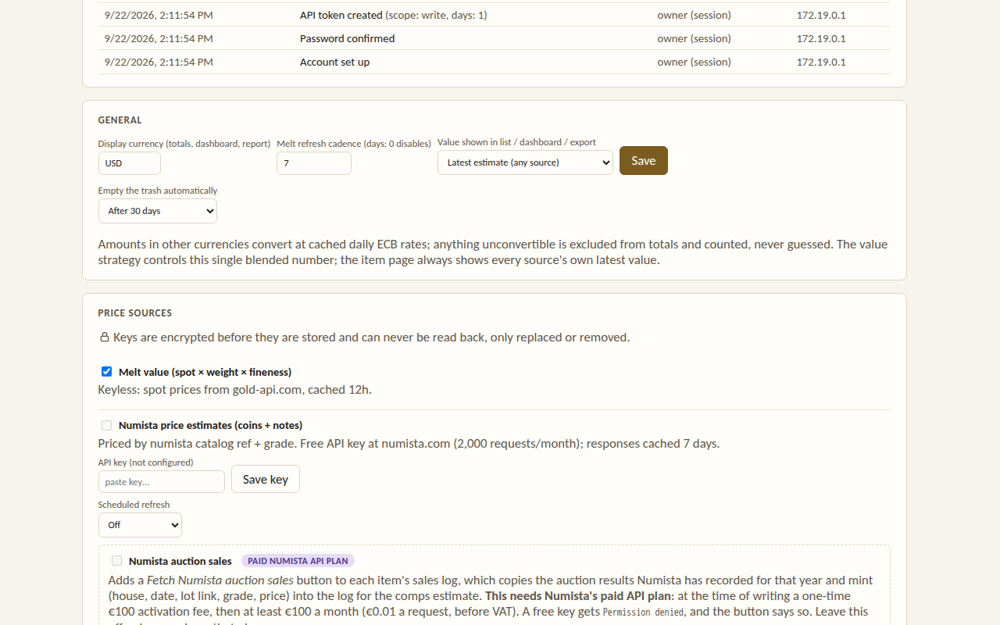

# Cabinet

**Numismatics: Coin & Paper Money Collection Manager**

[](https://github.com/jsaumer/cabinet-numismatics/actions/workflows/ci.yml)
[](LICENSE)


A self-hosted, single-user web application for cataloging a coin and paper
money collection, managing photos of each item, and tracking estimated market
value over time. Runs as a small Docker Compose stack; no external accounts
or API keys required.

**Status: v0.24.5, feature-complete and in daily use.** Pre-1.0 signals that
the HTTP API may still change; the data model and migration path are stable.
Nothing is queued next: the roadmap is a list of candidates, pulled by
what entering a real collection turns up rather than by a schedule. See the
[roadmap](docs/roadmap.md) and [changelog](CHANGELOG.md).

> **Deploying it?** Cabinet has no built-in login by design: put it behind an
> authenticating reverse proxy. See [docs/deployment.md](docs/deployment.md).

## Screenshots

Shown with the bundled demo collection (`python scripts/seed_demo.py`).

Dark is the default; the header toggle switches to light and remembers it.

| Dark | Light |
|---|---|
| [](docs/screenshots/dashboard-dark.png) | [](docs/screenshots/dashboard-light.png) |
| [](docs/screenshots/collection-dark.png) | [](docs/screenshots/collection-light.png) |
| [](docs/screenshots/item-detail-dark.png) | [](docs/screenshots/item-detail-light.png) |
| [](docs/screenshots/settings-dark.png) | [](docs/screenshots/settings-light.png) |

## Features

### Cataloging
- Coins and notes with full numismatic detail: country, denomination, year,
  mint mark, series, variety/sub-type, strike (business, proof, specimen),
  composition, weight, fineness, diameter, thickness, edge, shape, mintage,
  quantity, and free-text notes (banknotes add serial number, prefix/block,
  signatures, issuer, and replacement notes), plus up to 20 custom fields per
  item.
- **Grading** on seeded Sheldon (coins) and PMG (notes) scales, with proof
  and specimen strikes, plus grades, stars, designations (CAM/DCAM, PL/DMPL,
  RD/RB/BN, EPQ…), CAC stickers, and details grades, shown the way the holder
  reads, e.g. `PR-69 DCAM ★`. Certification tracking (service + cert number)
  links to the grading service's verification.
- **Provenance & location**: acquisition date, price and fees, source (dealer, show,
  auction, inheritance), and storage location (album, slab box, safe).
- **Lifecycle**: `owned` / `sold` / `wishlist` status with sold date and
  realized price; sets/lots for pieces held or sold together; catalog
  references (Krause, Numista, Red Book…); free-form tags.
- **Working at scale**: search across notes/series/variety/certs/refs/tags,
  combined filters (type, status, country, year ranges, grade ranges,
  latest-value ranges, tag, set), sortable columns, clone-item, bulk edit,
  per-item edit history, and completeness checklists for target sets (e.g. a
  date/mint run) with progress tracking.
- List filters and paging persist in the URL, so back-navigation keeps your
  place.
- **Fill from Numista**: enter a Numista number or search by name, and the
  item form fills in country, denomination, composition, fineness, weight,
  dimensions, catalogue references, and the issue's year, mint, and mintage.

### Photos
- Multiple photos per item with angle designation (obverse/reverse/edge/
  other), a primary image, and reordering.
- Uploads are validated as real JPEG/PNG/WebP images, EXIF orientation is
  corrected, and thumbnails are generated automatically. Files live on a
  plain Docker volume served directly by nginx, with no object store.
- Add photos by file picker, drag and drop, pasting an image, a URL, or a
  webcam or phone camera; view them full size in a zoomable lightbox; and
  crop, turn, or straighten them in the browser.
- Attach documents, such as receipts, invoices, certificates of
  authenticity, and grading labels (PDF or image), with a first-page
  thumbnail; share one lot's invoice across every coin in it. Kept off the
  public photo path and included in backups.

### Valuation
- **Manual estimates**: record researched values (dealer quote, auction
  result, price guide) with source and optional confidence, kept as
  append-only history, never overwritten.
- **Pluggable price sources**: melt value (spot price × weight × fineness ×
  quantity, keyless), Numista (coins and notes, priced by catalog ref +
  grade), and PCGS (US coins, by cert number or catalog ref + grade,
  preferring realized auction prices over the price guide). One-click and
  scheduled refresh for all three, with Numista and PCGS off by default and
    Numista's cadence (7/14/30 days) shown against its 2,000/month quota.
- **Sold comparables**: log what pieces like yours actually sold for (eBay
  sold listings, auction archives, dealer sales) and get a comps estimate:
  the median of recent sales in your currency, with confidence from how many
  there are and how much they agree. Numista's auction records can fill the
  log automatically on Numista's paid API plan.
- **Value differentiation**: the item page shows every configured source's
  own latest value side by side (never blended), each with a "time since"
  label. A `value_strategy` setting picks the single blended number shown
  in the items list, export, and dashboard totals: latest estimate,
  a preferred source, or an average, with a `SOURCE` column on the list
  showing which one produced it.
- **Multi-currency**: totals are shown in one display currency; other
  currencies convert at cached daily ECB rates, and anything unconvertible
  is excluded and counted, never silently mixed.
- **Value over time**: month-end collection value and per-item estimate
  charts.
- **Pricing reports**: a Pricing page showing which items lack estimates and
  why (source off, missing catalog ref or grade, what the source said, a
  failed fetch), which estimates are stale, how the sources compare and
  disagree, and how estimates held up against actual sale prices.

### Insights & reporting
- Dashboard (the home page): hero collection value, cost basis, unrealized and realized
  gain/loss, breakdowns by country/decade/grade/tag, acquisitions by year,
  and top-movers tables.
- Export to CSV or Excel; CSV import round-trips the export format (including
  grades, tags, refs, sets, and custom fields) with per-row error reporting.
- Deleting is recoverable: items go to a trash with their photos, documents,
  values, and history, and restore exactly as they were; the trash empties
  itself after 30 days (adjustable).
- Import from other tools, with a preview first: your Numista collection
  (straight from your account), Numista's export file, OpenNumismat
  collections with their photos, or any spreadsheet with its columns matched
  to Cabinet's fields. Re-importing skips what's already here.
- Printable insurance report with photos, certs, provenance, and totals,
  exported to PDF via the browser's print dialog.

### Platform
- Three-container Compose stack; responsive UI for phone/tablet; full
  **dark mode** with a header toggle; auto-generated OpenAPI docs.
- **Backups from the app**: download the collection as one checksummed
  `.zip` (database + photos + manifest) from Settings, or schedule daily or
  weekly archives with retention into a directory you can point at a NAS.
  `scripts/restore.sh` restores them, and CI rehearses that restore on every
  push (see [docs/backup-restore.md](docs/backup-restore.md)).
- **Configurable pricing**: a Settings page for display currency, the
  blended-value strategy, per-source refresh cadence, and price-source
  credentials, stored **encrypted at rest** and never readable back
    through the API (see [docs/security.md](docs/security.md)).
- **Add a run**: pick a type on Numista, tick the dates and mints you have,
  and get one item each. **Checklists generate themselves** from a type or
  a date range and fill from what you own, with a completion percentage.
- Fill a slabbed coin in from its **PCGS cert number**, and a **duplicate
  warning** while entering anything already here: by cert, reference, or
  country, denomination, year, and mint.
- **Alerts and metrics**: a webhook (n8n, ntfy, Discord, Slack, Gotify) when
  a backup fails, a price source rejects its key or runs out of quota, or a
  refresh fails, and when it recovers; an Uptime Kuma heartbeat; and
  Prometheus metrics. See [docs/monitoring.md](docs/monitoring.md).

## Architecture

| Service    | Image             | Purpose                                    |
|------------|-------------------|--------------------------------------------|
| `proxy`    | nginx (built)     | Entry point; serves the UI (built into the image) and photos, proxies `/api/` |
| `backend`  | FastAPI (built)   | REST API + in-process background tasks (thumbnails, scheduled melt refresh) |
| `db`       | postgres          | Relational store; schema managed by Alembic migrations |

Backend: Python / FastAPI / SQLAlchemy 2 / Alembic / Pillow. Frontend:
React + Vite + TypeScript, hand-rolled SVG charts (no chart library). Photos
are plain files on a shared volume: the backend writes, nginx serves. See
[docs/architecture.md](docs/architecture.md) for detail.

## Quick start

```bash
git clone <your-repo-url> cabinet-numismatics
cd cabinet-numismatics
cp .env.example .env        # then edit secrets in .env
docker compose up --build
```

No host Node or Python install is needed: the frontend is built inside the
proxy image. Once running: the app is at http://localhost/, API docs at
http://localhost/api/docs. The backend creates and updates the database schema
itself on startup. After pulling a new version, run `docker compose up --build`
again; Settings → About shows the version and whether the schema is current.

**Want something to look at first?** Load a small demo collection (13 items
across several countries, decades, and grades, with value history):

```bash
python scripts/seed_demo.py
```

It uses only the standard library and refuses to run if you already have
items. To start clean afterwards: `docker compose down -v`.

## Configuration

All configuration is via environment variables in `.env` (gitignored; start
from `.env.example`).

| Variable          | Purpose                                              |
|-------------------|------------------------------------------------------|
| `DB_USER`         | Postgres username                                    |
| `DB_PASSWORD`     | Postgres password                                    |
| `DB_NAME`         | Postgres database name                               |
| `REESTIMATE_DAYS` | Optional: default melt re-estimation window in days (Settings overrides it; `0` disables the scheduler) |
| `AUTO_MIGRATE`    | Optional, default `true`: apply database migrations when the backend starts. Set `false` to run `alembic upgrade head` yourself |
| `BACKUP_DIR`      | Set by `docker-compose.yaml` to `/data/backups` (the `backup_data` volume): where scheduled and on-demand backups are written |
| `SECRET_KEY`      | Recommended: Fernet key encrypting stored price-source API credentials. Auto-generated onto a private volume if unset. Comma-separated to rotate. See [docs/security.md](docs/security.md) |

External data sources (both free, keyless, and only contacted when needed,
with cached fallbacks): gold-api.com for metal spot prices and
frankfurter.dev for daily ECB exchange rates. No collection data ever leaves
the machine.

## Backup & restore

Settings → Backups downloads an archive or schedules them. From the host:

```bash
./scripts/backup.sh                     # → backups/<timestamp>/{db.dump, photos.tar.gz}
./scripts/restore.sh backups/<timestamp>
./scripts/restore.sh cabinet-backup-20260914-031500.zip   # an in-app archive
```

Run from Git Bash on Windows. Copy backups off the machine. See
[docs/backup-restore.md](docs/backup-restore.md).

## Documentation

- [Deployment](docs/deployment.md): a durable install (secrets, reverse proxy + auth, backups, upgrades)
- [Swarm stack file](deploy/docker-stack.yaml): `docker stack deploy` with the published images
- [Architecture](docs/architecture.md): services, data flow, configuration
- [Data model](docs/data-model.md): database schema and relationships
- [API](docs/api.md): REST endpoints (mirrors the OpenAPI spec)
- [Price sources](docs/price-sources.md): where estimates come from and caveats
- [Backup & restore](docs/backup-restore.md): what a backup contains and how to drill it
- [Monitoring](docs/monitoring.md): alert webhooks, the heartbeat, and Prometheus metrics
- [Security](docs/security.md): secrets at rest, key management, exposure guidance
- [Roadmap](docs/roadmap.md): full feature list, what's done, what remains
- [Changelog](CHANGELOG.md) · [Contributing](CONTRIBUTING.md) · [Security policy](SECURITY.md)
- [Developing with Claude Code](docs/claude-code.md): how the project is built from Phase 0 on

## Development

- **Full stack:** `docker compose up --build` (the container build is also
  the frontend typecheck).
- **Backend:** in `backend/`, `pip install -e .[dev]` once, then `pytest`
  (no database needed), `ruff check .` / `ruff format .`, and
  `alembic upgrade head` with `DATABASE_URL` set.
- **Frontend:** in `frontend/`, `npm run dev` proxies `/api` to
  localhost:8000.

CI runs ruff, the backend test suite on Python 3.10 and 3.12, a frontend
typecheck, and a full compose build with migrations and an API smoke test on
every pull request.

From Phase 0 onward the project is built with Claude Code, which reads the
repo-root `CLAUDE.md` for persistent context. See
[docs/claude-code.md](docs/claude-code.md).

## Contributing

Issues and pull requests are welcome. See [CONTRIBUTING.md](CONTRIBUTING.md)
for setup, conventions, and what's in scope. Cabinet stays deliberately small;
[docs/roadmap.md](docs/roadmap.md) records what was cut and why. Security
issues should be reported privately per [SECURITY.md](SECURITY.md).

## License

[MIT](LICENSE) © 2026 Jayson Saumer.

Value estimates produced by Cabinet are guidance, not appraisals. For
insurance or sale, get a professional appraisal or grading-service valuation.
