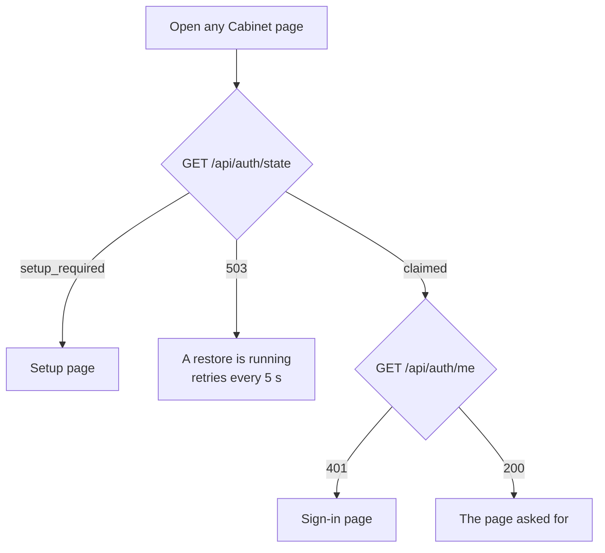
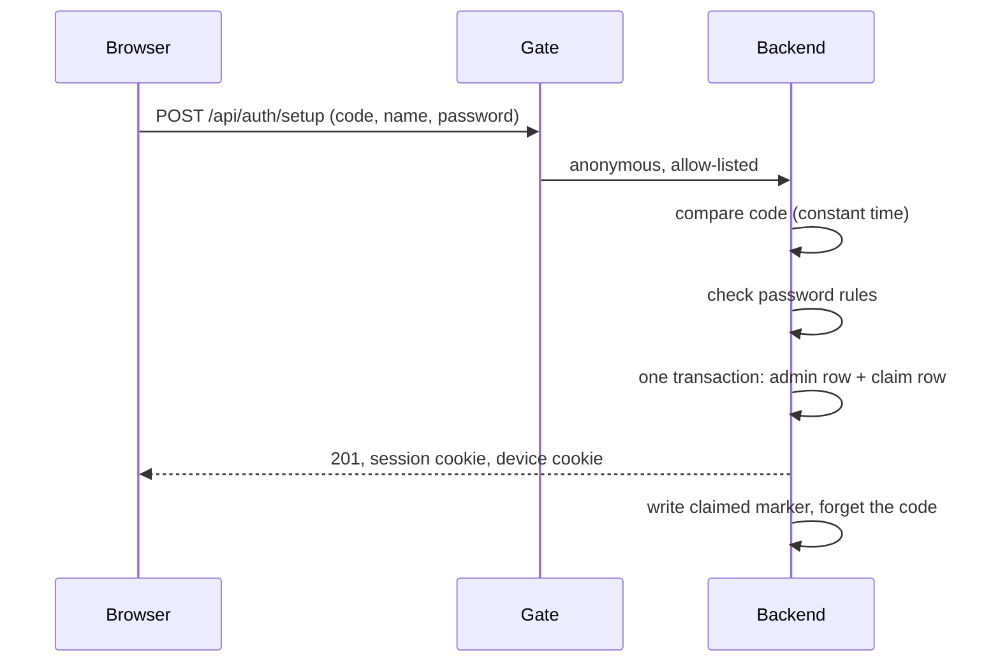
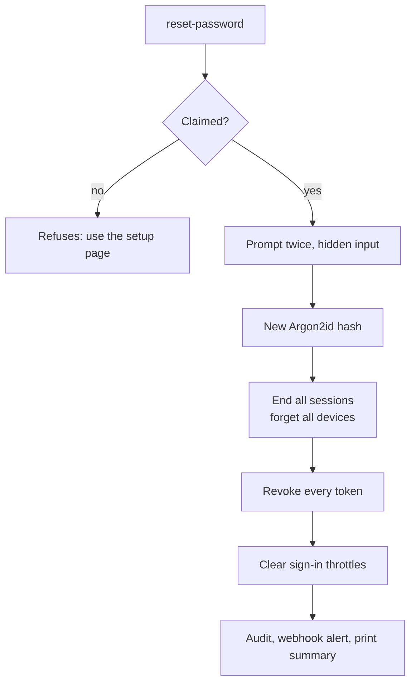

# How it works: the sign-in front door and the one admin

Companion to [SPEC_0300.md](SPEC_0300.md), the v0.30.0 contract. Draft of
21 September 2026, awaiting the owner's approval; nothing is built.

**One admin, one password, a front door that turns everyone else away, and
three ways back in when something goes wrong: the setup code (once, at the
start), the password change (in the app), and the reset command (in the
container, for when the app can't help).** This file describes v0.30.0 as it
will behave; the contract is the source of truth for exact rules.

## What a visitor sees

Every address in Cabinet goes through the same check before anything from
the collection is shown.



The app's code (HTML, scripts, styles) is public, as it is on GitHub. Nothing
from the collection is: every item, photo, document, value, and storage
location needs a signed-in session or an API token. The only things an
anonymous visitor can get are the setup page, the sign-in page, a health
word (`ok`, `restoring`, or `degraded`), and whether setup is still open.

## 1. Initialising the admin (once)

**The first person to present the setup code chooses the admin's name and
password. The code exists only until then, and the setup page closes for
good.**

### Before the first start

The operator picks one of the ways to get the code:

| Way | How | When to use it |
|---|---|---|
| **A Docker secret** (recommended on a Swarm) | `openssl rand -hex 32 \| docker secret create cabinet_setup_code -`, then `SETUP_CODE_FILE=/run/secrets/cabinet_setup_code` on the backend | Portainer, Dozzle, and `docker service inspect` show environment variables but not secret contents |
| **Let Cabinet generate it** (the default) | Set nothing. On start, while unclaimed, the backend logs one line: `Cabinet is not set up yet. Open it in a browser and enter this setup code: 7K2M-QX4P-...` (32 characters, 160 random bits). Read it with `docker compose logs backend` or `docker service logs cabinet_backend` | Local stacks, or when reading the log is easy |
| `SETUP_CODE` in the environment | Still accepted, for compose | Works, but anyone who can read the service's environment can read it until the claim |

A code the operator supplies must be at least 32 characters, and no single
character may make up more than a quarter of it, or the backend refuses to
start. That catches mistakes like `aaaa...`; it cannot prove the code is
random, so the docs give the `openssl` command and say choosing a strong one
is the operator's job.

### The setup page

Fields: **Setup code**, **Username**, **Password**, **Confirm password**.
The form works with password managers (`autocomplete` `new-password`), and
on a page that is not a secure context (plain `http` to anything other than
localhost) it warns in red that the password would travel unencrypted.



- **Right code first.** The code is compared before any throttle counts it,
  in constant time. A right code always gets through; wrong codes count
  towards five per address in 15 minutes, so a neighbour on the network
  can't block the owner by burning attempts.
- **Password rules:** 12 to 256 characters, no composition rules, hashed
  with Argon2id.
- **Exactly one winner.** The admin row and a single-row `claim` table are
  written in one transaction; a second attempt, even at the same instant,
  gets 409 "Cabinet is already set up."
- **Afterwards:** the browser is signed in and becomes a known device; the
  log says `Cabinet was set up by <name>. The setup code no longer works.`;
  a `claimed` marker is written on the state volume, after which
  `SETUP_CODE` and `SETUP_CODE_FILE` are ignored for good. The docs tell the
  operator to delete the Docker secret or the variable.
- **Upgrading an open install** (today's v0.29.1): the same thing happens on
  the first start of v0.30.0. Until the admin exists, nothing from the
  collection is served.

## 2. Signing in

Fields: **Username**, **Password** (`autocomplete` `username` and
`current-password`).

- **Wrong name or wrong password** gives one answer, "Wrong username or
  password.", in the same time either way.
- **Too many failures** gives "Too many attempts. Try again in 16 seconds.",
  never a lockout. After five failures for a name, each further attempt
  waits twice as long as the last, up to a minute.
- **A known device** (a browser that signed in successfully in the last 7
  days) skips those waits and has a password-check slot kept free for it,
  so a flood of attempts from elsewhere can't keep the owner out. Five
  failures presented with the same device cookie and it is forgotten.
- **On success:** a session cookie (HttpOnly, Secure, SameSite=Lax), valid
  for a day after its last use and never more than 7 days; a fresh
  known-device cookie; and, if there were failed attempts since the last
  sign-in, a notice: "4 failed sign-ins since your last visit on 20
  September. See the audit log."
- **A webhook alert** (if one is set up) on a sign-in from a new device, and
  when failures pass 20 in 15 minutes.

## 3. Everyday use

- The session renews itself as it is used; a day away signs you out, and a
  week is the limit regardless.
- **Sensitive actions ask for the password again.** Downloading a backup,
  exporting CSV or Excel, restoring, deleting old unencrypted archives, any
  change in Settings, creating or revoking an API token, ending another
  session or signing out everywhere, emptying the trash or deleting for
  good, and changing the password or username all show "Confirm your
  password to continue." A correct password opens a 5-minute window for
  that session only; tokens can never have it. Each confirmation and each
  download is audited. Signing out of the session you are in never asks.
- **Signing out** ends the session on the server, tells the browser to clear
  its cache of Cabinet's pages and files, and clears the app's in-memory
  data. Photos, documents, and exports are sent `no-store`, so nothing from
  the collection stays behind in the browser.
- **API tokens** for scripts and CI (`read` or `write`) last a day or a week
  at most, and the form says plainly that a `read` token can see every item
  and where it is kept. A `metrics` token for the Homepage tile or
  Prometheus sees only totals and can be long-lived.

## 4. Changing the password

**Settings, Account, Password.** Fields: **Current password**, **New
password**, **Confirm new password**.

1. The current password is checked with the same throttles as sign-in.
2. The new one follows the same rules (12 to 256 characters).
3. Then, in one step:
    - the new hash is stored;
    - this session gets a new id (the cookie is replaced), and every other
      session ends;
    - every known device is forgotten, including this one's (it is
      re-issued);
    - **every API token is revoked, whatever its scope**, including the
      Homepage and Prometheus `metrics` tokens; the answer names each one so
      you can replace it;
    - the audit log records it, and the webhook sends "Cabinet password
      changed".
4. The page says exactly what happened: "Password changed. 2 other sessions
   were signed out. Revoked: CI (write), Homepage tile (metrics), Prometheus
   (metrics). Create new tokens for anything that still needs one."

Why every token goes: someone who learned the old password could have made
a token, even a harmless-looking `metrics` one that never expires, and it
would otherwise outlive the change. Pasting a new token into Homepage is the
right price for a suspected compromise.

**Changing the username** is on the same page: current password plus the
new name.

## 5. When something goes wrong

| Situation | What to do | What happens |
|---|---|---|
| Lost or stolen laptop, you can still sign in elsewhere | Settings, Account, Sessions: end that session, or **Sign out everywhere** (password again) | Every session ends and every device is forgotten |
| You think the password is known | Change it (section 4) | Sessions, devices, and every token end |
| A token leaked | Settings, Account, Tokens: revoke it | Immediate 401 for that token |
| **Forgotten password** | Break the glass (below) | New password; everything that could have been stolen is revoked |
| Forgotten username | `python -m app.cli status` | Prints it |
| Lost state volume | Nothing for sign-in: the admin is in the database; supply `SECRET_KEY` as today. **The generated backup key was on that volume**: use your saved copy (section 6) | |
| Lost database, restoring to a new machine | Start v0.30.0 on the empty database, claim it with a fresh code, give it your saved backup key (`BACKUP_KEY_FILE`), then restore the collection (in the app, or `restore.sh`) | Backups never carry sign-in data, so the new admin is whoever claimed the new machine |
| Lost backup key and lost machine | Nothing can open the encrypted archives | This is why the key must be saved outside Cabinet |

### Breaking the glass: the reset command

**Shell access to the machine running Cabinet is the proof of ownership.**
Nothing on the network can reset the password; the command runs inside the
backend container.

```bash
docker compose exec backend python -m app.cli reset-password
```

On a Swarm, on the node running the backend task:

```bash
docker exec -it $(docker ps -q -f name=cabinet_backend) python -m app.cli reset-password
```



- The password is typed at a hidden prompt, twice, and **never** taken as an
  argument, so it never appears in shell history, the process list, or
  container logs.
- The command drops from root to the app's own user before touching
  anything.
- The running backend clears its in-memory sign-in throttles when it sees
  the command's flag file on the state volume.
- It prints what it did, without secrets: "Password reset for admin. Signed
  out 3 sessions and forgot 2 devices. Revoked 3 tokens: CI, Homepage tile,
  Prometheus."

The other container commands, same form:

| Command | Use it when |
|---|---|
| `status` | You want to see: claimed or not, the admin's name, last sign-in, failed sign-ins in the past 24 hours, live sessions and tokens with their last use, and the backup key's fingerprint and whether you have saved it. Prints no secrets |
| `sign-out-everywhere` | A device is lost and you can't sign in anywhere else |
| `revoke-tokens [--name NAME]` | A token leaked and you can't sign in |
| `backup-key show` | You need a copy of the backup key to keep safe (section 6) |
| `backup-key rotate` | You want a new backup key; older archives stay readable |

**There is deliberately no command that un-claims Cabinet or deletes the
admin.** Either would reopen the setup page to whoever reaches it first. If
it is ever truly needed, it is a documented database operation, not a
button.

## 6. Backups and the backup key

**Every backup Cabinet makes is encrypted, because a backup is the whole
collection: every item, value, storage location, photo, and receipt.**
Before v0.30.0, archives on the backup share were readable by anyone who
could read that share. Now they are unreadable without the backup key, and
nobody without the key can forge or alter one that restores.

- **The key.** On the first start of v0.30.0 Cabinet makes one (or uses
  yours, from a Docker secret, `BACKUP_KEY_FILE`). Settings, Backups shows
  its fingerprint and a reminder, **"Save your backup key"**, until you tick
  that you have. If the key is stored beside the backups, or Cabinet can't
  tell, Settings says so and suggests supplying it as a secret.
- **Saving it.** From the host:
  `docker compose exec backend python -m app.cli backup-key show` (or
  `docker exec` on the Swarm node). Put it in your password manager. It is
  never shown in the browser: like the password reset, the container is the
  proof of ownership.
- **Losing it.** If the key and the machine are both lost, the archives
  cannot be opened by anyone, including you. There is no recovery by
  design.
- **Opening an archive without Cabinet.** Archives are standard
  [age](https://age-encryption.org) files:
  `age -d -i key.txt cabinet-backup-....zip.age > backup.zip`.
- **Old archives.** Unencrypted `.zip` archives from before v0.30.0 are
  still readable copies of the collection, and can no longer be restored.
  Settings lists them as **unencrypted**, with "Delete unencrypted archives"
  (password again); delete them once you have a new encrypted backup.
- **Restoring** decrypts the archive in a private working folder, never on
  the backup share, and checks it was made with your key before reading
  anything in it; an altered or foreign archive is refused. The summary says
  whether this Cabinet made the archive and how many newer backups exist;
  restoring an older one needs you to type `RESTORE OLDER`, so nobody can
  quietly swap in an old backup.
- **What Cabinet cannot encrypt:** the database's own files and the photo
  and document folders. Protecting that storage is the operator's job, as
  for any service; Cabinet encrypts the backups it writes.

## 7. Until single sign-on: a door in front

**Until v0.31.0 brings single sign-on and two-factor sign-in, keep an
authenticating proxy in front of Cabinet as well.** Any forward-auth or SSO
gateway works (Authentik, Authelia, oauth2-proxy, Pomerium, Cloudflare
Access), and it brings its own second factor today. Cabinet's login is then
a second door, not a replacement:

- Cabinet ignores whatever identity the proxy asserts; it always asks for
  its own sign-in.
- A `Basic` or provider `Bearer` header the proxy adds is ignored; only
  Cabinet's own tokens count.
- `PUBLIC_ORIGINS` is the address the browser sees, the proxy's public name.
- Homepage and Prometheus skip the proxy on the internal name with a
  `metrics` token.

In v0.31.0 the two doors can become one: signing in through the provider
signs you in to Cabinet, with the local password kept for when the provider
is down.

## 8. What each piece protects

| Piece | Stops |
|---|---|
| Deny by default, tested against every route | A forgotten route leaking the inventory |
| Setup code, one winner, then closed | Someone claiming an open instance first |
| Argon2id, delays, known devices, a reserved slot | Guessing the password, and locking the owner out |
| Tiny limits on anonymous requests | Flooding the sign-in page to exhaust memory |
| Password again before sensitive actions and every settings change | Someone at an unlocked laptop taking the collection, planting a token, or quietly deleting for good |
| Every token revoked on a password change; script tokens last a week at most | A stolen password or token turning into lasting access |
| Webhook alerts | An attempt going unnoticed |
| `no-store`, clear on sign-out | The collection lingering in a shared browser |
| Encrypted, keyed backups | Someone reading or altering the collection on the backup share |
| Backups without sign-in data; secrets used only if encrypted with your key | A tampered archive planting an account or a webhook |
| Reset only from the container | Anyone on the network resetting the password |
