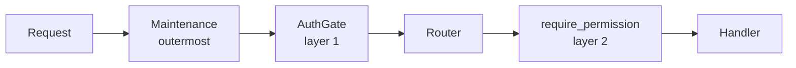

# SPEC_0300: Cabinet v0.30.0 authentication (P8 A1)

Status: **approved by the owner on 21 September 2026**; the build follows section 10. Read [SPEC_0300-how-it-works.md](SPEC_0300-how-it-works.md) first for the plain-language tour. The owner's working copy is a claude.ai doc; this file is the snapshot reviewers read.

## Status and scope

**Approved by the owner on 21 September 2026. The build follows section 10; only a critical or high finding reopens this contract (section 15).** This is the contract for v0.30.0, roadmap Phase 7, P8, part A1: one admin, database-backed sessions, scoped API tokens, a deny-by-default gate, photos behind the same check, and the three approved API renames. **For a plain-language tour of setup, sign-in, password changes, and the break-glass reset, read SPEC_0300-how-it-works.md first.** Sections 12 to 15 record Codex's four adversarial reviews of 21 September 2026 and what was taken from each; the largest result is that every backup archive is now encrypted (section 2).

**Precedence.** Where sources disagree, the newest wins: the fourth-review answer (taken as written), then the third, second, and first reviews, then the base decisions in the handoff. docs/security.md at cd669a2 already matches the fourth review. Where the code at main forces a change, the section on plan versus code says so.

**In scope:** the `cabinet_auth` schema and its Alembic chain; credential-free archives; the restore marker; the two-layer gate; CSRF; sessions, tokens, scopes; setup; throttles and the known-device cookie; the admin's maintenance tools (in the app and in the container); photos through `auth_request`; the host and origin settings; the API docs page turned off; the renames; the new dependency; docs, CI, Playwright.

**Out of scope:** A2 (OIDC and trusted-header mode, v0.31.0), more accounts and roles, the share view (P9), any switch that turns login off, caching the photo check, the API call counter (tabled), and the two left-alone API oddities (`/api/grades` and `/api/tags` outside `/api/reference/`, `POST /api/items/bulk`).

**Words used exactly.** *Session* means a signed-in browser. *Token* means an API token. *Principal* means whichever one a request carries. *Admin* means the one account. *Anonymous* means neither.

## Plan versus code at main (cd669a2)

**The plan holds against the code, with nine mismatches. Two change a settled rule (M1, M2), and each change is stated in this spec.** Checked read-only by four agents plus spot reads. They covered `main.py`, the maintenance, restore, backup, and schema services, health, conftest, both Dockerfiles, the entrypoint, nginx, compose, the stack file, CI, the scripts, `frontend/src/api`, and all 100 API operations probed from `app.openapi()` on FastAPI 0.141.1 and Starlette 1.6.0.

### Mismatches

| # | The plan says | The code says | What this spec does |
| --- | --- | --- | --- |
| M1 | CI sets `PUBLIC_ORIGINS=http://proxy`, `ALLOWED_HOSTS=proxy,localhost` (fourth review, item 7) | CI's Playwright runs on the runner host against `http://localhost` (`playwright.config.ts` default; ci.yml L213-220). Only `capture.cjs` and local dockerised runs use `http://proxy` | CI sets `PUBLIC_ORIGINS=http://localhost` and `ALLOWED_HOSTS=localhost`. The local `.env.example` lists both origins. **Changes a settled value; the code forces it** |
| M2 | `none` is allowed on `/docs/oauth2-redirect` | It is FastAPI's default path, outside `/api/`, so nginx never forwards it (it falls to `try_files`). It is unused | Removed (`swagger_ui_oauth2_redirect_url=None`). `With the docs page also off (C4), the one framework route left is /api/openapi.json`. **Narrows a settled list; the code forces it** |
| M3 | Playwright's existing export and backup downloads keep passing | There are no download tests. The backup test clicks "Back up now" and restores | New: one Playwright test downloads the CSV export and `backup.zip` while signed in |
| M4 | `check_sources.py` needs a token | It calls adapters in-process through `SessionLocal` and makes no HTTP call to Cabinet | No change to it |
| M5 | Inspect reads the dump's table of contents | `inspect()` never runs `pg_restore --list`. `_dump_tables` does (regex `TABLE public (\S+)`), but only inside `restore_database` | New `backup.list_dump(path)` (a monkeypatch point) used by inspect, after extracting `db.dump` to staging |
| M6 | The renames reach about 30 test sites | 36: A 11 in 7 files, B 2, C 23 in 7 files (4 are shared helpers). A's tests must move to the multi-step `/api/imports` flow, where an existing id is a duplicate rather than a skip | Full list in section 8 |
| M7 | The journal goes `preparing` then `swapping` | Confirmed, and `preparing` is written before the safety backup (restore.py:659), not just before the database. A crash after the leftover-table DROP commits also reads "Nothing was changed" | The marker (section 2) covers both |
| M8 | Stack file: the proxy never joins egress | Today the proxy joins `cabinet-egress` (docker-stack.yaml L78-80), and L127-128 and deployment.md L303-310 tell operators to swap that network for a shared overlay | Section 7 rewrites both |
| M9 | CI makes about 30 anonymous curl calls | 38 curl call sites | All 38 listed for the token helper in section 9 |

### Confirmed, and worth knowing while building

- 21 `include_router` calls (from 19 modules). `MaintenanceMiddleware` is the only middleware (main.py:119). `redoc_url=None`. `redirect_slashes` is on. No `include_in_schema`, `app.mount(`, or `add_api_route` anywhere.
- `app.routes` holds 21 `_IncludedRouter` wrappers and 3 plain routes, so the OpenAPI document is the only complete list (100 operations).
- Startup: `recover()` (main.py:96), then migrations under `pg_advisory_xact_lock(7340512)` in one transaction (schema.py:97).
- uvicorn has no `--forwarded-allow-ips` (Dockerfile:64). nginx appends `$proxy_add_x_forwarded_for` and sets `X-Forwarded-Proto $scheme` in all four `/api` locations. No `Cache-Control` is set anywhere in nginx.
- `pg_restore` today runs `--clean --if-exists --no-owner --single-transaction` (restore.py:562). The leftover-table drop already filters `schemaname = 'public'` (restore.py:550). `pg_dump` runs `--format=custom` (backup.py:158). `backup.sh` runs `pg_dump -Fc`; `restore.sh` runs `pg_restore --clean --if-exists`.
- `/api/health` uses the module-level engine, not `get_db`, and skips the database during maintenance. Its tests must patch it.
- conftest's `TestClient(app)` uses `http://testserver`. It must become `https://testserver`.
- `app_settings.get_setting` raises `KeyError` for keys outside `DEFAULTS`. The restore marker is written and read by direct ORM, never through `get_setting`.
- Documents send `Cache-Control: private, max-age=3600` (documents.py:178). This spec changes that to `private, no-cache`.
- `/api/metrics` answers 404 unless `metrics_enabled`. That stays; the gate runs first.
- The restore upload reads `request.stream()` (routers/restore.py:94). The gate never reads a body.
- `DELETE /api/items/{id}` purges without `?permanent=true` when the item is already in the trash. Its admin check is `permanent or item.deleted_at is not None`.
- `frontend/src/api/client.ts` `req()` is the only `fetch`. Five plain links hit the API directly (backup downloads, the CSV and XLSX exports, `/api/metrics`), and all send `same-origin`.
- No CLI module exists. `argon2-cffi` appears nowhere in code or lockfiles.
- Versions pinned: fastapi 0.141.1, starlette 1.6.0, uvicorn 0.53.0, sqlalchemy 2.0.54, alembic 1.20.0, nginx 1.31-alpine, postgres 16-alpine.

## 1. Data model: the cabinet_auth schema

**Credentials live in their own Postgres schema, `cabinet_auth`, with their own Alembic chain. No foreign key crosses between it and `public` in either direction.** The collection never stores a user id; the audit log records who did what, inside `cabinet_auth`.

### Tables (auth revision `a0001`)

| Table | Columns | Notes |
| --- | --- | --- |
| `claim` | `id` smallint PK with `CHECK (id = 1)`, `claimed_at`, `user_id` FK users | The singleton. Its insert is the atomic claim on Postgres and SQLite alike. Row present means claimed |
| `users` | `id`, `username` String(64) unique (stored lowercased), `password_hash` String(255) nullable (A2 identities), `role` String(16) `CHECK IN ('admin','editor','viewer')`, `is_active` bool, `external_issuer` / `external_subject` String(255) nullable, unique together, `created_at`, `last_login_at`, `password_changed_at` | Only the admin is ever created in A1 |
| `sessions` | `id`, `secret_hash` bytes(32) unique, `user_id` FK, `auth_method` String(16) (`password` in A1; A2 adds `oidc`, `header`), `created_at`, `last_seen_at`, `expires_at` (created + 7 days), `confirmed_until` nullable (the recent-password window, section 5), `user_agent` String(256), `address` String(45), `revoked_at` | Idle limit is `last_seen_at` + 1 day, checked in code |
| `api_tokens` | `id`, `public_id` String(10) unique, `secret_hash` bytes(32), `user_id` FK, `name` String(100), `scope` String(8) `CHECK IN ('read','write','metrics')`, `created_at`, `last_used_at`, `expires_at` (required for `read` and `write`, at most 7 days), `revoked_at` | One scope per token |
| `known_devices` | `id`, `secret_hash` bytes(32) unique, `user_id` FK, `created_at`, `expires_at` (created + 7 days), `failures` int | See section 5 |
| `audit_log` | `id`, `at`, `actor_user_id` FK nullable `ON DELETE SET NULL`, `actor_label` String(64), `actor_kind` String(12) (`session`, `token`, `anonymous`, `cli`, `system`), `action` String(40), `target` String(200), `detail` JSON, `address` String(45), `user_agent` String(256) | `sign_in_failed` rows capped at 10,000; all other rows 180 days or 50,000. Failures can never push out other events |
| `backup_ledger` | `id`, `name` String(100) unique, `kind` String(12) (`scheduled`, `manual`, `download`, `prerestore`), `created_at`, `mac_recipient` String(80), `mac_digest` bytes(32) (SHA-256 of the archive's MAC), `size` bigint | Every archive this Cabinet writes (section 2). Lives here so a restore never rewrites it. Pruned with the audit log's 180 days, never below the newest 50 rows |

Throttle counters are **not** a table: they live in memory (section 5).

Throttle counters are **not** a table: they live in memory (section 5).

Foreign keys inside `cabinet_auth` are allowed; none reaches `public`.

### The chain

- `backend/alembic_auth/` (`env.py`, `script.py.mako`, `versions/a0001_initial.py`) with its own ORM base: `AuthBase` over `MetaData(schema="cabinet_auth")` in `app/models/auth.py`. The collection's `alembic/env.py` keeps `target_metadata = Base.metadata`, which never includes `AuthBase`, so autogenerate on either chain cannot see the other.
- `alembic_auth/env.py` runs `CREATE SCHEMA IF NOT EXISTS cabinet_auth`, then `configure(version_table="alembic_version", version_table_schema="cabinet_auth", include_schemas=True, include_name=<cabinet_auth only>)`.
- `services/schema.py` gains `upgrade_auth_to_head`. `upgrade_to_head` runs the collection chain, then the auth chain, **inside the same transaction and the same `pg_advisory_xact_lock(7340512)`**. `AUTO_MIGRATE=false` skips both.
- Auth migrations never touch `public`; collection migrations never touch `cabinet_auth`. A test greps both `versions/` folders for the other schema's name.
- `/api/health` (full body) reports `schema` as today and adds `auth_schema: {current, expected, status}` from the same `describe()`.
- **SQLite tests:** the test engine uses `execution_options(schema_translate_map={"cabinet_auth": None})`; `create_all` runs over both metadatas.

### Tests

- A metadata test finds no foreign key between `Base.metadata` and `AuthBase.metadata`.
- On real Postgres (local, then CI): a fresh database gets both chains; **a v0.29.1 database migrates to head** (the upgrade test, now required); the auth chain goes up, down, and up again; restoring an archive at `0021` leaves `cabinet_auth` and its version untouched.

## 2. Backups and restore

**An archive never holds a credential, and a restore never adds, changes, or revokes one.** There is no credentials epoch. A session or token is judged only by its own row.

### Dumps leave the schema out

| Path | Change |
| --- | --- |
| `backup.dump_database` (download, scheduled, pre-restore) | `[pg_dump, "--format=custom", "--exclude-schema=cabinet_auth"]` |
| `scripts/backup.sh:16` | `pg_dump -Fc --exclude-schema=cabinet_auth` |
| Manifest | Adds `"auth_excluded": true`. Informational only; the check below is the guarantee |

### Restores take only the collection

| Path | Change |
| --- | --- |
| `restore.restore_database` | `[pg_restore, "--schema=public", "--clean", "--if-exists", "--no-owner", "--single-transaction", ...]` |
| Leftover-table drop (restore.py:550) | Keeps `schemaname = 'public'`, with a comment saying `cabinet_auth` must never be dropped |
| `scripts/restore.sh` | Adds `--schema=public`. Before restoring, it runs `pg_restore --list` and refuses, naming the reason, if any line holds `cabinet_auth` |
| After the restore | Only the collection chain migrates. The auth chain's tables and version were never touched |

### Archives holding credentials are refused

`check_archive` gains a last step: decrypt the archive into `/data/staging` and extract `db.dump` there, as `/data/staging/<id>.dump`; run `backup.list_dump(path)` (new, `pg_restore --list`, a monkeypatch point like `dump_database`); and answer **422** "This archive contains sign-in data, which Cabinet never restores. It was not made by Cabinet's own backup." if any entry is in schema `cabinet_auth`. The inspect summary adds two lines: "Your sign-in, sessions, API tokens, and audit log are kept." and which stored secrets the archive would set (price-source keys, webhook, heartbeat), by name only.

An archive from before v0.30.0 has no `cabinet_auth` objects, passes, and cannot reopen setup.

### The restore marker closes the crash window

The order of `_run`, with the new steps in bold:

1. Busy and movability checks, typed confirmation, **and a recent password confirmation** (section 5).
2. Journal `preparing` (unchanged, restore.py:659), then the safety backup, auth excluded.
3. Unpack into `.restore-new` (unchanged).
4. **Write `app_settings` row `restore_marker` = a fresh `secrets.token_hex(16)` by direct ORM, commit. Journal phase `database` with that exact value as `marker`.**
5. **Journal `dropped` = the leftover public tables' names, then drop them.**
6. `pg_restore --schema=public ...`, then journal `swapping` (unchanged).
7. **Delete any `restore_marker` row the archive brought in. Clear every stored secret that does not decrypt with the current key, and list them in the outcome** ("Cleared: alert webhook. Enter it again in Settings.").
8. Collection migrations only, then the file swap, `_finish` (unchanged order).
9. **Audit `restore_finished`** (actor, archive name, outcome) and a webhook event. The `restore_started` event was written before step 1; both survive, since the audit log is not restored.

`pg_restore --clean` replaces `app_settings` wholesale, so the marker survives only if the database was not replaced. The archive cannot hold that id. A successful restore leaves no marker row.

`recover()` for each journal phase:

| Journal | Database check | Recovery | Outcome recorded |
| --- | --- | --- | --- |
| `preparing` | not consulted | clear `.restore-new` | Nothing was changed |
| `database` | a `restore_marker` row **equal to the journal's value**, nothing dropped | delete marker, clear `.restore-new` | Nothing was changed |
| `database` | equal value, tables dropped | clear `.restore-new` | Partial: names the tables and the safety backup (the `PartialDatabase` wording) |
| `database` | no row, or a row with any other value (an archive can carry one, never this one) | delete any marker row, clear unencrypted secrets (step 7), leave migrations to startup, roll the swap forward | Restored, finished after a restart |
| `database` | unreachable after `wait_for_database` (60 s) | keep the journal; **the process stays in maintenance** until a restart resolves it | none yet |
| `swapping` | not consulted | roll the swap forward (today's logic) | Restored |

The marker must live in `public`: it works precisely because a restore replaces that table. Moving it to `cabinet_auth` or the state volume (Codex's C2 proposal) would make it survive every restore and always read "nothing changed".

The unreachable row is new behaviour not in the fourth review: with the journal unresolved, serving the collection could mix an old database with new files, so the backend answers 503 (health answers `restoring`) until it can decide. `recover()` needs the database for the `database` phase, so it calls `schema.wait_for_database` first.

**Stored secrets that aren't encrypted with this deployment's key are never used** (Codex round 2, A3). Today `app_settings.get_setting` quietly accepts a plain-text secret and encrypts it in place (app_settings.py:71-76; `crypto.decrypt` returns unprefixed input, crypto.py:91-96). That lets an edited archive plant a working webhook address. The self-heal is removed, and in its place: on the first start of v0.30.0 and after every restore, each non-empty, unprefixed value of the four `SECRET_KEYS` is **cleared, never encrypted**, and reported by name only (log, the restore outcome, a `secrets_cleared` audit event and alert, and a Settings banner: "Re-enter: alert webhook"). The upgrade note says so. In practice every secret saved since v0.10 is already encrypted.

### The restore grant

The session that calls `POST /api/restore/{id}/run` gets an in-memory grant: the SHA-256 of its session secret plus the restore id. It is **consulted only while maintenance is on**, for `GET /api/restore/status` only, with no database access. Any other caller then gets **401**. It expires 10 minutes after the restore ends, and 2 hours after issue at the latest. Outside maintenance, restore status is an ordinary admin route, and since sessions survive a restore, the progress page keeps working afterwards.

### Tests

- pytest records `pg_dump` and `pg_restore` argument lists and asserts `--exclude-schema=cabinet_auth` and `--schema=public`.
- Inspect with a stubbed `list_dump` holding a `cabinet_auth` entry answers 422.
- `recover()` called directly for each journal row above, including a forged marker with a different value (rolls forward), unreachable (journal kept, maintenance on), and a normal restore leaving no marker.
- A restored plain-text webhook URL is cleared and reported; `get_setting` on a plain-text secret returns unset.
- A session, a read token, and a revoked token exist; a restore runs (monkeypatched); the session and token answer 200, and the revoked token 401.
- CI on real Postgres: claim, mint a token, back up; `pg_restore --list db.dump` has no `cabinet_auth` line; restore in-app and with `restore.sh`; the password and the token still work.

### Encrypted, tamper-evident archives (owner's decision, 21 September 2026)

**Every archive Cabinet writes is encrypted, no plain text of an archive ever touches `BACKUP_DIR`, and only encrypted archives made with the deployment's key can be restored.** An archive is the whole collection: every item, value, storage location, photo, and receipt. Codex's round 2 raised the integrity half (an archive on a writable share can be altered), confidentiality is the larger half, and Codex's round 3 found that decrypting for a restore inside `BACKUP_DIR` would have undone both (B1).

| Piece | Rule |
| --- | --- |
| Format | [age](https://age-encryption.org) v1, X25519 recipient, around the existing zip: `cabinet-backup-YYYYMMDD-HHMMSS[-data\|-prerestore].zip.age`. Anyone holding the key can decrypt with the standard `age` tool, without Cabinet |
| Tool | The `age` binary from Debian's package, installed in the backend image and called as a subprocess, streaming (archives can be many GB). No new Python dependency. The version is pinned by the image build; Trivy scans it |
| Writing (B1) | The zip is written as a stream straight into `age`'s stdin (Python's `zipfile` writes to an unseekable stream), and `age` writes the only file: `<name>.zip.age.partial` in `BACKUP_DIR`, renamed when complete and removed on any failure. Every member, the `pg_dump` output included, goes into that stream or through the private staging folder; no plain archive, member, partial, or download file is ever created in `BACKUP_DIR`. Download, scheduled, run-now, pre-restore, and `backup.sh` all work this way. The download is built as ciphertext, then sent |
| Staging (B1) | Decryption happens only in `/data/staging`, its own volume (`staging_data`), never inside `BACKUP_DIR` or `PHOTO_DIR`. The folder is 0700 and its files 0600, owned by the app's user. It is emptied at the start of every inspect and restore, on every success and failure path, and by `recover()` at startup. Free space is checked against the archive's size before decrypting (422 "Not enough space to open this archive"). Plain text lives there as it does in the database, so where it lives is the operator's storage; the docs say to keep it on the host's own disk. `BACKUP_DIR/.restore-staging/` keeps only uploaded ciphertext |
| The key | One age identity (`AGE-SECRET-KEY-1...`). From `BACKUP_KEY_FILE` (a secret file) or `BACKUP_KEY` (the identity text as a variable, section 16) if set; otherwise generated at first start into `backup.key` (0600) on the state volume. A secret file must be readable by the app's user; the entrypoint never changes its ownership or mode, and an unreadable one stops startup before any backup is written. More than one identity is allowed for rotation: the first encrypts |
| Keeping a copy | The owner must keep the key outside Cabinet (a password manager). `python -m app.cli backup-key show` prints it (the container is the proof of ownership, as with the password reset); it is never sent over the API. Settings shows the key's public fingerprint and a setup-checklist item, "Save your backup key", until the owner ticks "I have saved it" |
| Tamper evidence | age authenticates the contents, but anyone who knows the public recipient could make a new archive. So the manifest carries `mac_recipient` (the age recipient of the identity that made the archive) and `mac`: HMAC-SHA256, keyed by HKDF-SHA256 over that identity's raw 32-byte X25519 secret (empty salt, info `cabinet-backup-mac-v1`), over the manifest itself (canonical JSON, sorted keys, UTF-8, with `mac` removed, so `mac_recipient` is covered) followed by `SHA256SUMS`. The manifest lists every member's SHA-256 and size, so the MAC covers every byte; compared with `hmac.compare_digest` |
| Verifying (B2) | After decrypting, restore reads the manifest, picks the one configured identity whose recipient equals `mac_recipient` (none or more than one: 422), derives that identity's key, and verifies `mac` before reading anything else. A mismatch is 422 "This archive was not made with your backup key." Only someone with the private key can forge an archive |
| Archive record (B3) | Every archive this Cabinet writes is recorded in `cabinet_auth.backup_ledger` (section 1), which no restore rewrites. An archive is identified by its verified mac_recipient and SHA-256 of its mac, never by file name or filesystem time, and "older" compares its verified manifest created_at with the newest created_at in the ledger, so a renamed or re-dated old archive, or one whose own row was pruned, still needs RESTORE OLDER (Codex round 4, C1). With an empty ledger, inspect says "Cabinet has no record of its own backups here, so it cannot tell whether this is the newest". Inspect says one of: "Made by this Cabinet on 18 September 2026", with "3 newer backups exist" when there are; "Not made by this Cabinet" (another machine, or an empty ledger on a new one). Restoring an archive older than the newest recorded one needs the typed confirmation `RESTORE OLDER` instead of `RESTORE`, and is audited and alerted |
| Every path | In-app restore and `restore.sh` decrypt and verify; both accept only encrypted archives |
| `restore.sh` | Decrypts into a private `mktemp -d` folder (0700) removed by a `trap` on exit or interrupt, never beside the archive: with the running backend's key (`docker compose exec -T backend python -m app.cli decrypt-archive`) or with `age -d -i <key file>` on the host for a new machine, then verifies `mac` through `python -m app.cli verify-archive` before touching anything |
| Old archives (B4) | Plain `.zip` archives from before v0.30.0 **cannot be restored by any path** (the owner's decision: nobody else runs Cabinet with data that needs them). Settings lists them as unencrypted, with "Delete unencrypted archives" (fresh) |
| Losing the key | An encrypted archive cannot be read without it. There is no recovery; the docs say so plainly, and the setup checklist nags until the key is saved |
| Rotation (B2) | `python -m app.cli backup-key rotate` prepends a new identity to a generated `backup.key`. With `BACKUP_KEY_FILE` it changes nothing and prints the steps: a new secret holding the new identity first and the old after it. Old archives stay readable while their identity stays in the file, and each is always checked against the identity its `mac_recipient` names |
| Data volumes | Out of scope, by the owner's decision: the database's data directory and the photo and document volumes are the operator's storage to protect, like any service's. Cabinet encrypts what it writes to `BACKUP_DIR` and nothing else, and the docs say so in one sentence |

Route paths do not change (`GET /api/backup.zip` still downloads, now named `...zip.age` in `Content-Disposition`), and `GET /api/backups` gains `encrypted: bool` per archive plus the key's `fingerprint` and `saved`. Two routes are new, both admin: `POST /api/backups/key/saved` (the "I have saved it" tick, audited) and `DELETE /api/backups/unencrypted` (fresh; deletes every plain `.zip` archive in `BACKUP_DIR`, never a `.restore-*` entry, audited and alerted). Inspect decrypts an uploaded or stored archive into `/data/staging` and verifies `mac` before reading the manifest's contents, so the summary never describes an archive it could not authenticate. The CI drills and the Playwright restore test use encrypted archives.

**Where the key lives matters as much as the encryption (B5).** A generated key on the state volume is only as private as that volume; if it shares storage with `BACKUP_DIR`, the key sits beside the archives it protects. `BACKUP_KEY_FILE` from a secret store (a Docker secret on a Swarm) is the documented path for any deployment whose backups leave the host. When the key is the generated one, startup parses `/proc/self/mountinfo` (mount source and filesystem type, new parsing; the document check only lists mount points) and reaches one of three answers, shown in Settings and the setup checklist and logged on every start: **separate** (nothing shown), **shared** ("Your backup key is stored beside your backups; move it to a secret"), or **not verified** ("Cabinet cannot tell where your backup key is stored relative to your backups; supplying it as a secret removes the doubt"). Silence is never presented as a safety result. With `BACKUP_KEY_FILE` there is nothing to check. The same three-state check covers `SECRET_KEY_FILE`.

New monkeypatch points `backup.encrypt_stream(src, dst)` and `backup.decrypt_stream(src, dst)` (SQLite tests cannot rely on an `age` binary on the dev machine); the MAC, identity selection, the ledger, and the staging rules are plain Python and tested for real.

**Tests:**

- **MAC conformance (B6):** the exact byte sequence (canonical manifest without `mac`, then `SHA256SUMS`) with a fixed identity; an archive with only a manifest field changed, `SHA256SUMS` and `mac` kept, re-encrypted to the public recipient, is refused by in-app inspect and by `restore.sh`; so are a tampered `SHA256SUMS`, a fresh identity's archive, a wrong key, and a changed `mac_recipient`.
- **No plain text on the share (B1):** a watcher on `BACKUP_DIR` sees only age ciphertext (and ciphertext `.partial` files) through download, scheduled, run-now, safety backup, inspect, a successful restore, a failed decrypt, a MAC failure, and an interrupted restore; the decrypted zip exists only under `/data/staging` with mode 0600 and is gone after each path; `recover()` empties staging; not enough free space is a 422 before decrypting.
- **Rotation (B2):** archive A with the old key, rotate, archive B with the new; both restore while both identities are present; A fails once the old one is removed; a read-only `BACKUP_KEY_FILE` makes `backup-key rotate` print the steps and change nothing.
- **Archive record (B3):** every write path adds a ledger row that survives a restore; the older of two genuine archives needs `RESTORE OLDER`, and plain `RESTORE` is refused for it, also after renaming it to the newer archive's name, giving it a newer file time, or pruning its own ledger row; an empty ledger says rollback detection is unavailable; the newest needs neither; an archive from another key says "Not made by this Cabinet".
- **Legacy (B4):** a plain `.zip`, genuine or forged, is refused by upload, by stored-archive inspect, and by `restore.sh`; "Delete unencrypted archives" removes only plain `.zip` files.
- **Key location (B5):** mountinfo fixtures for a bind mount, a named volume, a network filesystem, and an unreadable mountinfo give separate, shared, and not verified correctly; an unreadable secret stops startup before any backup; the entrypoint never touches a secret mount.
- **The key:** generated at first start with mode 0600 and never returned by any route; `backup-key show`; every write path produces `.zip.age`.
- **CI on real Postgres and the real `age`:** download, scheduled, and pre-restore archives are age files; `age -d` with the key opens them; both restore paths restore one; a flipped byte is refused; `restore.sh`'s temporary folder is gone afterwards, including after an interrupt.

## 3. The gate: two layers, deny by default

**Anonymous callers are refused on the raw method and path before routing; each route's declared permission is checked after routing; a route that declares none is refused.** Completeness is tested against the OpenAPI document, never `app.routes`.

In `main.py`, `add_middleware(AuthGate)` comes first and `add_middleware(MaintenanceMiddleware)` last, because Starlette runs the last-added first. A test asserts the order in `app.user_middleware`.

### Layer 1: `app/auth/gate.py`, plain ASGI

It reads only method, raw path, and headers, never the body. Non-HTTP scopes pass through. Database lookups run in a worker thread (`anyio.to_thread`), never on the event loop.

1. **Encoded paths are refused.** Any request under `/api/` whose raw path (`scope["raw_path"]`) contains `%` is **400**, before anything else. Probed on FastAPI 0.141.1 and Starlette 1.6.0: today `/api/%68ealth` and `/api/%6fpenapi.json` both route and answer 200, so a gate comparing bytes could otherwise be sidestepped. No Cabinet route needs an encoded path segment (ids are numbers or hex, backup names match a fixed pattern). Every later comparison uses `scope["raw_path"]` bytes, never the decoded `scope["path"]`.
2. **During maintenance** (only the two exempt routes reach it): `GET /api/health` passes with no principal and no lookup. `GET /api/restore/status` passes only if the session cookie's hash matches the restore grant; otherwise 401. No database call either way.
3. **Find the credential.** `Authorization: Bearer cabinet_...` is a token: look up `public_id`, compare the secret's SHA-256 with `hmac.compare_digest`. A present but invalid Cabinet token is 401 with no fallback to the cookie. Any other `Authorization` value is ignored and the request is treated as a cookie request. Tokens are never read from a query string or a cookie. Otherwise, look up the session cookie.
4. **Anonymous** passes only on these exact (method, raw path) pairs: `GET /api/health`, `GET /api/auth/state`, `POST /api/auth/setup`, `POST /api/auth/login`. Everything else is **401** with `Cache-Control: no-store`, including unknown paths, HEAD, OPTIONS, trailing-slash variants, and the photo check.
5. **The one framework route**, `GET /api/openapi.json`, is matched by exact raw path: a session passes, a token gets **403**. Layer 2 never runs for it. There is no `/api/docs`, `/api/redoc`, or `/docs/oauth2-redirect`; those paths are unknown, so 401 anonymously and 404 signed in.
6. **CSRF** for cookie requests (section 4).
7. **Record the principal** on `scope["state"]["principal"]`: user id, username, kind (`session` or `token`), scope, session or token id, and whether the session is inside its recent-password window. `last_seen_at` and `last_used_at` are written at most once a minute.
8. **On the way out**, any `/api/` response without `Cache-Control` gets `private, no-store`.

### Layer 2: `app/auth/permissions.py`

`FastAPI(dependencies=[Depends(require_permission)])` runs for every matched API route and reads `request.scope["endpoint"]`. Each handler carries `@permission("public" | "read" | "write" | "admin", metrics_ok=False)`, written directly above `def`, below the router decorator, so the attribute is on the registered function.

| Principal | public | read | write | admin | `GET /api/stats/collection` | `GET /api/metrics` |
| --- | --- | --- | --- | --- | --- | --- |
| Anonymous | yes | 401 | 401 | 401 | 401 | 401 |
| Admin session | yes | yes | yes | yes | yes | yes |
| `write` token | yes | yes | yes | 403 | yes | 403 |
| `read` token | yes | yes | 403 | 403 | yes | 403 |
| `metrics` token | yes | 403 | 403 | 403 | yes | yes |

No token ever reaches an `admin` route. An undeclared handler gets 403 and logs an error naming it; under pytest it raises instead, so the completeness test fails by name. Nothing touches `_IncludedRouter`.

**Classes after the renames:** 99 existing operations (100 less `POST /api/items/import`) plus 18 new routes (16 auth routes in section 5, 2 backup routes in section 2). The 99: public 1, read 33, write 42, admin 23 (write 45 and admin 20 as approved; section 16 moved three photo and document deletions to admin). Two carry `metrics_ok`: `GET /api/stats/collection` (read) and `GET /api/metrics` (admin, so a read token gets 403). A `metrics` token on health gets the full body, like any principal. `@permission(..., fresh=True)` additionally requires the session's recent-password window (section 5); a token can never satisfy it. The full route-by-route table is in the appendix below.

**Decisions inside the table:**

- `GET /api/pcgs/cert/{cert}`, `GET /api/numista/search`, `GET /api/numista/types/{id}` are **write**, because they spend quota. A cert is `^[0-9A-Za-z-]{1,20}$`, checked in the form and the route (422 otherwise), so no supported cert needs percent-encoding (Codex round 2, A4).
- `DELETE /api/items/{id}` is write, and the handler calls `require(request, "admin", fresh=True)` when `permanent or item.deleted_at is not None`. `POST /api/trash/purge` and `DELETE /api/trash` are admin and fresh. That is the "delete for good" row.
- **Bulk and document bytes are session-only** (Codex H1): the CSV and XLSX exports are admin and fresh; `GET /api/documents/{id}/file` and `/thumb` are admin. A token can still page through items (a `read` token sees everything else, storage locations included, and the token page says so), but it cannot pull the collection in one request or read receipts, and it lives at most 7 days.
- **Fresh (recent password):** the two exports, `GET /api/backup.zip`, `GET /api/backups/{name}`, deleting unencrypted archives (deleting a stored archive from v0.30.1, section 17), `POST /api/restore/inspect`, `POST /api/restore/{id}/run`, `POST /api/auth/tokens`, `DELETE /api/auth/tokens/{id}`, `DELETE /api/auth/sessions/{id}` for a session other than this one, `DELETE /api/auth/sessions` (sign out everywhere), `POST /api/auth/password`, `POST /api/auth/username`, purge and empty trash, deleting a photo or replacing its image, deleting a document or unlinking it from its last item (section 16), and **every `PUT /api/settings`** (Codex round 2, A2, widened: without it, a stale session could set trash retention to one day and let the hourly clean-up delete for good, set `backup_keep` to 1 and prune the recovery points, or change the webhook format to silence alerts). Signing out of this session stays immediate.
- `GET /api/settings`, `/api/backups`, `POST /api/backups`, the alerts test, restore status, and dashboard `PUT`/`DELETE` are admin. `GET /api/dashboard/layout` is read.
- `GET /api/health`: public. The handler returns the full body when any principal is present and `{"status": ...}` otherwise.

### Tests (`tests/test_gate.py`)

- **Anonymous matrix:** every path in `app.openapi()["paths"]`, with its own methods plus HEAD and OPTIONS, each also with a trailing slash, plus `/api/openapi.json`, `/api/docs`, and an unknown path. Everything is 401 except the four allow-listed pairs.
- **Encoding:** `%`-encoded forms (`/api/%68ealth`, `/api/auth/%73tate`, `/api/%6fpenapi.json`, `%2f`, `%2e%2e`) are 400 for anonymous, session, and token alike; `//`, `..`, `;` parameters, and trailing slashes never reach an allow-listed handler anonymously.
- **Completeness:** every OpenAPI operation, called with an admin session and placeholder path values, reaches `require_permission` with a declared permission.
- **Scope matrix:** every operation for each token scope gives what the table says. The metrics case also pins `CollectionStats`' nine keys.
- **Fresh matrix:** every fresh route is 403 with `reauth_required` for a session outside its window, passes inside it, and is 403 for every token.
- **Plain routes:** the only top-level `starlette.routing.Route` is `/api/openapi.json`.
- **Source lint** (a pytest over `app/`): no `include_in_schema=False`, no `app.mount(`, no `add_api_route` outside `routers/`, and `docs_url`/`redoc_url` stay `None`.
- **Ordering:** middleware order; during maintenance an ordinary route is 503 before the gate runs; health does no credential lookup (the session store patched to raise); restore status answers the granted session and 401s another, with no database call.
- **conftest:** `client` becomes the admin session over `https://testserver`, sending `Sec-Fetch-Site: same-origin` by default and inside its recent-password window, so the 502 existing tests need only the rename edits. New fixtures: `anon_client`, `stale_client` (outside the window), and `token_client(scope)`.

## 4. CSRF: fails closed, every method

**A cookie-authenticated `/api/` request of any method passes only with `Sec-Fetch-Site: same-origin`, or with no `Sec-Fetch-Site` and an `Origin` (or the `Referer`'s origin) exactly matching an entry in `PUBLIC_ORIGINS`.** Anything else is 403 "Cross-site request refused.": `cross-site`, `same-site`, `none`, or no evidence at all. There is no list of sensitive GETs to keep up to date.

- **`none` is accepted** (a typed address, a bookmark) only on `GET /api/openapi.json` and `GET /api/documents/{document_id}/file`.
- **The photo check** (`GET /api/auth/photo`) refuses only `cross-site`: it has no side effects, and "open image in new tab" sends `none`.
- `Origin: null` counts as absent. Origins compare after lowercasing scheme and host, with default ports removed (`https://x:443` equals `https://x`).
- **Bearer requests are not CSRF-checked.** A cross-site page cannot set that header, and Cabinet answers no CORS preflight.
- No route changes method, so the approved API pass is not widened.
- **The app already complies:** every `req()` call, the five plain API links, and document `img` and `a` elements are same-origin.

**Tests:** a table over every GET (and every other method) in the OpenAPI document with a session cookie: `same-origin` passes; `cross-site`, `same-site`, and missing each give 403; `none` passes only on the two routes; a read token passes the same requests. A cookie POST whose Origin is only in `ALLOWED_HOSTS` (for example `http://localhost` when it is not in `PUBLIC_ORIGINS`) is 403.

## 5. Credentials: passwords, sessions, tokens, throttles

### Passwords

- Argon2id through `argon2-cffi`, pinned in code: time 3, memory 65536 KiB, parallelism 4. `check_needs_rehash` on each success.
- 12 to 256 characters, no composition rules. Username 1 to 64 characters of letters, digits, `.`, `_`, `-`, stored lowercased; the sign-in compare is case-insensitive.
- One failure answer for an unknown user and a wrong password (401 "Wrong username or password."), with a dummy verify for an unknown name so timing matches.
- **Two verification slots, one reserved** (Codex C4): one public slot for any sign-in, and one used only by a request presenting a valid known-device cookie for the account being signed in to (checked by a cheap hash lookup before any Argon2 work). 128 MiB worst case inside the 1024M limit. Hashing runs in a worker thread. Waiting more than 10 seconds for a slot gives 503 with `Retry-After`.
- Throttle checks run before any Argon2 work.
- No password, setup code, or token secret in a log line, exception, audit detail, or argv.

### Sessions

- Secret: 32 random bytes, base64url. Stored as SHA-256. Never minted from a caller's value. Rotated on sign-in and password change.
- Cookie `__Host-cabinet_session` (`Secure; HttpOnly; SameSite=Lax; Path=/`, no `Domain`, no `Max-Age`). With `AUTH_INSECURE_HTTP` it is `cabinet_session` without `Secure`, since the `__Host-` prefix requires Secure.
- Valid while not revoked, `now < expires_at` (created + 7 days), and `now < last_seen_at + 1 day`, with the account active.
- **A password change** needs the current password, rotates the current session, and revokes every other session, every known device (this browser's is re-issued), and **every API token of every scope** (owner's decision after Codex round 2: someone who knew the password could otherwise mint a never-expiring `metrics` token that outlives the change). The answer names every revoked token so they can be replaced.
- **Sign-out** revokes the session, clears both cookies, and answers with `Clear-Site-Data: "cache"`; the frontend drops its in-memory data. Preferences in local storage (theme, dismissed setup card, show-empty-fields) are harmless and kept.

### API tokens

- Format `cabinet_<public_id>_<secret>`: `public_id` is 10 lowercase base32 characters, `secret` is 43 base64url characters (256 bits). Regex `cabinet_[a-z2-7]{10}_[A-Za-z0-9_-]{43}`. A pytest fails if that regex matches anything in the repository.
- Stored as the SHA-256 of the secret, looked up by `public_id`, compared with `hmac.compare_digest`. A code comment says why not Argon2: a 256-bit random secret needs no work factor.
- One scope per token: `read`, `write` (includes read), or `metrics`. **`read` and `write` tokens last at most 7 days** (1 day or 7 days; default 1), which covers CI, the seed script, and a one-off script (owner's decision after Codex round 2). A `metrics` token may be set to never expire; it sees only totals.
- **Honest about what `read` means** (Codex H1): the creation form says in plain words "A read token can see every item, its value, and where it is kept. Anyone holding it can too." Tokens cannot export, download backups, or read document files (section 3).
- Creating or revoking one needs a recent password confirmation; creation sends a webhook alert and is audited. The secret appears once, in the creation response only. At most 50 live tokens.
- A token is 401 when unknown, revoked, expired, or its user is inactive. A password change or reset revokes all of them.

### The known-device cookie

- A successful password sign-in sets `__Host-cabinet_device` (`HttpOnly; Secure; SameSite=Strict; Path=/; Max-Age=604800`; named `cabinet_device` without Secure under `AUTH_INSECURE_HTTP`) to 32 random bytes. Only the SHA-256 is stored in `known_devices`, with user, expiry, and failures.
- A matching, unexpired row **for the user being signed in as** lifts the per-username delay, the per-address delay, and the global limit, and gives the request the reserved verification slot. It never lifts the setup throttle and never skips the password check.
- Each failed sign-in presenting it adds one failure; after 5 the row is deleted. A successful sign-in replaces row and cookie.
- Every row for the user is deleted on a password change, the reset command, and "sign out everywhere".
- It never authenticates any route.

### Throttles (constants in code, not settings)

| Bucket | Free attempts | Then | Lifted by a known device |
| --- | --- | --- | --- |
| `user:<name>` | 5 failures | next attempt allowed after 2^(n-5) s, capped at 60 s; never a lock | yes |
| `addr:<ip>` | 20 failures in 15 min | same curve, capped at 60 s | yes |
| Global sign-in | 60 password checks a minute | 429 | yes (Codex C4) |
| `setup:<ip>` | 5 wrong codes in 15 min | 429 until the window passes; **a right code is checked first and always passes** (Codex H3) | no |

An attempt before a bucket's `next_allowed_at` is 429 with `Retry-After`, answered before any Argon2 work. A bucket's failures reset after 15 minutes without one, and on a success. Every counter lives in memory: a bounded map of at most 10,000 keys, oldest evicted first, entries dropped 15 minutes after their last failure. A restart or crash clears them (Codex M3 is not taken; see section 12). The address is the one nginx saw (`X-Real-IP`, section 7). Behind Swarm ingress every client shares one address, so the address bucket is coarse by design: the known-device cookie and the username delay carry the load. A brand-new device can still be delayed during a flood; that is documented.

### Audit log

- Events: `setup`, `sign_in`, `sign_in_failed`, `sign_out`, `reauth`, `password_changed`, `username_changed`, `password_reset`, `sessions_revoked_all`, `tokens_revoked_all` (the last three can come from the CLI), `session_revoked`, `token_created`, `token_revoked`, `backup_downloaded`, `export_downloaded`, `restore_started`, `restore_finished`, `secrets_cleared`.
- A failed username is recorded only if it is the account's name; otherwise `unknown`. Nothing from the collection (item names, locations, documents) is ever written to an audit row, a log line, or a webhook.
- One row per event. **`sign_in_failed` rows have their own cap of 10,000**; all other rows are kept 180 days or up to 50,000. A flood of failures can never push out the evidence of anything else (a finding Codex missed). Both caps are enforced as rows are written, not only hourly.
- **Stdout is sampled for failures** (Codex C5): every non-failure event is one JSON line (logger `cabinet.audit`); failed sign-ins print at most one line per name-or-`unknown` per 15 minutes, with a count.
- The example compose and stack files set log rotation for every service (`json-file`, `max-size: 10m`, `max-file: 3`).

### Recent password confirmation (Codex H2)

- `POST /api/auth/confirm {password}` checks the password (same throttles and slots as sign-in) and sets `sessions.confirmed_until` = now + 5 minutes for **this session only**. It is cleared on sign-out and password change. A token can never have one.
- A fresh route without it answers **403** `{"detail": "Confirm your password to continue.", "reauth_required": true}`. The frontend's `req()` catches that, shows the password dialog, and retries once. For plain links (exports, backup downloads) the frontend checks `GET /api/auth/me`'s `confirmed_until` first and asks before navigating.
- `password` and `username` changes take the current password in their own body, which also counts as confirmation.
- Each confirmation is audited (`reauth`); each download it unlocks is audited too.

### Alerts through the existing webhook

Each is one `alerts.event` (the same one-shot delivery wish-list targets use), sent only when a webhook is set, carrying no collection data: `sign_in_new_device`, `sign_in_failures` (20 in 15 minutes, at most once an hour), `password_changed`, `password_reset`, `token_created`, `backup_downloaded`, `export_downloaded`, `restore_started`, `restore_finished`, `secrets_cleared`.

### The new routes (`routers/auth.py`)

| Route | Permission | Answer |
| --- | --- | --- |
| `GET /api/auth/state` | public | `{"setup_required": bool}`, `no-store`. Reads the database, so 503 during maintenance |
| `POST /api/auth/setup` | public, body at most 8 KiB | `{code, username, password}` gives 201 and sets both cookies; 403 bad code; 409 already claimed; 413; 429 |
| `POST /api/auth/login` | public, body at most 8 KiB | `{username, password}` gives 200 `{username, previous_sign_in_at, failed_since_previous}` and sets both cookies; 401; 413; 429; 503 |
| `POST /api/auth/logout` | admin | 204, revokes this session, clears cookies, `Clear-Site-Data: "cache"` |
| `GET /api/auth/me` | read | `{username, role, via: "session" \| "token", scope, confirmed_until}` |
| `POST /api/auth/confirm` | admin | `{password}` gives 204 and opens the 5-minute window |
| `POST /api/auth/password` | admin, fresh | `{current_password, new_password}` gives 200 with every revoked token, and a new cookie |
| `POST /api/auth/username` | admin, fresh | `{current_password, username}` gives 204 |
| `GET /api/auth/sessions` | admin | list, with `current: true` on this one |
| `DELETE /api/auth/sessions/{id}` | admin; fresh unless it is this session | 204 |
| `DELETE /api/auth/sessions` | admin, fresh | sign out everywhere, this session included, and every known device |
| `GET /api/auth/tokens` | admin | list, no secrets |
| `POST /api/auth/tokens` | admin, fresh | 201 with `token` once |
| `DELETE /api/auth/tokens/{id}` | admin, fresh | 204 |
| `GET /api/auth/audit` | admin | `?before=<id>&limit=` (at most 200), newest first |
| `GET /api/auth/photo` | read | 204 (section 7) |

Status codes throughout: 401 for a missing, invalid, expired, revoked, or disabled credential; 403 for a valid one without permission; 429 with `Retry-After`. Auth, token, password, and backup responses are `no-store`.

**Tests:** hashing parameters and rehash; uniform failure; the reserved slot (flood the public slot with unknown names, and a known-device sign-in still completes within 10 s; an invalid device cookie never gets the reserved slot); each throttle curve and the 10,000-key bound; a known device lifts its three limits and never setup; forged, expired, or other-user device cookies do not; the sixth failure with a device is delayed; password change, reset, and sign-out-everywhere make devices inert; a password change and a reset each revoke every token of every scope; session idle and absolute expiry (time frozen); rotation; the confirmation window (opens, expires after 5 minutes, cleared on sign-out and password change, never for a token); token format, required expiry, lookup, revocation, and the non-Cabinet `Authorization` fallthrough; Bearer beats a cookie with no fallback; the audit label rule, the separate failure cap, stdout sampling; each alert event fires once and carries no collection data; the login answer's failed-since count; a username change needs the current password.

## 6. Setup, the claimed marker, and the reset command

**An unclaimed instance serves the static app and the four anonymous routes, nothing else, and is claimed exactly once with a code of at least 128 bits.** Unclaimed means no row in `cabinet_auth.claim`.

### The setup code

- At startup, after migrations, if the instance is unclaimed and the claimed marker file does not exist, the code comes from, in order: `SETUP_CODE_FILE` (a path, typically a Docker secret at `/run/secrets/...`), then `SETUP_CODE`. With neither, or once the marker exists, a code is generated: 20 random bytes as base32 (160 bits), shown in groups of four. The log says once: "Cabinet is not set up yet. Open it in a browser and enter this setup code: XXXX-XXXX-...". Nothing else logs it.
- The code is held in memory only. A restart generates a new one unless a supplied code applies.
- **A supplied code is the operator's secret, and the spec is honest about it** (Codex C3): the backend refuses to start if it is shorter than 32 characters or if any one character makes up more than a quarter of it. That catches mistakes; it cannot prove randomness, and nothing claims it does. The docs give `openssl rand -hex 32` and recommend `SETUP_CODE_FILE` on a Swarm, because Portainer, Dozzle, and `docker service inspect` show environment variables but not secret contents.
- The compare strips spaces and dashes, uppercases a generated code, and uses `hmac.compare_digest`.

### The claim

- `POST /api/auth/setup` **compares the code first** (constant time; a right code is never throttled), counts a wrong one against `setup:<ip>`, then checks the password rules, then in **one transaction** inserts the admin user and `claim(id=1)`. A duplicate-key error is 409 "Cabinet is already set up." This is atomic on Postgres and SQLite alike, so pytest tests it; CI also races two real requests.
- On success: audit `setup`, a session and a known device (as a sign-in), the setup code dropped from memory, the log line "Cabinet was set up by \<name>. The setup code no longer works.", and the **claimed marker** written: `auth_claimed` on the state volume, beside `SECRET_KEY_FILE`.
- Once the marker exists, `SETUP_CODE` and `SETUP_CODE_FILE` are ignored for good. If the database is claimed but the marker is missing (a lost state volume), startup writes it.
- An in-app restore needs the admin, so it cannot run before the claim. A fresh machine is claimed first, then restored in-app, or restored with `restore.sh` in either order, since neither touches `cabinet_auth`.

### Looking after the one account

**In the app** (Settings, Account, admin session only):

- Change the password (current password required; every other session and every known device ends).
- Change the username (current password required).
- See live sessions with their device, address, and last use; end one, or sign out everywhere.
- Create, list, and revoke API tokens; a new token is shown once.
- Read the audit log.
- After each sign-in, a notice when there were failed attempts: "3 failed sign-ins since your last visit on 20 September", linking to the audit log.
- The sign-in and setup forms work with password managers (`autocomplete` `username`, `current-password`, `new-password`), and warn in plain words when the page is not in a secure context.

**In the container**, for when the app can't be reached (`docker compose exec backend python -m app.cli <command>`, or `docker exec` into the task on a Swarm). New `backend/app/cli.py`:

| Command | Does | Audit event |
| --- | --- | --- |
| `reset-password` | Prompts twice with `getpass` (never argv). Sets the hash, ends every session and known device, **revokes every token of every scope** and lists them, clears the running process's in-memory throttles through a flag file on the state volume that the gate checks, sends a webhook alert, prints a summary without secrets | `password_reset` |
| `sign-out-everywhere` | Ends every session and known device. For a lost laptop | `sessions_revoked_all` |
| `revoke-tokens [--name NAME]` | Revokes every token, or the one with that name | `tokens_revoked_all` or `token_revoked` |
| `status` | Claimed or not, the admin's name, last sign-in, failed sign-ins in the past 24 hours, live sessions and tokens with last use, the backup key's fingerprint, whether it has been saved, and its location check (separate, shared, or not verified). No secrets | none |
| `backup-key show` | Prints the backup key, for the owner to keep outside Cabinet | `backup_key_shown` |
| `backup-key rotate` | Prepends a new identity to a generated `backup.key`; with a supplied key (`BACKUP_KEY_FILE` or `BACKUP_KEY`), prints the rotation steps and changes nothing | `backup_key_rotated` |
| `backup-key new` | Prints a fresh identity in age-keygen's format and changes nothing: the whole output is a secret file for `BACKUP_KEY_FILE`, the last line a value for `BACKUP_KEY`. No database; works before setup (section 16) | none |
| `decrypt-archive` | Decrypts an archive from stdin to stdout, for `restore.sh`, which writes it only into its private temporary folder | none |
| `verify-archive <path>` | Verifies a decrypted archive's `mac` against the configured identities, for `restore.sh`; exit status 0 only when valid | none |

- Every command refuses when unclaimed ("use the setup page"), and runs as the `cabinet` user when started as root (the entrypoint's `setpriv` hand-off), so files keep their owner. Each audit row has actor kind `cli`.
- **Deliberately absent:** any command that un-claims the instance or deletes the admin. That would reopen setup to whoever reaches it first; if ever truly needed, it is a documented database operation, not a tool.

### Frontend boot

The app calls `GET /api/auth/state`, then `GET /api/auth/me`. `setup_required` shows `/setup`. A 401 shows `/login?next=<path>`. A 503 shows "A restore is running" and retries every 5 seconds.

**Tests:** a weak `SETUP_CODE` stops startup; the marker makes the environment code inert; two concurrent claims give one 201 and one 409; a wrong code is 403 and throttled; after the claim, the setup route is 409 and `state` says false; each CLI command refuses when unclaimed, does what its row says, and audits; reset-password never reads argv.

## 7. Proxy, network, and deployment

**nginx believes no forwarded header from anyone, and the backend never trusts one in A1 (uvicorn runs with --no-proxy-headers).** Cabinet pins no network ranges: addressing belongs to the operator's infrastructure (Q3). Every setting below is checked at start-up, and a bad value stops that service with a message naming the variable.

### Settings

| Variable | Read by | Default | Rule |
| --- | --- | --- | --- |
| `PUBLIC_ORIGINS` | backend (CSRF), proxy (default for `ALLOWED_HOSTS`) | none: required | Exact browser origins `scheme://host[:port]`, comma-separated. The only CSRF allow-list |
| `ALLOWED_HOSTS` | proxy | hosts of `PUBLIC_ORIGINS` | Host names (no ports) rendered into `server_name`. Add internal names such as `cabinet_proxy`, `localhost`, a LAN name. Any other Host gets 444 |
| `SETUP_CODE_FILE` | backend | unset | Path to a file holding the setup code (a Docker secret). Preferred over `SETUP_CODE`. Ignored once claimed |
| `SETUP_CODE` | backend | unset (generated, logged) | At least 32 characters, no character more than a quarter of it. Ignored once claimed |
| `BACKUP_KEY_FILE` | backend | unset (a key is generated into `backup.key` on the state volume) | Path to a file of age identities (`AGE-SECRET-KEY-1...`, one per line, comments allowed), typically a Docker secret. Takes precedence over the generated key. Must be readable by the app's user; never modified by Cabinet; unreadable or unparsable stops startup before any backup. The first identity encrypts; each archive is verified with the identity its `mac_recipient` names. Rotation is the operator's: a new secret with the new identity first |
| `BACKUP_KEY` | backend | unset | The key itself as a variable (section 16): age identities separated by commas or newlines, the first encrypting, comments allowed. Written at every start to a container-local file (`/run/cabinet/backup.key`, 0600, never a data volume) for `age` to read. Setting it with `BACKUP_KEY_FILE` stops startup. Visible to anything that can inspect the service, so the operator's secret manager is what protects it |
| `AUTH_INSECURE_HTTP` | backend | false | Cookies without `Secure` and without `__Host-`. Accepted only when every `PUBLIC_ORIGINS` entry is `http`, with a warning on every start; with any `https` origin, start-up fails |
| `CABINET_PORT` | compose, stack file | compose 80, stack none | The published port |

The staging folder is not a variable: like the other data paths it is fixed at `/data/staging` and placed by the volume mount.

`TRUSTED_PROXIES` and `FORWARDED_ALLOW_IPS` are both cut. Nothing in A1 needs a forwarded client address or scheme, and behind Swarm ingress there is none to recover. Codex's L1 suggested allowing exact addresses only; without pinned networks a container's address changes on every restart, so the setting could protect nothing and is removed instead. A2's trusted-header mode brings proxy trust back, with a shared secret or signed assertion rather than an address.

Not variables: session lifetimes, device-cookie limits, throttle curves, the schema name.

### nginx (`proxy/`)

- **New `proxy/40-cabinet-hosts.sh`**, copied to `/docker-entrypoint.d/` by `frontend/Dockerfile`. It validates `ALLOWED_HOSTS` (or derives it from `PUBLIC_ORIGINS`) and writes `/etc/nginx/cabinet/hosts.conf` (`server_name ...;`). An invalid value exits non-zero, so the container stops. To confirm in the build: the base image's `/docker-entrypoint.sh` stops on a failing script.
- **Hosts.** A `default_server` answers 444. The real server lists `ALLOWED_HOSTS`.
- **Anonymous bodies are tiny** (Codex round 2, A1): `location = /api/auth/login` and `location = /api/auth/setup` set `client_max_body_size 8k` (nginx applies it to chunked bodies too) and the same proxy include. The gate also refuses a declared `Content-Length` over 8 KiB on those two routes (413) before anything reads the body, and the handlers read at most 8 KiB. Every other anonymous request is refused by the gate before its body is read.
- **Towards the backend, one include (`cabinet-proxy.conf`) in every proxied location, overwriting and never appending:** `Host $host`, `X-Forwarded-For $remote_addr`, `X-Real-IP $remote_addr` (the immediate peer), `X-Forwarded-Proto $scheme`, and identity headers blanked from every peer: `Remote-User`, `X-Forwarded-User`, `X-Forwarded-Email`, `X-Forwarded-Preferred-Username`, `X-Forwarded-Groups`, `X-authentik-username`, `-groups`, `-email`, `-name`, `-uid`, `-jwt`, `-meta-jwks`, `-meta-outpost`, `-meta-provider`, `-meta-app`, `-meta-version`, `X-Auth-Request-User`, `-Email`, `-Preferred-Username`, `-Groups`, `-Access-Token`, Remote-Groups, Remote-Email, Remote-Name, X-Pomerium-Jwt-Assertion, Cf-Access-Authenticated-User-Email, Cf-Access-Jwt-Assertion (the common forward-auth gateways: Authentik, Authelia, oauth2-proxy, Pomerium, Cloudflare Access). nginx cannot wildcard a header name, so the list is explicit; the backend reads none of them in A1 either. `underscores_in_headers` stays off. No realip module.
- **Security headers** move into `cabinet-headers.conf`, included wherever a location sets its own `add_header` (the v0.23.1 rule).
- **Photos:** `auth_request /_auth/photo;` at server level; `auth_request off;` in `location /` and every `/api` location. `location = /_auth/photo { internal; auth_request off; proxy_pass http://backend:8000/api/auth/photo; proxy_pass_request_body off; proxy_set_header Content-Length ""; include cabinet-proxy.conf; }`. `/photos/` sends **`Cache-Control: private, no-store`**. A failed check other than 401 or 403 becomes nginx's 500, so `/photos/` maps 500 to a named location answering **503 with `Retry-After: 5`**. No cache of the check.
- **Documents, thumbnails, and exports** are sent `private, no-store` by the backend (documents were `private, max-age=3600`).
- The dot-name 404 under `/photos/` stays; stage 7 adds real-nginx cases for percent-encoded and dot-segment photo paths and for a missing versus existing photo.

### The photo check

`GET /api/auth/photo` answers 204 to a session or a read or write token, 403 to a metrics token and to `Sec-Fetch-Site: cross-site`, 401 anonymously, and 503 during maintenance. With `last_seen_at` written at most once a minute, a page of thumbnails costs one indexed lookup each. **Measured in its stage:** a collection page of 50 thumbnails and the photo mosaic, time per check and page load, with and without. Caching is only proposed if the numbers ask for it, and only with a reviewed key.

### Backend

- `Dockerfile` CMD gains `--no-proxy-headers`, so uvicorn never rewrites the client address or scheme from a header, whatever the environment says.
- **The address in the audit log and the address throttle** is nginx's `X-Real-IP`: the immediate peer nginx saw (Traefik, or a LAN client on the published port), overwritten by nginx on every request. It is informational. If something other than nginx could reach the backend it could forge that header, and the only effect would be on audit addresses and the address delay; no allow or deny decision uses it. The docs state the rule that makes it trustworthy: nothing but nginx should reach the backend.
- `Secure` cookies come from `AUTH_INSECURE_HTTP`, CSRF from `PUBLIC_ORIGINS`; neither depends on a forwarded header.
- `app/config.py` validates `PUBLIC_ORIGINS`, `SETUP_CODE`, `SETUP_CODE_FILE`, and `AUTH_INSECURE_HTTP`.

### Networks

| File | Change |
| --- | --- |
| `docker-compose.yaml` | No network pinning. The backend gets `PUBLIC_ORIGINS`, `SETUP_CODE`, `SETUP_CODE_FILE`, `BACKUP_KEY_FILE`, and `AUTH_INSECURE_HTTP` from `.env`, a new `staging_data` volume at `/data/staging`, and a memory limit of 1024M, matching the stack file and the Argon2 budget in section 5. The proxy gets `PUBLIC_ORIGINS` and `ALLOWED_HOSTS`. `ports: "${CABINET_PORT:-80}:80"`. Every service: `logging: {driver: json-file, options: {max-size: 10m, max-file: "3"}}` |
| `deploy/docker-stack.yaml` (an example, not the owner's) | `cabinet-internal` (internal): db, backend, proxy. `cabinet-egress`: **backend only**, with a comment never to replace it with a shared network. The proxy leaves egress and joins Traefik's network only when there is one (commented example). No subnets pinned. The `staging_data` volume, with a comment to keep it on the node's own disk. A commented `secrets:` block for `cabinet_setup_code` and `cabinet_backup_key`. The same log rotation. `ports: "${CABINET_PORT:?set CABINET_PORT}:80"` |
| `.env.example` | `PUBLIC_ORIGINS=http://localhost,http://proxy`, `ALLOWED_HOSTS=localhost,proxy`, `AUTH_INSECURE_HTTP=true` for the local stack, with comments saying a real deployment sets an https origin and removes the flag |
| `docs/deployment.md` | The shared-network advice at L303-310 is replaced with the rule that matters: nothing but nginx should reach the backend. The Traefik section adds the settings, the setup and backup-key secrets, the upgrade steps, and ingress mode. One sentence that Cabinet encrypts its backups but not the database, photo, document, or staging volumes, which are the operator's to protect; a step to delete old unencrypted archives after upgrading; the section on an authenticating proxy in front (below), with a **gateway verification checklist**: the public origin set in `PUBLIC_ORIGINS`; cookies, `Origin`, `Referer`, and `Sec-Fetch-Site` passed through; a photo loads; the password-again dialog works; an internal `metrics`-token client reaches Cabinet around the gateway |

### The API docs page is off

- `FastAPI(docs_url=None, redoc_url=None, swagger_ui_oauth2_redirect_url=None)`. No Swagger UI is served or bundled, so no third-party script ever runs in the signed-in origin (the owner's decision of 21 September 2026, replacing the vendored copy).
- `GET /api/openapi.json` stays, for a signed-in session only. Anyone wanting an interactive view loads that file into a viewer of their own.
- docs/api.md, README.md, CONTRIBUTING.md, CLAUDE.md, and docs/deployment.md stop pointing at `/api/docs`; CI's smoke check of `/api/docs` becomes a check of `/api/openapi.json` (401 anonymous, 200 signed in, 403 with a token).

### Assumptions about the live Swarm stack (in the homelab repo, not verified here)

| # | Assumption | Why it matters |
| --- | --- | --- |
| S1 | Traefik publishes in ingress mode, reaches nginx over a shared overlay, and routes to `cabinet_proxy` | Client addresses are the ingress gateway's; the audit log shows Traefik's address as nginx saw it`, which is honest` |
| S2 | The backend may join a shared overlay today | It should join only the internal network and a private egress network, so nothing but nginx reaches it. Your infrastructure, your call; the docs say why |
| S4 | The public origin is `https://cabinet.saumer.cloud` | `PUBLIC_ORIGINS` |
| S5 | Homepage and Prometheus call `http://cabinet_proxy/...` over the overlay, and the stack publishes a non-80 LAN port | `ALLOWED_HOSTS` needs `cabinet_proxy` (and a LAN name if used); both clients need tokens |
| S6 | An authenticating proxy stays in front until v0.31.0 (the owner uses Authentik; the rules are generic) | Works unchanged: a second door. Any `Authorization: Basic` it adds is ignored |
| S7 | Portainer or Dozzle can read service environment | `SETUP_CODE` becomes inert at the claim; remove it from the stack file afterwards |

S3 (pinning `cabinet-internal`) is gone with Q3: no redeploy of the network is needed.

The live stack file is reviewed against this section before v0.30.0 is tagged.

### An authenticating proxy in front, until single sign-on

**Until v0.31.0 adds single sign-on and two-factor sign-in, the recommended deployment keeps an authenticating reverse proxy in front of Cabinet as a second door**: any forward-auth or SSO gateway (Authentik, Authelia, oauth2-proxy, Pomerium, Keycloak with a gateway, Cloudflare Access). It brings the provider's own second factor today. v0.30.0 is built to sit behind one without depending on it:

- Cabinet never trusts the proxy's identity headers; nginx blanks them (above). The proxy is a gate before Cabinet's own login, not a replacement for it.
- Any `Authorization` header the proxy adds that is not a Cabinet token (`Basic`, or a provider's own `Bearer`) is ignored, so the request is judged by Cabinet's session cookie (section 3).
- The proxy must pass Cabinet's cookies and `Sec-Fetch-Site`, `Origin`, and `Referer` through unchanged; every mainstream gateway does. `PUBLIC_ORIGINS` is the origin the browser sees (the proxy's public name).
- Machine clients (Homepage, Prometheus) reach Cabinet on the internal name listed in `ALLOWED_HOSTS` with a `metrics` token, not through the proxy's login.
- deployment.md gives the generic rules and one worked example for Traefik forward-auth (the owner's Authentik), without making any one provider a requirement, plus a verification checklist to run against whichever gateway is configured (section 7's deployment row).

**Tests:** CI: an unlisted Host gets no response (curl exit 52); a listed Host with a token gets 200; spoofed `X-Forwarded-For` and `X-Forwarded-Proto` from any peer are overwritten (seen in the audit log's address). pytest: a missing or malformed `PUBLIC_ORIGINS`, a mixed `AUTH_INSECURE_HTTP`, a`  weak SETUP_CODE, and an unreadable SETUP_CODE_FILE ` each stop start-up. Photos: anonymous 401, cookie 200, read token 200, metrics token 403, backend stopped 503.

## 8. The three approved API changes

**They land in the first build stage, before anything moves to tokens, so every script and CI step is edited once.** Historical CHANGELOG entries (L654, L719, L975) stay as written. The stability policy paragraph goes into `docs/api.md` in the same stage.

### A. `POST /api/items/import` is removed

- **Route:** `routers/items.py:666` `import_csv` goes. `_row_to_payload` (items.py:611) and `_build_item` stay: `services/import_formats.py:391` uses the row reader for the `cabinet` format. `schemas.ImportResult` (schemas.py:892) and the frontend `ImportResult` type (types/imports.ts:55) go if nothing else uses them.
- **Frontend:** `calls.ts:44-47` `importCsv` has no callers; delete it.
- **Tests (11 in 7 files):** test_catalog_depth.py:136, 163; test_catalog.py:165, 173, 194; test_depth.py:125; test_undated.py:155; test_stack.py:405, 416; test_parity.py:578; test_note_details.py:142. They move to a shared helper, `import_cabinet_csv(client, text)` in conftest, doing upload, preview, run through `/api/imports`. Where a test relied on "an existing id is skipped", it asserts the duplicate report instead.
- **Docs:** api.md:30 (table row), api.md:781; services/import_formats.py:8 (comment); roadmap.md:799.

### B. `POST /api/estimates/refresh-melt` becomes `POST /api/estimates/refresh?source=melt`

- **Route:** `routers/estimates.py:18` `refresh_melt` becomes `refresh` with a required `source` query. Only `melt` is accepted in v0.30.0; any other value is 422 "Only melt can be refreshed by hand for now." The 422 when melt is off stays.
- **Frontend:** `calls.ts:146` `refreshMelt()` becomes `refreshEstimates(source)`; one caller, `pages/Dashboard.tsx:133`.
- **Tests (2):** test_currency.py:141; test_settings.py:141.
- **Docs:** api.md:233, api.md:288; roadmap.md:800.
- **Not the endpoint, left alone:** the `refresh_melt` alert key (alerts.py:33, monitoring.md:81) and `pricing.refresh_melt_estimates`.

### C. `POST /api/items/{id}/estimate` becomes `POST /api/items/{id}/estimates/auto?source=`

- **Route:** `routers/estimates.py:74` `auto_estimate`, path `/estimates/auto`. No other `POST` under `/estimates` takes a path segment, so nothing collides.
- **Frontend:** `calls.ts:104-105` `autoEstimate(itemId, source)`; callers `components/value-history.tsx:78` and `components/sales.tsx:268`.
- **Tests (23 in 7 files):** test_comps.py:41 (helper); test_numista.py:67 (helper), 198; test_pcgs.py:84 (helper); test_pricing_reports.py:64 (helper); test_currency.py:125, 128; test_settings.py:139, 144, 154; test_valuation.py:42, 58, 64, 70, 81, 87, 91, 95, 103, 104, 110, 119, 130.
- **Docs:** api.md:232, 245, 658, 754; architecture.md:116; implementation-notes.md:31, 349; price-sources.md:11, 73; roadmap.md:471, 479, 802.

### Unaffected

ci.yml, frontend/e2e, capture.cjs, seed_demo.py (it posts to the manual `/estimates`), check_sources.py, README.md, CLAUDE.md, CONTRIBUTING.md, frontend/README.md, docs/security.md. Operation ids are generated from function names; nothing consumes them.

**Exit check:** a repo-wide grep for `items/import"`, `refresh-melt`, and `/estimate?` or `/estimate"` finds only CHANGELOG history.

## 9. Dependencies, docs, CI, and Playwright

### The new dependency

- `argon2-cffi` (and its `argon2-cffi-bindings`, `cffi`, `pycparser`) added to `pyproject.toml` with a minimum version. `requirements.txt` is regenerated with the documented `pip-compile --generate-hashes` command in `python:3.14-slim`. It has wheels for 3.10 and 3.14; confirmed in the stage by a clean image build.
- Checks: `pip-audit --requirement backend/requirements.txt --disable-pip --strict`, `npm audit --omit=dev --audit-level=high` (`unchanged: no frontend dependency is added`), and Trivy (HIGH and CRITICAL, fixable) on both locally built images, all clean before the stage exits.

### CI (`.github/workflows/ci.yml`)

- **Stack job environment:** the throwaway `.env` gains `PUBLIC_ORIGINS=http://localhost`, `ALLOWED_HOSTS=localhost`, `AUTH_INSECURE_HTTP=true`, and a fixed 32-hex `SETUP_CODE`.
- **Bootstrap step:** wait for health (the anonymous body is `{"status":"ok"}`, so the grep changes from `"db":"ok"`), claim with `POST /api/auth/setup` keeping the cookie jar, mint a `write` token, a `read` token, and a `metrics` token with `Origin: http://localhost`, and export them. An `api()` shell helper adds `Authorization: Bearer $WRITE_TOKEN`. An `admin()` helper uses the cookie jar plus `Origin` for the admin-only calls (settings, backups, restore, alerts test, dashboard layout writes).
- **All 38 existing curl calls** move onto `api` or `admin`. The metrics check becomes 401 anonymous, 403 with the read token, 404 with the metrics token while disabled, 200 after enabling.
- **New outside-in steps** (real nginx and Postgres): anonymous `/api/``openapi.json`, `/api/settings`, `/api/backups`, a document file, a photo, `/api/metrics`, and `/api/items/1` all 401; unlisted Host gives curl exit 52; each token scope against one route per class; a revoked token 401; two concurrent setup calls on a fresh stack give exactly one 201 (run before the bootstrap claim); spoofed forwarded headers are overwritten; photos anonymous, cookie, token, and backend stopped (503); `pg_restore --list` of a new backup shows no `cabinet_auth`; after both restore drills the password and the token still work.
- **Upgrade test:** start the v0.29.1 images from GHCR, create an item, switch to the built images, and assert both schema revisions reach head and the item survives.
- Recommended (see Questions): the stack job's shell moves into `scripts/ci/stack-smoke.sh`, so it can run against the local compose stack before any push.

### Playwright

- **Global setup** (`frontend/e2e/global-setup.ts`): claim with `SETUP_CODE` if `state` says unclaimed, else sign in, and save `storageState`. The 15 specs keep their bodies; any that hit a fresh route confirm the password through the dialog.
- **New tests:** sign-in page and sign-out (after sign-out, back navigation shows no collection data); a failed sign-in followed by a good one shows the failed-attempts notice; the confirmation dialog appears for a backup download and an export, and not again within 5 minutes; the Account section (change password with the revoked and kept tokens listed, change username, list and end a session, create a token shown once, revoke it); CSV export and `backup.zip` download while signed in (M3); a photo URL fetched from a signed-out context is refused. The setup page itself is covered by CI's curl claim, since global setup has already claimed the instance.
- The restore test (last) must still reach "Restore complete:" through the grant.

### Scripts and capture

- `scripts/seed_demo.py`: `--token` or `CABINET_TOKEN` (a write token), sent as Bearer. Fails with a clear message on 401.
- `docs/screenshots/capture.cjs`: signs in through the form (`CABINET_USER`, `CABINET_PASSWORD`), then captures; the README command adds them. Screenshots retaken, plus a sign-in page shot.
- `scripts/backup.sh`, `scripts/restore.sh`: the flags in section 2.

### Documents to update

| File | What changes |
| --- | --- |
| `docs/security.md` | "Authentication and network exposure" and "Next: accounts and permissions" become what shipped, with the threat model rows (shared Docker networks, Swarm ingress, supply chain, Docker API readers, archive tampering, plain-text Bearer on the LAN, shared devices); the photos, documents, and CSP paragraphs; no API docs page |
| `docs/api.md` | Auth routes, status codes, tokens and scopes, the permission of every route, health trimmed, the renames, the stability policy; the Swagger UI link becomes the signed-in `/api/openapi.json` |
| `docs/architecture.md` | The gate, `cabinet_auth`, the new variables, the network rule (nothing but nginx reaches the backend), the estimate data flow path |
| `docs/data-model.md` | The `cabinet_auth` tables, the `restore_marker` key |
| `docs/backup-restore.md` | Archives exclude credentials and are encrypted with the backup key; keeping, showing, and rotating the key; the MAC; the TOC refusal; script flags; marker recovery; old unencrypted archives; claim then restore on a new machine |
| `docs/deployment.md` | Required settings, `CABINET_PORT`, an authenticating proxy in front (generic rules, Traefik forward-auth with Authentik as the worked example), ingress mode, upgrading an open install, the maintenance commands; no `/api/docs` |
| `docs/monitoring.md` | Homepage tile and Prometheus with a `metrics` token header, Uptime Kuma against the trimmed health |
| `docs/price-sources.md`, `docs/implementation-notes.md` | Rename paths; a new "Authentication (v0.30.0)" section of rules |
| `docs/roadmap.md` | P8 A1 shipped, the API pass and the upgrade test ticked on the 1.0 checklist, P8 A2 next |
| `docs/screenshots/README.md` | The sign-in step and variables |
| `README.md`, `SECURITY.md`, `CONTRIBUTING.md`, `frontend/README.md` | Login in features and quick start, the setup code, development with `AUTH_INSECURE_HTTP`, the maintenance commands; no `/api/docs` |
| `CLAUDE.md` | Status, the new rules that bite (cabinet_auth never in a dump, permission decorator on every route, CSRF fail-closed, no docs page); no `/api/docs` |
| `CHANGELOG.md` | v0.30.0 with the upgrade warning first |
| `backend/pyproject.toml` | 0.30.0 |

### The upgrade warning (changelog and release body)

Nothing but the setup page is served until the admin is created. Set `PUBLIC_ORIGINS` (required) and `SETUP_CODE` before deploying, or read the code from `docker service logs`. Add internal names to `ALLOWED_HOSTS`. The Homepage tile and Prometheus stop until a `metrics` token is added (snippets included). An authenticating proxy in front (forward-auth or an SSO gateway) keeps working and is recommended until v0.31.0. From the first start, every backup is encrypted: save the backup key (backup-key show) or supply one as a secret (BACKUP_KEY_FILE) before relying on them, and delete the old unencrypted archives. Any stored secret still in plain text is cleared and named, to be entered again.

## 10. Build stages, in order

**Eleven stages on one branch (`p8-auth-a1`), each ending in a check judged by exit status.** The branch is created only after the owner approves this spec. Nothing is committed or pushed until the owner says "push it". The local compose stack is the only test bed; nothing destructive touches cabinet.saumer.cloud. The host check lands before sign-in and CSRF; the renames land before scripts and CI move to tokens; archive encryption lands before the gate, so no build ever writes a plain archive once it knows how not to.

| # | Stage | Tests added | Exit check |
| --- | --- | --- | --- |
| 1 | **API renames** (section 8) and the stability policy in api.md | The 36 moved call sites; the new `refresh?source=` 422 | `pytest`, `ruff check`, `npm run build` (in Docker) pass; the grep finds only CHANGELOG history |
| 2 | **Dependencies:** argon2-cffi and a regenerated `requirements.txt`; the Debian `age` package in the backend image | Import smoke; `age --version` in the image | Clean image build; `pip-audit`, Trivy on both images clean |
| 3 | **Proxy and settings:** nginx includes, the hosts script, `ALLOWED_HOSTS`, the 8 KiB caps on login and setup, forwarded headers overwritten and identity headers blanked, `--no-proxy-headers`, `CABINET_PORT`, log rotation and the compose memory limit, stack file networks, backend config validation, the docs page turned off, the PCGS cert grammar, and the plain-text secret clear-out | Config validation; unencrypted secrets cleared and named; cert grammar 422 | Local stack up; unlisted Host 444; a 9 KiB login body 413 through nginx; a spoofed `X-Forwarded-For` arrives overwritten (a temporary debug log line, removed before exit); a bad host name stops the proxy |
| 4 | **`cabinet_auth` schema and chain; credential-free archives; the marker; secrets cleared on restore** (sections 1 and 2). The private `/data/staging` volume and its clean-up are built here, so the table-of-contents check reads `db.dump` only there, never in `BACKUP_DIR` | Metadata FK test; dump/restore flags; TOC 422; every `recover()` row including a forged marker; restore keeps tokens | pytest; on local Postgres: fresh, a v0.29.1 database to head, auth chain up/down/up, a backup has no `cabinet_auth`, both restore paths leave it untouched |
| 5 | **Encrypted archives** (section 2): the key and its three-state location check, `age` streaming with no plain text in `BACKUP_DIR`, the MAC with `mac_recipient`, the archive record in `cabinet_auth` and `RESTORE OLDER`, every write path, inspect and restore decrypting in staging, `restore.sh` in a private temporary folder and `backup.sh`, unencrypted archives refused and deletable, the `backup-key`, `decrypt-archive`, and `verify-archive` commands | The archive tests in section 2 | pytest; on the local stack: a download, a scheduled archive, and a safety backup are age files; `age -d` with the key opens one; both restore paths restore it; a flipped byte is refused |
| 6 | **Credential services and the container tools:** passwords with the reserved slot, sessions, confirmation window, tokens with the 7-day limit, known devices, in-memory throttles, audit with the separate failure cap and sampled stdout, alert events, `app/cli.py`'s account commands | Section 5's unit tests; each CLI command | pytest; every command works in the local container |
| 7 | **The gate and the auth routes:** encoded-path 400, both layers, CSRF, `@permission` (and `fresh`) on all 99 operations, `/api/auth/*`, setup and claimed marker, `Cache-Control` defaults, conftest `client` as admin. The CI stack job (as `scripts/ci/stack-smoke.sh`), `seed_demo.py`, and Playwright global setup move onto tokens and sign-in in this same stage | Section 3's matrices, section 4's CSRF table, section 6's setup tests, ordering tests | All 502+ pytest pass; the stack-smoke script passes against the local stack; the 15 Playwright specs pass via global setup (dockerised, `http://proxy`) |
| 8 | **Photos through `auth_request`** | Photo matrix, encoded and dot-segment photo paths | Anonymous 401, cookie 200, tokens by scope, backend stopped 503; the measurement written into the stage notes |
| 9 | **Frontend:** setup, sign-in, 401 and `reauth_required` handling in `client.ts`, the confirmation dialog, the insecure-context warning, the failed-attempts notice, sign-out clearing state, Settings, Account (password, username, sessions, tokens, audit), Backups (key fingerprint, "Save your backup key", unencrypted archives) | New Playwright tests | **Owner approves the look from screenshots** |
| 10 | **Outside-in suite and upgrade test** in CI; new Playwright tests; screenshots retaken | Section 9's CI steps | Stack-smoke script and full Playwright pass locally |
| 11 | **Docs, version 0.30.0, changelog**; `/security-review` on the branch; every doc reread against the diff; the owner's live stack file reviewed against section 7 | None new | Owner's approval, then "push it"; CI green on the push; the tag only after that |

Each stage ends with a short report to the owner: what changed, the checks and their exit status, and anything the spec got wrong. A spec change found mid-build is proposed with a recommendation, not made silently.

## 11. Decisions taken on the questions

**The owner accepted every recommendation except Q3, which is dropped by design: Cabinet pins no network ranges, because addressing belongs to the operator's infrastructure. In a second round the same day the owner cut three pieces of plumbing, turned the API docs page off, and asked for the maintenance tools (21 September 2026).**

| # | Question | Decision |
| --- | --- | --- |
| Q1 | CI's origin | CI uses `PUBLIC_ORIGINS=http://localhost`, `ALLOWED_HOSTS=localhost`; `.env.example` lists `http://localhost` and `http://proxy` |
| Q2 | `/docs/oauth2-redirect` | Removed |
| Q3 | Pinned subnets | **Dropped.** No `ipam` in compose or the stack file, no own-address self-check; `FORWARDED_ALLOW_IPS` was later removed altogether (section 12, L1) |
| Q4 | Token scopes | One scope per token |
| Q5 | Quota-spending GETs | `write` |
| Q6 | Unresolved restore after a crash | Stay in maintenance until a restart resolves it |
| Q7 | Anonymous health | Always 200, `{"status": "ok" \| "restoring" \| "degraded"}` |
| Q8 | Throttle numbers | As written in section 5 |
| Q9 | Secret-scanning registration | Dropped; a pytest fails if the token regex appears in the repo |
| Q10 | Runnable stack test | `scripts/ci/stack-smoke.sh`, run locally from stage 6 on |

### Second round: simplifications

| # | Cut or change | Effect on security |
| --- | --- | --- |
| C1 | `TRUSTED_PROXIES` and nginx's realip, `geo`, and `map` are cut. nginx always overwrites forwarded headers with its immediate peer and `$scheme` | Stronger: nothing to misconfigure. Nothing in A1 needs the real client address or scheme |
| C2 | Throttle counters move from a `cabinet_auth` table to a bounded in-memory map | Neutral: only a restart clears them, and a restart needs host access |
| C3 | Audit rows are no longer merged | Neutral: the row cap stops a flood |
| C4 | `/api/docs` is off; no Swagger UI is bundled; `/api/openapi.json` stays, session only | Stronger: no third-party script in the signed-in origin |
| C5 | Added: the account tools in section 6 (four container commands, username change, the failed-attempts notice, password-manager-friendly forms) | Stronger: a lost device or a leaked token can be handled without the app |

This narrows the fourth review in two places, by the owner's choice: throttle state leaves `cabinet_auth`, and the `none` list loses the docs page.

### Third round: after Codex's review

The owner took every recommendation below on 21 September 2026, including three choices: tokens stay honest (expiry, password to create, alerts, no bulk or documents) rather than hiding fields; `metrics` tokens survive a password change; two-factor sign-in is v0.31.0.

## 12. Codex's review and what was taken

**Codex's adversarial review (`docs/specs/SPEC_0300-codex-review.md`) was checked finding by finding against the code. Eight held and are in this spec; two held with a different fix; one was rejected on wrong evidence; one led to a larger cut. Two more problems were found while checking it.**

| # | Codex's finding | Verdict | Where it landed |
| --- | --- | --- | --- |
| C1 | Tokens survive a password change or reset | **Taken.** Read and write tokens are revoked; metrics tokens kept and named. Superseded after round 2: every token is revoked (section 13) | Sections 5, 6 |
| C2 | A tampered archive can carry a restore marker | **Defect real, fix changed.** Codex proposed moving the marker to `cabinet_auth` or the state volume; that would survive every restore and break the mechanism. Recovery now compares the exact value from the journal, and archive-supplied marker rows are deleted. Severity medium: it needs write access to the backup share and a crash at one moment | Section 2 |
| C3 | A supplied setup code's entropy can't be proven | **Taken.** Honest wording, a mistake check only, `SETUP_CODE_FILE` for Docker secrets | Sections 6, 7 |
| C4 | The global sign-in limit can be exhausted to lock the owner out | **Taken.** Known devices skip it and get a reserved verification slot | Section 5 |
| C5 | Failed sign-ins can flood stdout and fill the disk | **Taken, and extended**: sampled stdout, caps enforced on write, log rotation in the examples, plus a separate failure cap (below) | Sections 5, 7 |
| H1 | A read token is the whole inventory | **Risk taken, fix changed.** Hiding fields per token would be false comfort, since search and filters still reveal locations. Instead: required expiry, password to create, an alert, a plain warning, and exports and document files session-only | Sections 3, 5 |
| H2 | An unlocked laptop can take the collection | **Taken.** A 5-minute recent-password window for sensitive actions, never for tokens | Sections 3, 5 |
| H3 | Wrong setup codes can block the real one | **Taken.** The code is compared first; a right code always passes | Section 6 |
| M1 | Cached collection data after sign-out | **Taken, trimmed.** `no-store` on photos, documents, thumbnails, exports; `Clear-Site-Data: "cache"` only, keeping harmless local preferences | Sections 5, 7 |
| M2 | A tampered archive can change settings | **Taken, and a real hole found** (below). Signed archives are not planned for now | Section 2 |
| M3 | Crashing the backend resets throttles | **Not taken.** Its evidence is wrong (`deploy/docker-stack.yaml` L59-60, L84-85, L112-113 set memory limits), and a delay after an unclean restart adds a moving part for little gain | none |
| L1 | Exact addresses only in `FORWARDED_ALLOW_IPS` | **Went further:** the setting is removed and `--no-proxy-headers` set | Section 7 |
| L2 | Compare raw path bytes | **Taken, and probed:** `/api/%6fpenapi.json` and `/api/%68ealth` answer 200 today, so any `/api/` path containing `%` is now 400 | Section 3 |

**Found while checking it:**

- **A failure flood could erase evidence.** With one audit cap, 50,000 failed sign-ins would push out older events, including an intruder's own token creation. Failures now have their own cap.
- **A tampered archive could plant a working webhook.** `get_setting` (app_settings.py:60-77) accepts a plain-text secret and encrypts it in place, so an archive edited on the backup share could set the alert webhook. The self-heal is removed and a restore clears any secret not encrypted with the deployment's key.

### Pushback: what is deliberately not being done

| Proposal | Why not |
| --- | --- |
| Moving the restore marker out of `public` (C2) | It must be in the table a restore replaces, or it can't tell whether the restore happened |
| Hiding storage locations, documents, or photos from tokens field by field (H1) | Search and filters would still reveal them, every export and list path would need redacting, and a missed path would give false comfort. Tokens are instead made short-lived, alerted, and kept away from bulk and document bytes |
| A delay after an unclean restart (M3) | Built on a wrong claim about memory limits; adds state for little gain. A crash is noisy and itself worth an alert |
| Signed archives (M2, v0.31.0) | Needs a key outside the backup share and a verification path in `restore.sh`. Clearing unencrypted secrets and showing what an archive sets covers the webhook risk; archive signing stays a candidate if the backup share can't be trusted |
| `Clear-Site-Data: "storage"` (M1) | Local storage holds only the theme and two display choices, none of it collection data |
| Exact-address `FORWARDED_ALLOW_IPS` (L1) | Without pinned networks the addresses change on every restart |
| Two-factor sign-in in v0.30.0 | Planned for v0.31.0, alongside single sign-on: passkeys (WebAuthn) locally, or the identity provider's own second factor. v0.30.0 ships the password-again window and alerts meanwhile |

## 13. Codex's second review and what was taken

**Codex's second review (`docs/specs/SPEC_0300-codex-review-2.md`) found four real gaps and pushed back on three decisions; the owner took all of it on 21 September 2026, including building encrypted archives into this release.** The gap Codex called fundamental, the backup share, is larger than it described: an unencrypted archive is a readable copy of the whole collection outside the login, not only an alterable one.

| # | Finding | Verdict | Where it landed |
| --- | --- | --- | --- |
| A1 | 25 MiB anonymous bodies to login and setup can exhaust memory | **Taken.** 8 KiB caps in nginx and the gate; a memory limit in the compose example | Section 7 |
| A2 | A stale session can revoke tokens and sessions without the password | **Taken and widened.** Those, and every settings change, are fresh: a stale session could otherwise shorten trash retention to delete for good, cut `backup_keep` to prune recovery points, or break the webhook format | Section 3 |
| A3 | Removing the plain-text self-heal silently drops legacy secrets | **Taken.** Cleared at upgrade and after restore, named, alerted, never auto-encrypted | Section 2 |
| A4 | The PCGS cert lookup encodes its path segment | **Taken.** A cert grammar with no characters that need encoding | Section 3 |
| Pushback | `read` tokens are a 90-day inventory | **Taken, differently:** `read` and `write` last at most 7 days. Removing only `read` would not help, since `write` includes it and CI needs `write` | Section 5 |
| Pushback | `metrics` tokens should not survive a password change | **Taken.** Every token is revoked on a change or reset | Sections 5, 6 |
| Pushback | Unsigned archives on a writable share | **Taken, as encryption with a keyed MAC**: archives are unreadable without the backup key and cannot be forged without it | Section 2 |

Out of scope, and accepted by the owner as the operator's responsibility in general rather than a Cabinet feature: the database's data directory and the photo and document volumes, wherever an operator keeps them.

## 14. Codex's third review and what was taken

**Codex's third review (`docs/specs/SPEC_0300-codex-review-3.md`) confirmed every round-2 fix closed and found one critical gap, in the encrypted-archive design only: decrypting for a restore inside `BACKUP_DIR` would have put a plain copy of the collection on the share. The owner took all six findings on 21 September 2026, choosing the archive record for B3 and dropping legacy restore entirely for B4.**

| # | Finding | Verdict | Where it landed |
| --- | --- | --- | --- |
| B1 | Decrypting into `.restore-staging` inside `BACKUP_DIR` leaks plain text onto the share; download and safety-backup temporaries did too | **Taken, structural.** Archives are streamed into `age`; decryption happens only in the private `/data/staging` volume; `restore.sh` uses a private temporary folder | Section 2 |
| B2 | Which identity checks the MAC after a rotation is undefined | **Taken.** `mac_recipient` in the covered manifest selects exactly one identity | Section 2 |
| B3 | An older genuine archive can be swapped in for a rollback | **Taken, as an archive record:** every archive Cabinet writes is recorded in `cabinet_auth`; inspect says whether this Cabinet made it and how many are newer; an older one needs `RESTORE OLDER` | Sections 1, 2 |
| B4 | The typed legacy-restore override lets a share writer plant a plain archive | **Taken, further than proposed:** plain archives cannot be restored at all; no sealing command, by the owner's decision | Section 2 |
| B5 | The key-location warning is silent when unsure | **Taken.** Three states: separate, shared, not verified; secret files never modified, unreadable ones stop startup | Sections 2, 7 |
| B6 | No test proves the manifest is covered by the MAC | **Taken.** A byte-exact conformance test and an altered-manifest refusal on both restore paths | Section 2 |
| Consistency | The stale token test line, `BACKUP_KEY_FILE` missing from the settings, staging in the security doc, the roadmap's old archive text, "unless the operator says so" | **All fixed** | Sections 5, 7; security.md; roadmap |
| Addition | A verification checklist for whichever gateway sits in front | **Taken** | Section 7 |

Codex recommended no cuts, and confirmed the extra MAC is necessary rather than overbuilt: the age recipient is public, so without it anyone could encrypt a forged archive to it.

## 15. Codex's final review and the method from here

**Codex's fourth review (`docs/specs/SPEC_0300-codex-review-4.md`) returned "approve, with rules to add during the build": no critical or high finding, and every round-3 item closed.** That meets the stopping rule the owner set before the round.

| # | Finding | Grade | Where it landed |
| --- | --- | --- | --- |
| C1 | The archive record must match an archive by its verified MAC identity and compare its verified `created_at`, never a file name or time | Medium; a missing sentence rather than a new risk | Section 2, and the B3 test |
| Consistency | `check_archive` still named the old staging path | Leftover from before B1 | Section 2 |
| Consistency | Section 12 still said `metrics` tokens survive a password change | Historical row | Labelled superseded |
| Consistency | Stage 4 read `db.dump` before stage 5 built the staging volume | Ordering | Staging moved into stage 4 |

**The method from here.** Four rounds went from critical findings in the sign-in core, to high findings at the deployment edges, to a critical finding only in newly added backup encryption, to one medium sentence. The design has converged; further paper review would mostly find wording. The remaining risk is in the code, which the build is set up to catch: an exit-status check at every stage, OpenAPI-driven anonymous, completeness, scope, fresh, and CSRF matrices, outside-in CI against real nginx, Postgres, and `age`, and `/security-review` on the branch before release. During the build, anything new is proposed with a recommendation and a severity; only a critical or high finding reopens the contract for review.

Also decided along the way: documents, thumbnails, photos, and exports are sent `private, no-store`; `GET /api/metrics` stays admin plus `metrics` token (a read token gets 403, per security.md's table); the audit log records restores itself now that it survives them.

## 16. The build reviews and what was taken

Two reviews of the finished build (22 September 2026): an Opus fresh-context
review as the `/security-review` step of stage 11, and Codex's round 5
(`SPEC_0300-review-5-codex.md`, "approve, no findings"), checked by a Fable
pass in the build session. Neither found anything critical or high; the
contract stands. What was taken:

| Finding | Severity | Where it landed |
|---|---|---|
| Parallel wrong-password attempts all read the failure count before any was added, leaving only the global limit | medium | Stage 11: an attempt is counted before Argon2 (`throttle.attempt`); a known device reserves its attempts atomically |
| A session outside its password window could prune every full backup with data-only ones | medium | Stage 11: retention keeps full and data-only archives separately |
| Photos and documents are deleted for good by `write`, with no trash, while items need the admin and the password again | design | **Stage 12, the one change to the appendix, the owner's decision:** `DELETE /api/photos/{id}`, `PUT /api/photos/{id}/image`, and `DELETE /api/documents/{id}` are admin and fresh; unlinking a document from its last item asks the same in the handler. Other photo and document edits stay write. A trash for photos and documents is a roadmap candidate |
| A `metrics` token could make the backend parse a multipart upload before its 403 | low | Stage 12: the gate refuses a read or metrics token on any unsafe method (every such route is write or admin) before a body is read |
| A killed `verify-archive -` left a decrypted spool in staging until the next restart | low | Stage 12: the in-app cleanup removes `.cli-` files older than ten minutes |
| Wrong setup codes were not audited; nginx buffered anonymous `/api/` bodies before the 401; `.env.example` shipped `AUTH_INSECURE_HTTP=true` unexplained | info | Stage 12: `setup_failed` audit rows; a comment in the example. The nginx change was tried and reverted: unbuffered, a refused 5 MB body stalls for `proxy_send_timeout` (60 s) because nginx keeps sending to an upstream that has already answered, where buffered it answers in 14 ms. The same stall exists, and stays, on the unbuffered imports and restore locations, bounded by their send timeouts |

**Stage 13 (the owner's decision, 22 September 2026):** the backup key may also be supplied as a variable, `BACKUP_KEY`, for a deployment whose secret manager delivers environment variables rather than files. The trade-off was weighed and accepted: a variable is visible to anything that can inspect the service, is inherited by child processes, and is easier to leak by accident than a secret file, so the file stays the recommended form and the docs say so; against the generated default, a variable is no worse, and for the owner's layout (state and backups on one NFS share) it is better. `python -m app.cli backup-key new` is the one documented way to make a key for either form.

Recorded and left: a `write` token can still make `PUT /api/photos/{id}/image`
(now admin) parse up to nginx's 25 MB before its 403; the setup throttle
cannot slow a correct code, by design; `restore.sh` has no `RESTORE OLDER`
step; same-second archive names take over a ledger row.

## 17. After the release: v0.30.1

Decided by the owner on 22 September 2026, the day v0.30.0 went live on
their Swarm (they are the platform's only user to date). Three changes,
all inside section 2's model:

- **The unencrypted-archive mechanism is gone.** B4's refusal to restore a
  plain `.zip` stands (upload, stored, and `restore.sh`), but Cabinet no
  longer lists a plain archive, flags it (`encrypted` on `GET /api/backups`),
  or deletes it (`DELETE /api/backups/unencrypted` and its audit event are
  removed). A plain `cabinet-backup-*.zip` is not a Cabinet archive: `404`
  by name everywhere. The operator deletes any left by hand.
- **`DELETE /api/backups/{name}`**, admin and fresh, deletes one stored
  archive; `409` while a backup or restore holds the backup directory;
  audited (`backup_deleted`) and alerted. It replaces the row above in the
  appendix; the class counts are unchanged.
- **Retention by age.** `backup_retention_days` (7, 14, 30, 90, 365, or 0
  for forever, with a warning in Settings) replaces `backup_keep`. After
  each run, archives older than the retention are deleted, but the newest
  full and the newest data-only archive always stay, which keeps the
  stage 11 rule (data-only runs can't push out the last full archive) and
  adds that a stopped schedule can't leave nothing. Pre-restore archives
  keep their own limit.

## Sources

- [Response to Codex's fourth review](https://claude.ai/code/artifact/9bdec26d-c612-4e80-979a-3ddc24aacc0d) (newest layer, taken as written, with M1 and M2 above)
- [The plan](https://claude.ai/code/artifact/839a8c9c-2f8a-4a91-af05-cb05106f084a) (Gate 3 outline)
- [The independent review](https://claude.ai/code/artifact/06d1278f-7658-4323-824d-e9a5e1dc84d8) (S1 to S15, I1 to I10)
- docs/security.md at cd669a2, docs/roadmap.md, CLAUDE.md, and the build handoff memory

---

# Appendix: route permissions (v0.30.0)

**Every API operation after the renames: 99 existing plus 18 new (16 auth, 2 backup), 117 in all.** Classes follow section 3. Existing by class: public 1, read 33, write 45, admin 20. **fresh** means the session must have confirmed its password in the last 5 minutes; a token never can. Generated from `app.openapi()` at cd669a2; handler lines are from before the renames.

The one framework route (not in OpenAPI, layer 1 only): `GET /api/openapi.json`, session only, a token gets 403. `/api/docs`, `/api/redoc`, and `/docs/oauth2-redirect` do not exist.

## New auth routes

| Method | Path | Class | Note |
|---|---|---|---|
| GET | `/api/auth/state` | public | `{setup_required}`; 503 in maintenance |
| POST | `/api/auth/setup` | public | Body at most 8 KiB; code compared first; 201, 403, 409, 413, 429 |
| POST | `/api/auth/login` | public | Body at most 8 KiB; 200 with the failed-attempts count, 401, 413, 429, 503; sets session and device cookies |
| POST | `/api/auth/logout` | admin | Revokes this session; `Clear-Site-Data: "cache"` |
| GET | `/api/auth/me` | read | Username, role, via, scope, `confirmed_until` |
| POST | `/api/auth/confirm` | admin | Opens the 5-minute window |
| POST | `/api/auth/password` | admin, fresh | Rotates; revokes other sessions, devices, and every token |
| POST | `/api/auth/username` | admin, fresh | Current password required |
| GET | `/api/auth/sessions` | admin | |
| DELETE | `/api/auth/sessions/{session_id}` | admin; fresh unless this session | |
| DELETE | `/api/auth/sessions` | admin, fresh | Sign out everywhere, devices too |
| GET | `/api/auth/tokens` | admin | No secrets |
| POST | `/api/auth/tokens` | admin, fresh | Secret shown once; read and write at most 7 days; alerted |
| DELETE | `/api/auth/tokens/{token_id}` | admin, fresh | |
| GET | `/api/auth/audit` | admin | Paged, newest first |
| GET | `/api/auth/photo` | read | nginx `auth_request`; CSRF refuses only cross-site |

## New backup routes

| Method | Path | Class | Note |
|---|---|---|---|
| POST | `/api/backups/key/saved` | admin | The "I have saved my backup key" tick; audited |
| DELETE | `/api/backups/{name}` | admin, fresh | Deletes one stored archive (v0.30.1, section 17); 409 while a backup or restore runs; audited and alerted |

## Existing routes

| Method | Path | Class | Note | Handler |
|---|---|---|---|---|
| GET | `/api/health` | public | Anonymous: {status}; any principal: full body | routers/health.py:11 |
| GET | `/api/items` | read |  | routers/items.py:401 |
| GET | `/api/items/export.csv` | admin, fresh | Session only; password again | routers/items.py:446 |
| GET | `/api/items/export.xlsx` | admin, fresh | Session only; password again | routers/items.py:478 |
| POST | `/api/items` | write |  | routers/items.py:728 |
| POST | `/api/items/run` | write | Add a run | routers/items.py:738 |
| GET | `/api/items/similar` | read | Duplicate check, local DB only. | routers/items.py:792 |
| GET | `/api/items/{item_id}` | read | Includes trashed items (read-only view). | routers/items.py:831 |
| PATCH | `/api/items/{item_id}` | write |  | routers/items.py:838 |
| GET | `/api/items/{item_id}/history` | read | Edit history is read | routers/items.py:907 |
| POST | `/api/items/bulk` | write | Bulk edit. | routers/items.py:919 |
| POST | `/api/items/{item_id}/clone` | write |  | routers/items.py:974 |
| DELETE | `/api/items/{item_id}` | write (admin, fresh in handler) | Admin and password again when permanent=true or already trashed | routers/items.py:999 |
| POST | `/api/items/{item_id}/restore` | write | Restore from trash. | routers/items.py:1011 |
| GET | `/api/items/{item_id}/photos` | read |  | routers/photos.py:35 |
| POST | `/api/items/{item_id}/photos` | write |  | routers/photos.py:65 |
| POST | `/api/items/{item_id}/photos/url` | write | The backend fetches a public URL the caller chose (guarded) | routers/photos.py:79 |
| PUT | `/api/photos/{photo_id}/image` | admin, fresh | Crop/rotate replace; the old files are deleted for good (section 16) | routers/photos.py:92 |
| POST | `/api/items/{item_id}/photos/order` | write |  | routers/photos.py:114 |
| PATCH | `/api/photos/{photo_id}` | write |  | routers/photos.py:128 |
| DELETE | `/api/photos/{photo_id}` | admin, fresh | Deletes the files for good; other photo edits stay write (section 16) | routers/photos.py:144 |
| GET | `/api/items/{item_id}/estimates` | read |  | routers/estimates.py:27 |
| POST | `/api/items/{item_id}/estimates` | write | Manual value entry. | routers/estimates.py:41 |
| DELETE | `/api/items/{item_id}/estimates/{estimate_id}` | write | Typed-in values only; a source's estimate is 409 | routers/estimates.py:57 |
| POST | `/api/items/{item_id}/estimates/auto?source=` | write | Renamed in A1; spends quota | routers/estimates.py:74 |
| POST | `/api/estimates/refresh?source=melt` | write | Renamed in A1; only melt accepted | routers/estimates.py:18 |
| GET | `/api/sets` | read |  | routers/reference.py:25 |
| POST | `/api/sets` | write |  | routers/reference.py:38 |
| PATCH | `/api/sets/{set_id}` | write |  | routers/reference.py:50 |
| DELETE | `/api/sets/{set_id}` | write | Deletes the set, detaches items (items survive). | routers/reference.py:62 |
| GET | `/api/grades` | read | Reference. | routers/reference.py:71 |
| GET | `/api/tags` | read | Reference. | routers/reference.py:81 |
| GET | `/api/reference/serial-traits` | read | Reference. | routers/reference.py:95 |
| GET | `/api/reference/calendars` | read | Reference. | routers/reference.py:104 |
| GET | `/api/reference/convert-date` | read | Pure computation. | routers/reference.py:116 |
| GET | `/api/reference/historic-spot` | read | Keyless outbound call; writes the cache | routers/reference.py:131 |
| GET | `/api/stats/collection` | read + metrics_ok | Aggregates only; nine keys pinned by a test | routers/stats.py:52 |
| GET | `/api/stats/breakdowns` | read |  | routers/stats.py:122 |
| GET | `/api/stats/gains` | read |  | routers/stats.py:187 |
| GET | `/api/stats/value-history` | read |  | routers/stats.py:244 |
| GET | `/api/stats/notes-by-signature` | read |  | routers/stats.py:278 |
| GET | `/api/stats/quality` | read |  | routers/stats.py:317 |
| GET | `/api/stats/value-spread` | read |  | routers/stats.py:329 |
| GET | `/api/stats/data-health` | read |  | routers/stats.py:341 |
| GET | `/api/stats/showcase` | read |  | routers/stats.py:348 |
| GET | `/api/checklists` | read |  | routers/checklists.py:45 |
| POST | `/api/checklists` | write |  | routers/checklists.py:63 |
| POST | `/api/checklists/generate` | write | May spend Numista quota | routers/checklists.py:78 |
| GET | `/api/checklists/{checklist_id}` | read |  | routers/checklists.py:132 |
| PATCH | `/api/checklists/{checklist_id}/slots/{slot_id}` | write |  | routers/checklists.py:137 |
| DELETE | `/api/checklists/{checklist_id}` | write | Checklists are write per table (no trash for them). | routers/checklists.py:156 |
| GET | `/api/settings` | admin | Carries monitoring status too | routers/settings.py:251 |
| PUT | `/api/settings` | admin, fresh | Password again for every change | routers/settings.py:256 |
| GET | `/api/backup.zip` | admin, fresh | Password again; an encrypted .zip.age; audited and alerted | routers/backup.py:41 |
| GET | `/api/backups` | admin | The setup widget reads it as the admin | routers/backup.py:57 |
| POST | `/api/backups` | admin | Run now. | routers/backup.py:81 |
| GET | `/api/backups/{name}` | admin, fresh | Password again; audited and alerted | routers/backup.py:91 |
| GET | `/api/numista/search` | write | A GET gated as write: spends quota | routers/catalogue.py:31 |
| GET | `/api/numista/types/{type_id}` | write | A GET gated as write: spends quota | routers/catalogue.py:46 |
| GET | `/api/pcgs/cert/{cert}` | write | A GET gated as write: spends quota; cert matches ^[0-9A-Za-z-]{1,20}$ | routers/catalogue.py:18 |
| GET | `/api/pricing/coverage` | read | Report. | routers/pricing_reports.py:16 |
| GET | `/api/pricing/stale` | read | Report. | routers/pricing_reports.py:22 |
| GET | `/api/pricing/sources` | read | Report. | routers/pricing_reports.py:29 |
| GET | `/api/pricing/accuracy` | read | Report. | routers/pricing_reports.py:39 |
| GET | `/api/items/{item_id}/comparables` | read | Sales log. | routers/comparables.py:37 |
| POST | `/api/items/{item_id}/comparables` | write | Sales log. | routers/comparables.py:52 |
| PATCH | `/api/comparables/{comparable_id}` | write | Sales log. | routers/comparables.py:63 |
| DELETE | `/api/comparables/{comparable_id}` | write | Sales log. | routers/comparables.py:79 |
| POST | `/api/items/{item_id}/comparables/numista` | write | Spends Numista quota (paid plan). | routers/comparables.py:85 |
| POST | `/api/imports` | write | Import upload. | routers/imports.py:34 |
| POST | `/api/imports/numista/preview` | write | Import; spends Numista quota. | routers/imports.py:81 |
| POST | `/api/imports/numista/run` | write | Import; spends Numista quota. | routers/imports.py:90 |
| DELETE | `/api/imports/{upload_id}` | write | Discards a staged upload only. | routers/imports.py:104 |
| POST | `/api/imports/{upload_id}/preview` | write | Import. | routers/imports.py:154 |
| POST | `/api/imports/{upload_id}/run` | write | Import. | routers/imports.py:164 |
| GET | `/api/items/{item_id}/documents` | read |  | routers/documents.py:50 |
| POST | `/api/items/{item_id}/documents` | write |  | routers/documents.py:55 |
| PATCH | `/api/documents/{document_id}` | write |  | routers/documents.py:108 |
| POST | `/api/documents/{document_id}/items` | write | Link to another item. | routers/documents.py:119 |
| DELETE | `/api/items/{item_id}/documents/{document_id}` | write (admin, fresh in handler) | Unlink; from the last holder the file is deleted for good, so the handler then asks for admin and the password again (section 16) | routers/documents.py:137 |
| DELETE | `/api/documents/{document_id}` | admin, fresh | Deletes the file for good (section 16) | routers/documents.py:153 |
| GET | `/api/documents/{document_id}/file` | admin | Session only; CSRF accepts Sec-Fetch-Site: none | routers/documents.py:183 |
| GET | `/api/documents/{document_id}/thumb` | admin | Session only | routers/documents.py:191 |
| GET | `/api/trash` | read | Viewing | routers/trash.py:29 |
| POST | `/api/trash/items` | write | Move to trash. | routers/trash.py:52 |
| POST | `/api/trash/restore` | write | Restore from trash. | routers/trash.py:58 |
| POST | `/api/trash/purge` | admin, fresh | Delete for good; password again | routers/trash.py:63 |
| DELETE | `/api/trash` | admin, fresh | Empty the trash; password again | routers/trash.py:72 |
| POST | `/api/alerts/test` | admin | Either target | routers/monitoring.py:40 |
| GET | `/api/metrics` | admin + metrics_ok | Read tokens 403; 404 until metrics_enabled | routers/monitoring.py:56 |
| GET | `/api/restore/status` | admin | During maintenance: the restore grant only, no database | routers/restore.py:33 |
| POST | `/api/restore/inspect` | admin, fresh | Password again | routers/restore.py:116 |
| POST | `/api/restore/{restore_id}/run` | admin, fresh | Password again; issues the grant | routers/restore.py:158 |
| DELETE | `/api/restore/{restore_id}` | admin | Restore. | routers/restore.py:176 |
| GET | `/api/dashboard/layout` | read | Viewing the dashboard. | routers/dashboard.py:33 |
| PUT | `/api/dashboard/layout` | admin | Save layout. | routers/dashboard.py:40 |
| DELETE | `/api/dashboard/layout` | admin | Reset layout. | routers/dashboard.py:52 |
| GET | `/api/stack` | read | Keyless fetches; commits the cache | routers/stack.py:12 |
| POST | `/api/stack/backfill` | write | Writes spot_at_purchase; no quota | routers/stack.py:30 |
