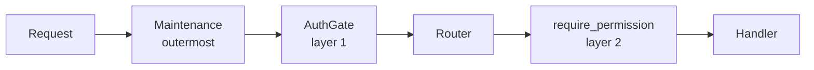

# SPEC_0300: Cabinet v0.30.0 authentication (P8 A1)

Status: draft awaiting the owner's approval, 21 September 2026. Nothing is built. The owner's working copy is a claude.ai doc; this file is the snapshot reviewers read.

## Status and scope

**Draft for the owner's approval. No code, branch, migration, or commit until it is approved.** This is the contract for v0.30.0, roadmap Phase 7, P8, part A1: one admin, database-backed sessions, scoped API tokens, a deny-by-default gate, photos behind the same check, and the three approved API renames.

**Precedence.** Where sources disagree, the newest wins: the fourth-review answer (taken as written), then the third, second, and first reviews, then the base decisions in the handoff. docs/security.md at cd669a2 already matches the fourth review. Where the code at main forces a change, the section on plan versus code says so.

**In scope:** the `cabinet_auth` schema and its Alembic chain; credential-free archives; the restore marker; the two-layer gate; CSRF; sessions, tokens, scopes; setup; throttles and the known-device cookie; the admin's maintenance tools (in the app and in the container); photos through `auth_request`; the host and origin settings; the API docs page turned off; the renames; the new dependency; docs, CI, Playwright.

**Out of scope:** A2 (OIDC and trusted-header mode, v0.31.0), more accounts and roles, the share view (P9), any switch that turns login off, caching the photo check, the API call counter (tabled), and the two left-alone API oddities (`/api/grades` and `/api/tags` outside `/api/reference/`, `POST /api/items/bulk`).

**Words used exactly.** *Session* means a signed-in browser. *Token* means an API token. *Principal* means whichever one a request carries. *Admin* means the one account. *Anonymous* means neither.

## Plan versus code at main (cd669a2)

**The plan holds against the code, with nine mismatches. Two change a settled rule (M1, M2), and each change is stated in this spec.** Checked read-only by four agents plus spot reads. They covered `main.py`, the maintenance, restore, backup, and schema services, health, conftest, both Dockerfiles, the entrypoint, nginx, compose, the stack file, CI, the scripts, `frontend/src/api`, and all 100 API operations probed from `app.openapi()` on FastAPI 0.141.1 and Starlette 1.6.0.

### Mismatches

| # | The plan says | The code says | What this spec does |
| --- | --- | --- | --- |
| M1 | CI sets `PUBLIC_ORIGINS=http://proxy`, `ALLOWED_HOSTS=proxy,localhost` (fourth review, item 7) | CI's Playwright runs on the runner host against `http://localhost` (`playwright.config.ts` default; ci.yml L213-220). Only `capture.cjs` and local dockerised runs use `http://proxy` | CI sets `PUBLIC_ORIGINS=http://localhost` and `ALLOWED_HOSTS=localhost`. The local `.env.example` lists both origins. **Changes a settled value; the code forces it** |
| M2 | `none` is allowed on `/docs/oauth2-redirect` | It is FastAPI's default path, outside `/api/`, so nginx never forwards it (it falls to `try_files`). It is unused | Removed (`swagger_ui_oauth2_redirect_url=None`). `With the docs page also off (C4), the one framework route left is /api/openapi.json`. **Narrows a settled list; the code forces it** |
| M3 | Playwright's existing export and backup downloads keep passing | There are no download tests. The backup test clicks "Back up now" and restores | New: one Playwright test downloads the CSV export and `backup.zip` while signed in |
| M4 | `check_sources.py` needs a token | It calls adapters in-process through `SessionLocal` and makes no HTTP call to Cabinet | No change to it |
| M5 | Inspect reads the dump's table of contents | `inspect()` never runs `pg_restore --list`. `_dump_tables` does (regex `TABLE public (\S+)`), but only inside `restore_database` | New `backup.list_dump(path)` (a monkeypatch point) used by inspect, after extracting `db.dump` to staging |
| M6 | The renames reach about 30 test sites | 36: A 11 in 7 files, B 2, C 23 in 7 files (4 are shared helpers). A's tests must move to the multi-step `/api/imports` flow, where an existing id is a duplicate rather than a skip | Full list in section 8 |
| M7 | The journal goes `preparing` then `swapping` | Confirmed, and `preparing` is written before the safety backup (restore.py:659), not just before the database. A crash after the leftover-table DROP commits also reads "Nothing was changed" | The marker (section 2) covers both |
| M8 | Stack file: the proxy never joins egress | Today the proxy joins `cabinet-egress` (docker-stack.yaml L78-80), and L127-128 and deployment.md L303-310 tell operators to swap that network for a shared overlay | Section 7 rewrites both |
| M9 | CI makes about 30 anonymous curl calls | 38 curl call sites | All 38 listed for the token helper in section 9 |

### Confirmed, and worth knowing while building

- 21 `include_router` calls (from 19 modules). `MaintenanceMiddleware` is the only middleware (main.py:119). `redoc_url=None`. `redirect_slashes` is on. No `include_in_schema`, `app.mount(`, or `add_api_route` anywhere.
- `app.routes` holds 21 `_IncludedRouter` wrappers and 3 plain routes, so the OpenAPI document is the only complete list (100 operations).
- Startup: `recover()` (main.py:96), then migrations under `pg_advisory_xact_lock(7340512)` in one transaction (schema.py:97).
- uvicorn has no `--forwarded-allow-ips` (Dockerfile:64). nginx appends `$proxy_add_x_forwarded_for` and sets `X-Forwarded-Proto $scheme` in all four `/api` locations. No `Cache-Control` is set anywhere in nginx.
- `pg_restore` today runs `--clean --if-exists --no-owner --single-transaction` (restore.py:562). The leftover-table drop already filters `schemaname = 'public'` (restore.py:550). `pg_dump` runs `--format=custom` (backup.py:158). `backup.sh` runs `pg_dump -Fc`; `restore.sh` runs `pg_restore --clean --if-exists`.
- `/api/health` uses the module-level engine, not `get_db`, and skips the database during maintenance. Its tests must patch it.
- conftest's `TestClient(app)` uses `http://testserver`. It must become `https://testserver`.
- `app_settings.get_setting` raises `KeyError` for keys outside `DEFAULTS`. The restore marker is written and read by direct ORM, never through `get_setting`.
- Documents send `Cache-Control: private, max-age=3600` (documents.py:178). This spec changes that to `private, no-cache`.
- `/api/metrics` answers 404 unless `metrics_enabled`. That stays; the gate runs first.
- The restore upload reads `request.stream()` (routers/restore.py:94). The gate never reads a body.
- `DELETE /api/items/{id}` purges without `?permanent=true` when the item is already in the trash. Its admin check is `permanent or item.deleted_at is not None`.
- `frontend/src/api/client.ts` `req()` is the only `fetch`. Five plain links hit the API directly (backup downloads, the CSV and XLSX exports, `/api/metrics`), and all send `same-origin`.
- No CLI module exists. `argon2-cffi` appears nowhere in code or lockfiles.
- Versions pinned: fastapi 0.141.1, starlette 1.6.0, uvicorn 0.53.0, sqlalchemy 2.0.54, alembic 1.20.0, nginx 1.31-alpine, postgres 16-alpine.

## 1. Data model: the cabinet_auth schema

**Credentials live in their own Postgres schema, `cabinet_auth`, with their own Alembic chain. No foreign key crosses between it and `public` in either direction.** The collection never stores a user id; the audit log records who did what, inside `cabinet_auth`.

### Tables (auth revision `a0001`)

| Table | Columns | Notes |
| --- | --- | --- |
| `claim` | `id` smallint PK with `CHECK (id = 1)`, `claimed_at`, `user_id` FK users | The singleton. Its insert is the atomic claim on Postgres and SQLite alike. Row present means claimed |
| `users` | `id`, `username` String(64) unique (stored lowercased), `password_hash` String(255) nullable (A2 identities), `role` String(16) `CHECK IN ('admin','editor','viewer')`, `is_active` bool, `external_issuer` / `external_subject` String(255) nullable, unique together, `created_at`, `last_login_at`, `password_changed_at` | Only the admin is ever created in A1 |
| `sessions` | `id`, `secret_hash` bytes(32) unique, `user_id` FK, `auth_method` String(16) (`password` in A1; A2 adds `oidc`, `header`), `created_at`, `last_seen_at`, `expires_at` (created + 7 days), `user_agent` String(256), `address` String(45), `revoked_at` | Idle limit is `last_seen_at` + 1 day, checked in code |
| `api_tokens` | `id`, `public_id` String(10) unique, `secret_hash` bytes(32), `user_id` FK, `name` String(100), `scope` String(8) `CHECK IN ('read','write','metrics')`, `created_at`, `last_used_at`, `expires_at` nullable, `revoked_at` | One scope per token (Q4) |
| `known_devices` | `id`, `secret_hash` bytes(32) unique, `user_id` FK, `created_at`, `expires_at` (created + 7 days), `failures` int | See section 5 |
| `audit_log` | `id`, `at`, `actor_user_id` FK nullable `ON DELETE SET NULL`, `actor_label` String(64), `actor_kind` String(12) (`session`, `token`, `anonymous`, `cli`, `system`), `action` String(40), `target` String(200), `detail` JSON, `address` String(45), `user_agent` String(256) | 180 days or 50,000 rows, pruned hourly |

Throttle counters are **not** a table: they live in memory (section 5, the owner's cut of 21 September 2026).

Foreign keys inside `cabinet_auth` are allowed; none reaches `public`.

### The chain

- `backend/alembic_auth/` (`env.py`, `script.py.mako`, `versions/a0001_initial.py`) with its own ORM base: `AuthBase` over `MetaData(schema="cabinet_auth")` in `app/models/auth.py`. The collection's `alembic/env.py` keeps `target_metadata = Base.metadata`, which never includes `AuthBase`, so autogenerate on either chain cannot see the other.
- `alembic_auth/env.py` runs `CREATE SCHEMA IF NOT EXISTS cabinet_auth`, then `configure(version_table="alembic_version", version_table_schema="cabinet_auth", include_schemas=True, include_name=<cabinet_auth only>)`.
- `services/schema.py` gains `upgrade_auth_to_head`. `upgrade_to_head` runs the collection chain, then the auth chain, **inside the same transaction and the same `pg_advisory_xact_lock(7340512)`**. `AUTO_MIGRATE=false` skips both.
- Auth migrations never touch `public`; collection migrations never touch `cabinet_auth`. A test greps both `versions/` folders for the other schema's name.
- `/api/health` (full body) reports `schema` as today and adds `auth_schema: {current, expected, status}` from the same `describe()`.
- **SQLite tests:** the test engine uses `execution_options(schema_translate_map={"cabinet_auth": None})`; `create_all` runs over both metadatas.

### Tests

- A metadata test finds no foreign key between `Base.metadata` and `AuthBase.metadata`.
- On real Postgres (local, then CI): a fresh database gets both chains; **a v0.29.1 database migrates to head** (the upgrade test, now required); the auth chain goes up, down, and up again; restoring an archive at `0021` leaves `cabinet_auth` and its version untouched.

## 2. Backups and restore

**An archive never holds a credential, and a restore never adds, changes, or revokes one.** There is no credentials epoch. A session or token is judged only by its own row.

### Dumps leave the schema out

| Path | Change |
| --- | --- |
| `backup.dump_database` (download, scheduled, pre-restore) | `[pg_dump, "--format=custom", "--exclude-schema=cabinet_auth"]` |
| `scripts/backup.sh:16` | `pg_dump -Fc --exclude-schema=cabinet_auth` |
| Manifest | Adds `"auth_excluded": true`. Informational only; the check below is the guarantee |

### Restores take only the collection

| Path | Change |
| --- | --- |
| `restore.restore_database` | `[pg_restore, "--schema=public", "--clean", "--if-exists", "--no-owner", "--single-transaction", ...]` |
| Leftover-table drop (restore.py:550) | Keeps `schemaname = 'public'`, with a comment saying `cabinet_auth` must never be dropped |
| `scripts/restore.sh` | Adds `--schema=public`. Before restoring, it runs `pg_restore --list` and refuses, naming the reason, if any line holds `cabinet_auth` |
| After the restore | Only the collection chain migrates. The auth chain's tables and version were never touched |

### Archives holding credentials are refused

`check_archive` gains a last step: extract `db.dump` into `.restore-staging/<id>.dump`, run `backup.list_dump(path)` (new, `pg_restore --list`, a monkeypatch point like `dump_database`), and answer **422** "This archive contains sign-in data, which Cabinet never restores. It was not made by Cabinet's own backup." if any entry is in schema `cabinet_auth`. The inspect summary adds one line: "Your sign-in, sessions, API tokens, and audit log are kept."

An archive from before v0.30.0 has no `cabinet_auth` objects, passes, and cannot reopen setup.

### The restore marker closes the crash window

The order of `_run`, with the new steps in bold:

1. Busy and movability checks, typed confirmation (unchanged).
2. Journal `preparing` (unchanged, restore.py:659), then the safety backup, auth excluded.
3. Unpack into `.restore-new` (unchanged).
4. **Write `app_settings` row `restore_marker` = a fresh `secrets.token_hex(16)` by direct ORM, commit. Journal phase `database` with `marker`.**
5. **Journal `dropped` = the leftover public tables' names, then drop them.**
6. `pg_restore --schema=public ...`, then journal `swapping` (unchanged).
7. Collection migrations only, then the file swap, `_finish` (unchanged order).
8. **Audit `restore_finished`** (actor, archive name, outcome). The `restore_started` event was written before step 1; both survive, since the audit log is not restored.

`pg_restore --clean` replaces `app_settings` wholesale, so the marker survives only if the database was not replaced. The archive cannot hold that id. A successful restore leaves no marker row.

`recover()` for each journal phase:

| Journal | Database check | Recovery | Outcome recorded |
| --- | --- | --- | --- |
| `preparing` | not consulted | clear `.restore-new` | Nothing was changed |
| `database` | marker present, nothing dropped | delete marker, clear `.restore-new` | Nothing was changed |
| `database` | marker present, tables dropped | clear `.restore-new` | Partial: names the tables and the safety backup (the `PartialDatabase` wording) |
| `database` | marker absent | leave migrations to the normal startup step, roll the swap forward from `.restore-new` | Restored, finished after a restart |
| `database` | unreachable after `wait_for_database` (60 s) | keep the journal; **the process stays in maintenance** until a restart resolves it | none yet |
| `swapping` | not consulted | roll the swap forward (today's logic) | Restored |

The last `database` row is new behaviour not written in the fourth review: with the journal unresolved, serving the collection could mix an old database with new files, so the backend answers 503 (health answers `restoring`) until it can decide. `recover()` needs the database for the `database` phase, so it calls `schema.wait_for_database` first.

### The restore grant

The session that calls `POST /api/restore/{id}/run` gets an in-memory grant: the SHA-256 of its session secret plus the restore id. It is **consulted only while maintenance is on**, for `GET /api/restore/status` only, with no database access. Any other caller then gets **401**. It expires 10 minutes after the restore ends, and 2 hours after issue at the latest. Outside maintenance, restore status is an ordinary admin route, and since sessions survive a restore, the progress page keeps working afterwards.

### Tests

- pytest records `pg_dump` and `pg_restore` argument lists and asserts `--exclude-schema=cabinet_auth` and `--schema=public`.
- Inspect with a stubbed `list_dump` holding a `cabinet_auth` entry answers 422.
- `recover()` called directly for each journal row above, including unreachable (journal kept, maintenance on) and a normal restore leaving no marker.
- A session, a read token, and a revoked token exist; a restore runs (monkeypatched); the session and token answer 200, and the revoked token 401.
- CI on real Postgres: claim, mint a token, back up; `pg_restore --list db.dump` has no `cabinet_auth` line; restore in-app and with `restore.sh`; the password and the token still work.

## 3. The gate: two layers, deny by default

**Anonymous callers are refused on the raw method and path before routing; each route's declared permission is checked after routing; a route that declares none is refused.** Completeness is tested against the OpenAPI document, never `app.routes`.

In `main.py`, `add_middleware(AuthGate)` comes first and `add_middleware(MaintenanceMiddleware)` last, because Starlette runs the last-added first. A test asserts the order in `app.user_middleware`.

### Layer 1: `app/auth/gate.py`, plain ASGI

It reads only method, raw path, and headers, never the body. Non-HTTP scopes pass through. Database lookups run in a worker thread (`anyio.to_thread`), never on the event loop.

1. **During maintenance** (only the two exempt routes reach it): `GET /api/health` passes with no principal and no lookup. `GET /api/restore/status` passes only if the session cookie's hash matches the restore grant; otherwise 401. No database call either way.
2. **Find the credential.** `Authorization: Bearer cabinet_...` is a token: look up `public_id`, compare the secret's SHA-256 with `hmac.compare_digest`. A present but invalid Cabinet token is 401 with no fallback to the cookie. Any other `Authorization` value is ignored and the request is treated as a cookie request. Tokens are never read from a query string or a cookie. Otherwise, look up the session cookie.
3. **Anonymous** passes only on these exact (method, raw path) pairs, compared as strings: `GET /api/health`, `GET /api/auth/state`, `POST /api/auth/setup`, `POST /api/auth/login`. Everything else is **401** with `Cache-Control: no-store`, including unknown paths, HEAD, OPTIONS, trailing-slash variants, and the photo check.
4. **The one framework route**, `GET /api/openapi.json`, is matched by exact path: a session passes, a token gets **403**. Layer 2 never runs for it. There is no `/api/docs`, `/api/redoc`, or `/docs/oauth2-redirect` (`docs_url`, `redoc_url`, and `swagger_ui_oauth2_redirect_url` are all `None`); those paths are unknown, so 401 anonymously and 404 signed in.
5. **CSRF** for cookie requests (section 4).
6. **Record the principal** on `scope["state"]["principal"]`: user id, username, kind (`session` or `token`), scope, session or token id. `last_seen_at` and `last_used_at` are written at most once a minute.
7. **On the way out**, any `/api/` response without `Cache-Control` gets `private, no-store`.

### Layer 2: `app/auth/permissions.py`

`FastAPI(dependencies=[Depends(require_permission)])` runs for every matched API route and reads `request.scope["endpoint"]`. Each handler carries `@permission("public" | "read" | "write" | "admin", metrics_ok=False)`, written directly above `def`, below the router decorator, so the attribute is on the registered function.

| Principal | public | read | write | admin | `GET /api/stats/collection` | `GET /api/metrics` |
| --- | --- | --- | --- | --- | --- | --- |
| Anonymous | yes | 401 | 401 | 401 | 401 | 401 |
| Admin session | yes | yes | yes | yes | yes | yes |
| `write` token | yes | yes | yes | 403 | yes | 403 |
| `read` token | yes | yes | 403 | 403 | yes | 403 |
| `metrics` token | yes | 403 | 403 | 403 | yes | yes |

No token ever reaches an `admin` route. An undeclared handler gets 403 and logs an error naming it; under pytest it raises instead, so the completeness test fails by name. Nothing touches `_IncludedRouter`.

**Classes after the renames:** 99 existing operations (100 less `POST /api/items/import`) plus 15 new auth routes (section 5). The 99: public 1, read 37, write 45, admin 16. Two carry `metrics_ok`: `GET /api/stats/collection` (read) and `GET /api/metrics` (admin, so a read token gets 403, as docs/security.md's table says). A `metrics` token on health gets the full body, like any principal. The full route-by-route table is in the second tab.

**Decisions inside the table:**

- `GET /api/pcgs/cert/{cert}`, `GET /api/numista/search`, `GET /api/numista/types/{id}` are **write**, because they spend quota.
- `DELETE /api/items/{id}` is write, and the handler calls `require(request, "admin")` when `permanent or item.deleted_at is not None`. `POST /api/trash/purge` and `DELETE /api/trash` are admin. That is the "delete for good" row.
- `GET /api/settings`, `/api/backups`, `/api/backup.zip`, `/api/backups/{name}`, the alerts test, restore, and dashboard `PUT`/`DELETE` are admin. `GET /api/dashboard/layout` is read.
- `GET /api/health`: public. The handler returns the full body when any principal is present and `{"status": ...}` otherwise.

### Tests (`tests/test_gate.py`)

- **Anonymous matrix:** every path in `app.openapi()["paths"]`, with its own methods plus HEAD and OPTIONS, each also with a trailing slash, plus `/api/openapi.json`, `/api/docs`, and an unknown path. Everything is 401 except the four allow-listed pairs.
- **Completeness:** every OpenAPI operation, called with an admin session and placeholder path values, reaches `require_permission` with a declared permission.
- **Scope matrix:** every operation for each token scope gives what the table says. The metrics case also pins `CollectionStats`' nine keys.
- **Plain routes:** the only top-level `starlette.routing.Route` is `/api/openapi.json`.
- **Source lint** (a pytest over `app/`): no `include_in_schema=False`, no `app.mount(`, no `add_api_route` outside `routers/`, and `docs_url`/`redoc_url` stay `None`.
- **Ordering:** middleware order; during maintenance an ordinary route is 503 before the gate runs; health does no credential lookup (the session store patched to raise); restore status answers the granted session and 401s another, with no database call.
- **conftest:** `client` becomes the admin session over `https://testserver`, sending `Sec-Fetch-Site: same-origin` by default, so the 502 existing tests need only the rename edits. New fixtures: `anon_client` and `token_client(scope)`.

## 4. CSRF: fails closed, every method

**A cookie-authenticated `/api/` request of any method passes only with `Sec-Fetch-Site: same-origin`, or with no `Sec-Fetch-Site` and an `Origin` (or the `Referer`'s origin) exactly matching an entry in `PUBLIC_ORIGINS`.** Anything else is 403 "Cross-site request refused.": `cross-site`, `same-site`, `none`, or no evidence at all. There is no list of sensitive GETs to keep up to date.

- **`none` is accepted** (a typed address, a bookmark) only on `GET /api/openapi.json` and `GET /api/documents/{document_id}/file`.
- **The photo check** (`GET /api/auth/photo`) refuses only `cross-site`: it has no side effects, and "open image in new tab" sends `none`.
- `Origin: null` counts as absent. Origins compare after lowercasing scheme and host, with default ports removed (`https://x:443` equals `https://x`).
- **Bearer requests are not CSRF-checked.** A cross-site page cannot set that header, and Cabinet answers no CORS preflight.
- No route changes method, so the approved API pass is not widened.
- **The app already complies:** every `req()` call, the five plain API links, and document `img` and `a` elements are same-origin.

**Tests:** a table over every GET (and every other method) in the OpenAPI document with a session cookie: `same-origin` passes; `cross-site`, `same-site`, and missing each give 403; `none` passes only on the two routes; a read token passes the same requests. A cookie POST whose Origin is only in `ALLOWED_HOSTS` (for example `http://localhost` when it is not in `PUBLIC_ORIGINS`) is 403.

## 5. Credentials: passwords, sessions, tokens, throttles

### Passwords

- Argon2id through `argon2-cffi`, pinned in code: time 3, memory 65536 KiB, parallelism 4. `check_needs_rehash` on each success.
- 12 to 256 characters, no composition rules. Username 1 to 64 characters, stored lowercased; the sign-in compare is case-insensitive.
- One failure answer for an unknown user and a wrong password (401 "Wrong username or password."), with a dummy verify for an unknown name so timing matches.
- At most two verifications at once (`threading.BoundedSemaphore(2)`, 128 MiB worst case inside the 1024M limit). Hashing runs in a worker thread. Waiting more than 10 seconds for a slot gives 503 with `Retry-After`.
- Throttle checks run before any Argon2 work.
- No password, setup code, or token secret in a log line, exception, audit detail, or argv.

### Sessions

- Secret: 32 random bytes, base64url. Stored as SHA-256. Never minted from a caller's value. Rotated on sign-in and password change.
- Cookie `__Host-cabinet_session` (`Secure; HttpOnly; SameSite=Lax; Path=/`, no `Domain`, no `Max-Age`). With `AUTH_INSECURE_HTTP` it is `cabinet_session` without `Secure`, since the `__Host-` prefix requires Secure.
- Valid while not revoked, `now < expires_at` (created + 7 days), and `now < last_seen_at + 1 day`, with the account active.
- A password change needs the current password, rotates the current session, and revokes every other session and every known device.

### API tokens

- Format `cabinet_<public_id>_<secret>`: `public_id` is 10 lowercase base32 characters, `secret` is 43 base64url characters (256 bits). Regex `cabinet_[a-z2-7]{10}_[A-Za-z0-9_-]{43}`.
- Stored as the SHA-256 of the secret, looked up by `public_id`, compared with `hmac.compare_digest`. A code comment says why not Argon2: a 256-bit random secret needs no work factor.
- One scope per token: `read`, `write` (includes read), or `metrics`. A name (1 to 100 characters), an optional expiry (30, 90, or 365 days, or none), a last-used time, revocation. Shown once, in the creation response only. At most 50 live tokens.
- A token is 401 when unknown, revoked, expired, or its user is inactive.

### The known-device cookie

- A successful password sign-in sets `__Host-cabinet_device` (`HttpOnly; Secure; SameSite=Strict; Path=/; Max-Age=604800`; named `cabinet_device` without Secure under `AUTH_INSECURE_HTTP`) to 32 random bytes. Only the SHA-256 is stored in `known_devices`, with user, expiry, and failures.
- A matching, unexpired row **for the user being signed in as** lifts the per-username and per-address delays, and nothing else.
- Each failed sign-in presenting it adds one failure; after 5 the row is deleted. A successful sign-in replaces row and cookie.
- Every row for the user is deleted on a password change, the reset command, and "sign out everywhere".
- It never authenticates any route.

### Throttles (constants in code, not settings)

| Bucket | Free attempts | Then | Lifted by a known device |
| --- | --- | --- | --- |
| `user:<name>` | 5 failures | next attempt allowed after 2^(n-5) s, capped at 60 s; never a lock | yes |
| `addr:<ip>` | 20 failures in 15 min | same curve, capped at 60 s | yes |
| Global sign-in | 60 password checks a minute | 429 | no |
| `setup:<ip>` | 5 attempts in 15 min | 429 until the window passes | no |

An attempt before a bucket's `next_allowed_at` is 429 with `Retry-After`, answered before any Argon2 work. A bucket's failures reset after 15 minutes without one, and on a success. **Every counter lives in memory** (the owner's cut of 21 September 2026): a bounded map of at most 10,000 keys, oldest evicted first, entries dropped 15 minutes after their last failure. A restart clears them; restarting needs host access, which is already the proof of ownership. Behind Swarm ingress every client shares one address, so the address bucket is coarse by design: the known-device cookie and the username delay carry the load.

### Audit log

- Events: `setup`, `sign_in`, `sign_in_failed`, `sign_out`, `password_changed`, `username_changed`, `password_reset`, `sessions_revoked_all`, `tokens_revoked_all` (the last three can come from the CLI), `session_revoked`, `token_created`, `token_revoked`, `backup_downloaded`, `restore_started`, `restore_finished`.
- A failed username is recorded only if it is the account's name; otherwise `unknown`.
- One row per event, no merging (the owner's cut). Kept 180 days or 50,000 rows, whichever is smaller, pruned in the hourly loop under `maintenance.scheduled_task()`.
- Each event is also one JSON line on stdout (logger `cabinet.audit`).

### The new routes (`routers/auth.py`)

| Route | Permission | Answer |
| --- | --- | --- |
| `GET /api/auth/state` | public | `{"setup_required": bool}`, `no-store`. Reads the database, so 503 during maintenance |
| `POST /api/auth/setup` | public | `{code, username, password}` gives 201 and sets both cookies; 403 bad code; 409 already claimed; 429 |
| `POST /api/auth/login` | public | `{username, password}` gives 200 `{username, previous_sign_in_at, failed_since_previous}` and sets both cookies; 401; 429; 503 |
| `POST /api/auth/logout` | admin | 204, revokes this session, clears the cookie |
| `GET /api/auth/me` | read | `{username, role, via: "session" \| "token", scope}` |
| `POST /api/auth/password` | admin | `{current_password, new_password}` gives 204 and a new cookie |
| `POST /api/auth/username` | admin | `{current_password, username}` gives 204; audited |
| `GET /api/auth/sessions` | admin | list, with `current: true` on this one |
| `DELETE /api/auth/sessions/{id}` | admin | 204 |
| `DELETE /api/auth/sessions` | admin | sign out everywhere, this session included, and every known device |
| `GET /api/auth/tokens` | admin | list, no secrets |
| `POST /api/auth/tokens` | admin | 201 with `token` once |
| `DELETE /api/auth/tokens/{id}` | admin | 204 |
| `GET /api/auth/audit` | admin | `?before=<id>&limit=` (at most 200), newest first |
| `GET /api/auth/photo` | read | 204 (section 7) |

Status codes throughout: 401 for a missing, invalid, expired, revoked, or disabled credential; 403 for a valid one without permission; 429 with `Retry-After`. Auth, token, password, and backup responses are `no-store`.

**Tests:** hashing parameters and rehash; uniform failure; the semaphore timeout; each throttle curve, the 10,000-key bound, and that a known device lifts only its two; a forged, expired, or other-user device cookie does not; the sixth failure with it is delayed; password change, reset, and sign-out-everywhere make it inert; session idle and absolute expiry (time frozen); rotation; token format, lookup, expiry, revocation, and the non-Cabinet `Authorization` fallthrough; Bearer beats a cookie with no fallback; the audit label rule; the login answer's failed-since count; a username change needs the current password.

## 6. Setup, the claimed marker, and the reset command

**An unclaimed instance serves the static app and the four anonymous routes, nothing else, and is claimed exactly once with a code of at least 128 bits.** Unclaimed means no row in `cabinet_auth.claim`.

### The setup code

- At startup, after migrations, if the instance is unclaimed:
  - `SETUP_CODE` is used if set **and** the claimed marker file does not exist.
  - Otherwise a code is generated: 20 random bytes as base32, shown in groups of four. The log says once: "Cabinet is not set up yet. Open it in a browser and enter this setup code: XXXX-XXXX-...". Nothing else logs it.
- The code is held in memory only. A restart generates a new one unless `SETUP_CODE` applies.
- `SETUP_CODE` must carry at least 128 bits, or the backend refuses to start. The estimate is length times log2 of the smallest alphabet holding every character (hex 16, base32 32, base64url 64, else 95). So 32 hex characters pass, and `openssl rand -hex 16` is the documented generator.
- The compare strips spaces and dashes, uppercases a generated code, and uses `hmac.compare_digest`.

### The claim

- `POST /api/auth/setup` checks the `setup:<ip>` throttle, then the code, then the password rules, then in **one transaction** inserts the admin user and `claim(id=1)`. A duplicate-key error is 409 "Cabinet is already set up." This is atomic on Postgres and SQLite alike, so pytest tests it; CI also races two real requests.
- On success: audit `setup`, a session and a known device (as a sign-in), the setup code dropped from memory, and the **claimed marker** written: `auth_claimed` on the state volume, beside `SECRET_KEY_FILE`.
- Once the marker exists, `SETUP_CODE` from the environment is ignored for good. If the database is claimed but the marker is missing (a lost state volume), startup writes it.
- An in-app restore needs the admin, so it cannot run before the claim. A fresh machine is claimed first, then restored in-app, or restored with `restore.sh` in either order, since neither touches `cabinet_auth`.

### Looking after the one account

**In the app** (Settings, Account, admin session only):

- Change the password (current password required; every other session and every known device ends).
- Change the username (current password required).
- See live sessions with their device, address, and last use; end one, or sign out everywhere.
- Create, list, and revoke API tokens; a new token is shown once.
- Read the audit log.
- After each sign-in, a notice when there were failed attempts: "3 failed sign-ins since your last visit on 20 September", linking to the audit log.
- The sign-in and setup forms work with password managers (`autocomplete` `username`, `current-password`, `new-password`), and warn in plain words when the page is not in a secure context.

**In the container**, for when the app can't be reached (`docker compose exec backend python -m app.cli <command>`, or `docker exec` into the task on a Swarm). New `backend/app/cli.py`:

| Command | Does | Audit event |
| --- | --- | --- |
| `reset-password` | Prompts twice with `getpass` (never argv). Sets the hash, ends every session and known device, clears the in-memory throttles of the running process (through a flag file on the state volume the gate checks), leaves tokens alone | `password_reset` |
| `sign-out-everywhere` | Ends every session and known device. For a lost laptop | `sessions_revoked_all` |
| `revoke-tokens [--name NAME]` | Revokes every token, or the one with that name | `tokens_revoked_all` or `token_revoked` |
| `status` | Claimed or not, the admin's name, last sign-in, failed sign-ins in the past 24 hours, live sessions and tokens with last use. No secrets | none |

- Every command refuses when unclaimed ("use the setup page"), and runs as the `cabinet` user when started as root (the entrypoint's `setpriv` hand-off), so files keep their owner. Each audit row has actor kind `cli`.
- **Deliberately absent:** any command that un-claims the instance or deletes the admin. That would reopen setup to whoever reaches it first; if ever truly needed, it is a documented database operation, not a tool.

### Frontend boot

The app calls `GET /api/auth/state`, then `GET /api/auth/me`. `setup_required` shows `/setup`. A 401 shows `/login?next=<path>`. A 503 shows "A restore is running" and retries every 5 seconds.

**Tests:** a weak `SETUP_CODE` stops startup; the marker makes the environment code inert; two concurrent claims give one 201 and one 409; a wrong code is 403 and throttled; after the claim, the setup route is 409 and `state` says false; each CLI command refuses when unclaimed, does what its row says, and audits; reset-password never reads argv.

## 7. Proxy, network, and deployment

**nginx believes no forwarded header from anyone, and the backend believes none unless the operator says so.** Cabinet pins no network ranges: addressing belongs to the operator's infrastructure (Q3). Every setting below is checked at start-up, and a bad value stops that service with a message naming the variable.

### Settings

| Variable | Read by | Default | Rule |
| --- | --- | --- | --- |
| `PUBLIC_ORIGINS` | backend (CSRF), proxy (default for `ALLOWED_HOSTS`) | none: required | Exact browser origins `scheme://host[:port]`, comma-separated. The only CSRF allow-list |
| `ALLOWED_HOSTS` | proxy | hosts of `PUBLIC_ORIGINS` | Host names (no ports) rendered into `server_name`. Add internal names such as `cabinet_proxy`, `localhost`, a LAN name. Any other Host gets 444 |
| `FORWARDED_ALLOW_IPS` | backend (uvicorn's own) | unset: uvicorn's `127.0.0.1`, so the backend sees nginx as the client | Optional. CIDRs or addresses only; `*` is refused. Listing where nginx reaches the backend from makes the audit log show nginx's peer (Traefik, or a LAN client on the published port); whatever it lists must hold nothing but nginx |
| `SETUP_CODE` | backend | unset (generated, logged) | At least 128 bits. Ignored once the claimed marker exists |
| `AUTH_INSECURE_HTTP` | backend | false | Cookies without `Secure` and without `__Host-`. Accepted only when every `PUBLIC_ORIGINS` entry is `http`, with a warning on every start; with any `https` origin, start-up fails |
| `CABINET_PORT` | compose, stack file | compose 80, stack none | The published port |

`TRUSTED_PROXIES` is cut (the owner's decision of 21 September 2026): nothing in A1 needs a forwarded client address or scheme, and behind Swarm ingress there is none to recover. A2's trusted-header mode brings proxy trust back, with a shared secret or signed assertion rather than an address range.

Not variables: session lifetimes, device-cookie limits, throttle curves, the schema name.

### nginx (`proxy/`)

- **New `proxy/40-cabinet-hosts.sh`**, copied to `/docker-entrypoint.d/` by `frontend/Dockerfile`. It validates `ALLOWED_HOSTS` (or derives it from `PUBLIC_ORIGINS`) and writes `/etc/nginx/cabinet/hosts.conf` (`server_name ...;`). An invalid value exits non-zero, so the container stops. To confirm in the build: the base image's `/docker-entrypoint.sh` stops on a failing script.
- **Hosts.** A `default_server` answers 444. The real server lists `ALLOWED_HOSTS`.
- **Towards the backend, one include (`cabinet-proxy.conf`) in every proxied location, overwriting and never appending:** `Host $host`, `X-Forwarded-For $remote_addr`, `X-Real-IP $remote_addr` (the immediate peer), `X-Forwarded-Proto $scheme`, and identity headers blanked from every peer: `Remote-User`, `X-Forwarded-User`, `X-Forwarded-Email`, `X-Forwarded-Preferred-Username`, `X-Forwarded-Groups`, `X-authentik-username`, `-groups`, `-email`, `-name`, `-uid`, `-jwt`, `-meta-jwks`, `-meta-outpost`, `-meta-provider`, `-meta-app`, `-meta-version`, `X-Auth-Request-User`, `-Email`, `-Preferred-Username`, `-Groups`, `-Access-Token`. nginx cannot wildcard a header name, so the list is explicit; the backend reads none of them in A1 either. `underscores_in_headers` stays off. No realip module, no `geo`, no `map` of trusted peers.
- **Security headers** move into `cabinet-headers.conf`, included wherever a location sets its own `add_header` (the v0.23.1 rule).
- **Photos:** `auth_request /_auth/photo;` at server level; `auth_request off;` in `location /` and every `/api` location. `location = /_auth/photo { internal; auth_request off; proxy_pass http://backend:8000/api/auth/photo; proxy_pass_request_body off; proxy_set_header Content-Length ""; include cabinet-proxy.conf; }`. `/photos/` adds `Cache-Control: private, no-cache`. A failed check other than 401 or 403 becomes nginx's 500, so `/photos/` maps 500 to a named location answering **503 with `Retry-After: 5`**. No cache of the check.
- The dot-name 404 under `/photos/` stays.

### The photo check

`GET /api/auth/photo` answers 204 to a session or a read or write token, 403 to a metrics token and to `Sec-Fetch-Site: cross-site`, 401 anonymously, and 503 during maintenance. With `last_seen_at` written at most once a minute, a page of thumbnails costs one indexed lookup each. **Measured in its stage:** a collection page of 50 thumbnails and the photo mosaic, time per check and page load, with and without. Caching is only proposed if the numbers ask for it, and only with a reviewed key.

### Backend

- `Dockerfile` CMD is unchanged; uvicorn reads `FORWARDED_ALLOW_IPS` from the environment (to confirm on 0.53.0 in the build).
- **Secure by default without it:** left unset, the backend sees nginx's address as the client. Nothing security-relevant depends on the forwarded values: `Secure` cookies come from `AUTH_INSECURE_HTTP`, CSRF from `PUBLIC_ORIGINS`. Only the audit log's address and the per-address throttle lose precision, and behind Swarm ingress they have no real address to begin with.
- `app/config.py` validates `PUBLIC_ORIGINS`, `FORWARDED_ALLOW_IPS` (syntax, no `*`), `SETUP_CODE`, and `AUTH_INSECURE_HTTP`. There is no own-address self-check.

### Networks

| File | Change |
| --- | --- |
| `docker-compose.yaml` | No network pinning. The backend gets `PUBLIC_ORIGINS`, `SETUP_CODE`, `AUTH_INSECURE_HTTP`, and an optional `FORWARDED_ALLOW_IPS` from `.env`. The proxy gets `PUBLIC_ORIGINS` and `ALLOWED_HOSTS`. `ports: "${CABINET_PORT:-80}:80"` |
| `deploy/docker-stack.yaml` (an example, not the owner's) | `cabinet-internal` (internal): db, backend, proxy. `cabinet-egress`: **backend only**, with a comment never to replace it with a shared network. The proxy leaves egress and joins Traefik's network only when there is one (commented example). No subnets pinned. `ports: "${CABINET_PORT:?set CABINET_PORT}:80"` |
| `.env.example` | `PUBLIC_ORIGINS=http://localhost,http://proxy`, `ALLOWED_HOSTS=localhost,proxy`, `AUTH_INSECURE_HTTP=true` for the local stack, with comments saying a real deployment sets an https origin and removes the flag |
| `docs/deployment.md` | The shared-network advice at L303-310 is replaced with the rule that matters: nothing but nginx should reach the backend. The Traefik section adds the settings, the upgrade steps, and ingress mode |

### The API docs page is off

- `FastAPI(docs_url=None, redoc_url=None, swagger_ui_oauth2_redirect_url=None)`. No Swagger UI is served or bundled, so no third-party script ever runs in the signed-in origin (the owner's decision of 21 September 2026, replacing the vendored copy).
- `GET /api/openapi.json` stays, for a signed-in session only. Anyone wanting an interactive view loads that file into a viewer of their own.
- docs/api.md, README.md, CONTRIBUTING.md, CLAUDE.md, and docs/deployment.md stop pointing at `/api/docs`; CI's smoke check of `/api/docs` becomes a check of `/api/openapi.json` (401 anonymous, 200 signed in, 403 with a token).

### Assumptions about the live Swarm stack (in the homelab repo, not verified here)

| # | Assumption | Why it matters |
| --- | --- | --- |
| S1 | Traefik publishes in ingress mode, reaches nginx over a shared overlay, and routes to `cabinet_proxy` | Client addresses are the ingress gateway's; leave `FORWARDED_ALLOW_IPS unset; the audit log shows nginx's address, which is honest` |
| S2 | The backend may join a shared overlay today | It should join only the internal network and a private egress network, so nothing but nginx reaches it. Your infrastructure, your call; the docs say why |
| S4 | The public origin is `https://cabinet.saumer.cloud` | `PUBLIC_ORIGINS` |
| S5 | Homepage and Prometheus call `http://cabinet_proxy/...` over the overlay, and the stack publishes a non-80 LAN port | `ALLOWED_HOSTS` needs `cabinet_proxy` (and a LAN name if used); both clients need tokens |
| S6 | Authentik forward-auth may stay in front | Works unchanged: a second door. Any `Authorization: Basic` it adds is ignored |
| S7 | Portainer or Dozzle can read service environment | `SETUP_CODE` becomes inert at the claim; remove it from the stack file afterwards |

S3 (pinning `cabinet-internal`) is gone with Q3: no redeploy of the network is needed.

The live stack file is reviewed against this section before v0.30.0 is tagged.

**Tests:** CI: an unlisted Host gets no response (curl exit 52); a listed Host with a token gets 200; spoofed `X-Forwarded-For` and `X-Forwarded-Proto` from any peer are overwritten (seen in the audit log's address). pytest: a missing or malformed `PUBLIC_ORIGINS`, a mixed `AUTH_INSECURE_HTTP`, and `FORWARDED_ALLOW_IPS set to *` each stop start-up. Photos: anonymous 401, cookie 200, read token 200, metrics token 403, backend stopped 503.

## 8. The three approved API changes

**They land in the first build stage, before anything moves to tokens, so every script and CI step is edited once.** Historical CHANGELOG entries (L654, L719, L975) stay as written. The stability policy paragraph goes into `docs/api.md` in the same stage.

### A. `POST /api/items/import` is removed

- **Route:** `routers/items.py:666` `import_csv` goes. `_row_to_payload` (items.py:611) and `_build_item` stay: `services/import_formats.py:391` uses the row reader for the `cabinet` format. `schemas.ImportResult` (schemas.py:892) and the frontend `ImportResult` type (types/imports.ts:55) go if nothing else uses them.
- **Frontend:** `calls.ts:44-47` `importCsv` has no callers; delete it.
- **Tests (11 in 7 files):** test_catalog_depth.py:136, 163; test_catalog.py:165, 173, 194; test_depth.py:125; test_undated.py:155; test_stack.py:405, 416; test_parity.py:578; test_note_details.py:142. They move to a shared helper, `import_cabinet_csv(client, text)` in conftest, doing upload, preview, run through `/api/imports`. Where a test relied on "an existing id is skipped", it asserts the duplicate report instead.
- **Docs:** api.md:30 (table row), api.md:781; services/import_formats.py:8 (comment); roadmap.md:799.

### B. `POST /api/estimates/refresh-melt` becomes `POST /api/estimates/refresh?source=melt`

- **Route:** `routers/estimates.py:18` `refresh_melt` becomes `refresh` with a required `source` query. Only `melt` is accepted in v0.30.0; any other value is 422 "Only melt can be refreshed by hand for now." The 422 when melt is off stays.
- **Frontend:** `calls.ts:146` `refreshMelt()` becomes `refreshEstimates(source)`; one caller, `pages/Dashboard.tsx:133`.
- **Tests (2):** test_currency.py:141; test_settings.py:141.
- **Docs:** api.md:233, api.md:288; roadmap.md:800.
- **Not the endpoint, left alone:** the `refresh_melt` alert key (alerts.py:33, monitoring.md:81) and `pricing.refresh_melt_estimates`.

### C. `POST /api/items/{id}/estimate` becomes `POST /api/items/{id}/estimates/auto?source=`

- **Route:** `routers/estimates.py:74` `auto_estimate`, path `/estimates/auto`. No other `POST` under `/estimates` takes a path segment, so nothing collides.
- **Frontend:** `calls.ts:104-105` `autoEstimate(itemId, source)`; callers `components/value-history.tsx:78` and `components/sales.tsx:268`.
- **Tests (23 in 7 files):** test_comps.py:41 (helper); test_numista.py:67 (helper), 198; test_pcgs.py:84 (helper); test_pricing_reports.py:64 (helper); test_currency.py:125, 128; test_settings.py:139, 144, 154; test_valuation.py:42, 58, 64, 70, 81, 87, 91, 95, 103, 104, 110, 119, 130.
- **Docs:** api.md:232, 245, 658, 754; architecture.md:116; implementation-notes.md:31, 349; price-sources.md:11, 73; roadmap.md:471, 479, 802.

### Unaffected

ci.yml, frontend/e2e, capture.cjs, seed_demo.py (it posts to the manual `/estimates`), check_sources.py, README.md, CLAUDE.md, CONTRIBUTING.md, frontend/README.md, docs/security.md. Operation ids are generated from function names; nothing consumes them.

**Exit check:** a repo-wide grep for `items/import"`, `refresh-melt`, and `/estimate?` or `/estimate"` finds only CHANGELOG history.

## 9. Dependencies, docs, CI, and Playwright

### The new dependency

- `argon2-cffi` (and its `argon2-cffi-bindings`, `cffi`, `pycparser`) added to `pyproject.toml` with a minimum version. `requirements.txt` is regenerated with the documented `pip-compile --generate-hashes` command in `python:3.14-slim`. It has wheels for 3.10 and 3.14; confirmed in the stage by a clean image build.
- Checks: `pip-audit --requirement backend/requirements.txt --disable-pip --strict`, `npm audit --omit=dev --audit-level=high` (`unchanged: no frontend dependency is added`), and Trivy (HIGH and CRITICAL, fixable) on both locally built images, all clean before the stage exits.

### CI (`.github/workflows/ci.yml`)

- **Stack job environment:** the throwaway `.env` gains `PUBLIC_ORIGINS=http://localhost`, `ALLOWED_HOSTS=localhost`, `AUTH_INSECURE_HTTP=true`, and a fixed 32-hex `SETUP_CODE`.
- **Bootstrap step:** wait for health (the anonymous body is `{"status":"ok"}`, so the grep changes from `"db":"ok"`), claim with `POST /api/auth/setup` keeping the cookie jar, mint a `write` token, a `read` token, and a `metrics` token with `Origin: http://localhost`, and export them. An `api()` shell helper adds `Authorization: Bearer $WRITE_TOKEN`. An `admin()` helper uses the cookie jar plus `Origin` for the admin-only calls (settings, backups, restore, alerts test, dashboard layout writes).
- **All 38 existing curl calls** move onto `api` or `admin`. The metrics check becomes 401 anonymous, 403 with the read token, 404 with the metrics token while disabled, 200 after enabling.
- **New outside-in steps** (real nginx and Postgres): anonymous `/api/``openapi.json`, `/api/settings`, `/api/backups`, a document file, a photo, `/api/metrics`, and `/api/items/1` all 401; unlisted Host gives curl exit 52; each token scope against one route per class; a revoked token 401; two concurrent setup calls on a fresh stack give exactly one 201 (run before the bootstrap claim); spoofed forwarded headers are overwritten; photos anonymous, cookie, token, and backend stopped (503); `pg_restore --list` of a new backup shows no `cabinet_auth`; after both restore drills the password and the token still work.
- **Upgrade test:** start the v0.29.1 images from GHCR, create an item, switch to the built images, and assert both schema revisions reach head and the item survives.
- Recommended (see Questions): the stack job's shell moves into `scripts/ci/stack-smoke.sh`, so it can run against the local compose stack before any push.

### Playwright

- **Global setup** (`frontend/e2e/global-setup.ts`): claim with `SETUP_CODE` if `state` says unclaimed, else sign in, and save `storageState`. The 15 specs keep their bodies.
- **New tests:** sign-in page and sign-out; a failed sign-in followed by a good one shows the failed-attempts notice; the Account section (change password, change username, list and end a session, create a token shown once, revoke it); CSV export and `backup.zip` download while signed in (M3); a photo URL fetched from a signed-out context is refused. The setup page itself is covered by CI's curl claim, since global setup has already claimed the instance.
- The restore test (last) must still reach "Restore complete:" through the grant.

### Scripts and capture

- `scripts/seed_demo.py`: `--token` or `CABINET_TOKEN` (a write token), sent as Bearer. Fails with a clear message on 401.
- `docs/screenshots/capture.cjs`: signs in through the form (`CABINET_USER`, `CABINET_PASSWORD`), then captures; the README command adds them. Screenshots retaken, plus a sign-in page shot.
- `scripts/backup.sh`, `scripts/restore.sh`: the flags in section 2.

### Documents to update

| File | What changes |
| --- | --- |
| `docs/security.md` | "Authentication and network exposure" and "Next: accounts and permissions" become what shipped, with the threat model rows (shared Docker networks, Swarm ingress, supply chain, Docker API readers, archive tampering, plain-text Bearer on the LAN, shared devices); the photos, documents, and CSP paragraphs; no API docs page |
| `docs/api.md` | Auth routes, status codes, tokens and scopes, the permission of every route, health trimmed, the renames, the stability policy; the Swagger UI link becomes the signed-in `/api/openapi.json` |
| `docs/architecture.md` | The gate, `cabinet_auth`, the new variables, the network rule (nothing but nginx reaches the backend), the estimate data flow path |
| `docs/data-model.md` | The `cabinet_auth` tables, the `restore_marker` key |
| `docs/backup-restore.md` | Archives exclude credentials, the TOC refusal, script flags, marker recovery, claim then restore on a new machine |
| `docs/deployment.md` | Required settings, `CABINET_PORT`, Traefik and Authentik, ingress mode, upgrading an open install, the maintenance commands; no `/api/docs` |
| `docs/monitoring.md` | Homepage tile and Prometheus with a `metrics` token header, Uptime Kuma against the trimmed health |
| `docs/price-sources.md`, `docs/implementation-notes.md` | Rename paths; a new "Authentication (v0.30.0)" section of rules |
| `docs/roadmap.md` | P8 A1 shipped, the API pass and the upgrade test ticked on the 1.0 checklist, P8 A2 next |
| `docs/screenshots/README.md` | The sign-in step and variables |
| `README.md`, `SECURITY.md`, `CONTRIBUTING.md`, `frontend/README.md` | Login in features and quick start, the setup code, development with `AUTH_INSECURE_HTTP`, the maintenance commands; no `/api/docs` |
| `CLAUDE.md` | Status, the new rules that bite (cabinet_auth never in a dump, permission decorator on every route, CSRF fail-closed, no docs page); no `/api/docs` |
| `CHANGELOG.md` | v0.30.0 with the upgrade warning first |
| `backend/pyproject.toml` | 0.30.0 |

### The upgrade warning (changelog and release body)

Nothing but the setup page is served until the admin is created. Set `PUBLIC_ORIGINS` (required) and `SETUP_CODE` before deploying, or read the code from `docker service logs`. Add internal names to `ALLOWED_HOSTS`. The Homepage tile and Prometheus stop until a `metrics` token is added (snippets included). Authentik forward-auth keeps working in front.

## 10. Build stages, in order

**Ten stages on one branch (`p8-auth-a1`), each ending in a check judged by exit status.** The branch is created only after the owner approves this spec. Nothing is committed or pushed until the owner says "push it". The local compose stack is the only test bed; nothing destructive touches cabinet.saumer.cloud. The host check lands before sign-in and CSRF; the renames land before scripts and CI move to tokens.

| # | Stage | Tests added | Exit check |
| --- | --- | --- | --- |
| 1 | **API renames** (section 8) and the stability policy in api.md | The 36 moved call sites; the new `refresh?source=` 422 | `pytest`, `ruff check`, `npm run build` (in Docker) pass; the grep finds only CHANGELOG history |
| 2 | **Dependency:** argon2-cffi, regenerated `requirements.txt` | Import smoke | Clean image build; `pip-audit`, Trivy on both images clean |
| 3 | **Proxy and settings:** nginx includes, the hosts script, `ALLOWED_HOSTS`, forwarded headers overwritten and identity headers blanked, `CABINET_PORT`, stack file networks, backend config validation (`PUBLIC_ORIGINS`, `FORWARDED_ALLOW_IPS`, `AUTH_INSECURE_HTTP`), the docs page turned off | Config validation in pytest | Local stack up; unlisted Host 444; a spoofed `X-Forwarded-For` arrives overwritten (a temporary debug log line, removed before exit); a bad host name stops the proxy |
| 4 | **`cabinet_auth` schema and chain; credential-free archives; the marker** (sections 1 and 2) | Metadata FK test; dump/restore flags; TOC 422; every `recover()` row; restore keeps tokens | pytest; on local Postgres: fresh, a v0.29.1 database to head, auth chain up/down/up, a backup has no `cabinet_auth`, both restore paths leave it untouched |
| 5 | **Credential services and the container tools:** passwords, sessions, tokens, known devices, in-memory throttles, audit, `app/cli.py` with all four commands | Section 5's unit tests; each CLI command | pytest; every command works in the local container |
| 6 | **The gate and the auth routes:** both layers, CSRF, `@permission` on all 99 operations, `/api/auth/*`, setup and claimed marker, `Cache-Control` default, conftest `client` as admin. The CI stack job (as `scripts/ci/stack-smoke.sh`), `seed_demo.py`, and Playwright global setup move onto tokens and sign-in in this same stage | Section 3's matrices, section 4's CSRF table, section 6's setup tests, ordering tests | All 502+ pytest pass; the stack-smoke script passes against the local stack; the 15 Playwright specs pass via global setup (dockerised, `http://proxy`) |
| 7 | **Photos through `auth_request`** | Photo matrix | Anonymous 401, cookie 200, tokens by scope, backend stopped 503; the measurement written into the stage notes |
| 8 | **Frontend:** setup, sign-in, 401 handling in `client.ts`, the insecure-context warning, the failed-attempts notice, Settings, Account (password, username, sessions, tokens, audit) | New Playwright tests | **Owner approves the look from screenshots** |
| 9 | **Outside-in suite and upgrade test** in CI; new Playwright tests; screenshots retaken | Section 9's CI steps | Stack-smoke script and full Playwright pass locally |
| 10 | **Docs, version 0.30.0, changelog**; `/security-review` on the branch; every doc reread against the diff; the owner's live stack file reviewed against section 7 | None new | Owner's approval, then "push it"; CI green on the push; the tag only after that |

Each stage ends with a short report to the owner: what changed, the checks and their exit status, and anything the spec got wrong. A spec change found mid-build is proposed with a recommendation, not made silently.

## 11. Decisions taken on the questions

**The owner accepted every recommendation except Q3, which is dropped by design: Cabinet pins no network ranges, because addressing belongs to the operator's infrastructure. In a second round the same day the owner cut three pieces of plumbing, turned the API docs page off, and asked for the maintenance tools (21 September 2026).**

| # | Question | Decision |
| --- | --- | --- |
| Q1 | CI's origin | CI uses `PUBLIC_ORIGINS=http://localhost`, `ALLOWED_HOSTS=localhost`; `.env.example` lists `http://localhost` and `http://proxy` |
| Q2 | `/docs/oauth2-redirect` | Removed |
| Q3 | Pinned subnets | **Dropped.** No `ipam` in compose or the stack file, no own-address self-check; `FORWARDED_ALLOW_IPS` is optional and unset by default (section 7) |
| Q4 | Token scopes | One scope per token |
| Q5 | Quota-spending GETs | `write` |
| Q6 | Unresolved restore after a crash | Stay in maintenance until a restart resolves it |
| Q7 | Anonymous health | Always 200, `{"status": "ok" \| "restoring" \| "degraded"}` |
| Q8 | Throttle numbers | As written in section 5 |
| Q9 | Secret-scanning registration | Dropped; a pytest fails if the token regex appears in the repo |
| Q10 | Runnable stack test | `scripts/ci/stack-smoke.sh`, run locally from stage 6 on |

### Second round: simplifications

| # | Cut or change | Effect on security |
| --- | --- | --- |
| C1 | `TRUSTED_PROXIES` and nginx's realip, `geo`, and `map` are cut. nginx always overwrites forwarded headers with its immediate peer and `$scheme` | Stronger: nothing to misconfigure. Nothing in A1 needs the real client address or scheme |
| C2 | Throttle counters move from a `cabinet_auth` table to a bounded in-memory map | Neutral: only a restart clears them, and a restart needs host access |
| C3 | Audit rows are no longer merged | Neutral: the row cap stops a flood |
| C4 | `/api/docs` is off; no Swagger UI is bundled; `/api/openapi.json` stays, session only | Stronger: no third-party script in the signed-in origin |
| C5 | Added: the account tools in section 6 (four container commands, username change, the failed-attempts notice, password-manager-friendly forms) | Stronger: a lost device or a leaked token can be handled without the app |

This narrows the fourth review in two places, by the owner's choice: throttle state leaves `cabinet_auth`, and the `none` list loses the docs page.

Not questions, stated so they can be objected to: documents move from `private, max-age=3600` to `private, no-cache`; `GET /api/metrics` stays admin plus `metrics` token (a read token gets 403, per security.md's table); the audit log records restores itself now that it survives them.

## Sources

- [Response to Codex's fourth review](https://claude.ai/code/artifact/9bdec26d-c612-4e80-979a-3ddc24aacc0d) (newest layer, taken as written, with M1 and M2 above)
- [The plan](https://claude.ai/code/artifact/839a8c9c-2f8a-4a91-af05-cb05106f084a) (Gate 3 outline)
- [The independent review](https://claude.ai/code/artifact/06d1278f-7658-4323-824d-e9a5e1dc84d8) (S1 to S15, I1 to I10)
- docs/security.md at cd669a2, docs/roadmap.md, CLAUDE.md, and the build handoff memory

---

# Appendix: **Every API operation after the renames: 99 existing plus 15 new, 114 in all.** Classes follow section 3. Existing by class: admin 16, public 1, read 37, write 45. Generated from `app.openapi()` at cd669a2; handler lines are before the renames.

The one framework route (not in OpenAPI, layer 1 only): `GET /api/openapi.json`, session only, a token gets 403. `/api/docs`, `/api/redoc`, and `/docs/oauth2-redirect` do not exist (C4, Q2).

## New auth routes

| Method | Path | Class | Note |
|---|---|---|---|
| GET | `/api/auth/state` | public | {setup_required}; 503 in maintenance |
| POST | `/api/auth/setup` | public | Setup code; 201, 403, 409, 429 |
| POST | `/api/auth/login` | public | 200 with the failed-attempts count, 401, 429, 503; sets session and device cookies |
| POST | `/api/auth/logout` | admin | Revokes this session |
| GET | `/api/auth/me` | read | Username, role, via, scope |
| POST | `/api/auth/password` | admin | Current password required; rotates |
| POST | `/api/auth/username` | admin | Current password required |
| GET | `/api/auth/sessions` | admin |  |
| DELETE | `/api/auth/sessions/{session_id}` | admin |  |
| DELETE | `/api/auth/sessions` | admin | Sign out everywhere, devices too |
| GET | `/api/auth/tokens` | admin | No secrets |
| POST | `/api/auth/tokens` | admin | Secret shown once |
| DELETE | `/api/auth/tokens/{token_id}` | admin |  |
| GET | `/api/auth/audit` | admin | Paged, newest first |
| GET | `/api/auth/photo` | read | nginx auth_request; CSRF refuses only cross-site |

## Existing routes

| Method | Path | Class | Note | Handler |
|---|---|---|---|---|
| GET | `/api/health` | public | Anonymous: {status}; any principal: full body | routers/health.py:11 |
| GET | `/api/items` | read |  | routers/items.py:401 |
| GET | `/api/items/export.csv` | read |  | routers/items.py:446 |
| GET | `/api/items/export.xlsx` | read |  | routers/items.py:478 |
| POST | `/api/items` | write |  | routers/items.py:728 |
| POST | `/api/items/run` | write | Add a run | routers/items.py:738 |
| GET | `/api/items/similar` | read | Duplicate check, local DB only. | routers/items.py:792 |
| GET | `/api/items/{item_id}` | read | Includes trashed items (read-only view). | routers/items.py:831 |
| PATCH | `/api/items/{item_id}` | write |  | routers/items.py:838 |
| GET | `/api/items/{item_id}/history` | read | Edit history is read | routers/items.py:907 |
| POST | `/api/items/bulk` | write | Bulk edit. | routers/items.py:919 |
| POST | `/api/items/{item_id}/clone` | write |  | routers/items.py:974 |
| DELETE | `/api/items/{item_id}` | write (admin in handler) | Admin when permanent=true or the item is already trashed | routers/items.py:999 |
| POST | `/api/items/{item_id}/restore` | write | Restore from trash. | routers/items.py:1011 |
| GET | `/api/items/{item_id}/photos` | read |  | routers/photos.py:35 |
| POST | `/api/items/{item_id}/photos` | write |  | routers/photos.py:65 |
| POST | `/api/items/{item_id}/photos/url` | write | The backend fetches a public URL the caller chose (guarded) | routers/photos.py:79 |
| PUT | `/api/photos/{photo_id}/image` | write | Crop/rotate replace. | routers/photos.py:92 |
| POST | `/api/items/{item_id}/photos/order` | write |  | routers/photos.py:114 |
| PATCH | `/api/photos/{photo_id}` | write |  | routers/photos.py:128 |
| DELETE | `/api/photos/{photo_id}` | write | Photo edits are write; "delete for good" means items | routers/photos.py:144 |
| GET | `/api/items/{item_id}/estimates` | read |  | routers/estimates.py:27 |
| POST | `/api/items/{item_id}/estimates` | write | Manual value entry. | routers/estimates.py:41 |
| DELETE | `/api/items/{item_id}/estimates/{estimate_id}` | write | Typed-in values only; a source's estimate is 409 | routers/estimates.py:57 |
| POST | `/api/items/{item_id}/estimates/auto?source=` | write | Renamed in A1; spends quota | routers/estimates.py:74 |
| POST | `/api/estimates/refresh?source=melt` | write | Renamed in A1; only melt accepted | routers/estimates.py:18 |
| GET | `/api/sets` | read |  | routers/reference.py:25 |
| POST | `/api/sets` | write |  | routers/reference.py:38 |
| PATCH | `/api/sets/{set_id}` | write |  | routers/reference.py:50 |
| DELETE | `/api/sets/{set_id}` | write | Deletes the set, detaches items (items survive). | routers/reference.py:62 |
| GET | `/api/grades` | read | Reference. | routers/reference.py:71 |
| GET | `/api/tags` | read | Reference. | routers/reference.py:81 |
| GET | `/api/reference/serial-traits` | read | Reference. | routers/reference.py:95 |
| GET | `/api/reference/calendars` | read | Reference. | routers/reference.py:104 |
| GET | `/api/reference/convert-date` | read | Pure computation. | routers/reference.py:116 |
| GET | `/api/reference/historic-spot` | read | Keyless outbound call; writes the cache | routers/reference.py:131 |
| GET | `/api/stats/collection` | read + metrics_ok | Aggregates only; nine keys pinned by a test | routers/stats.py:52 |
| GET | `/api/stats/breakdowns` | read |  | routers/stats.py:122 |
| GET | `/api/stats/gains` | read |  | routers/stats.py:187 |
| GET | `/api/stats/value-history` | read |  | routers/stats.py:244 |
| GET | `/api/stats/notes-by-signature` | read |  | routers/stats.py:278 |
| GET | `/api/stats/quality` | read |  | routers/stats.py:317 |
| GET | `/api/stats/value-spread` | read |  | routers/stats.py:329 |
| GET | `/api/stats/data-health` | read |  | routers/stats.py:341 |
| GET | `/api/stats/showcase` | read |  | routers/stats.py:348 |
| GET | `/api/checklists` | read |  | routers/checklists.py:45 |
| POST | `/api/checklists` | write |  | routers/checklists.py:63 |
| POST | `/api/checklists/generate` | write | May spend Numista quota | routers/checklists.py:78 |
| GET | `/api/checklists/{checklist_id}` | read |  | routers/checklists.py:132 |
| PATCH | `/api/checklists/{checklist_id}/slots/{slot_id}` | write |  | routers/checklists.py:137 |
| DELETE | `/api/checklists/{checklist_id}` | write | Checklists are write per table (no trash for them). | routers/checklists.py:156 |
| GET | `/api/settings` | admin | Carries monitoring status too | routers/settings.py:251 |
| PUT | `/api/settings` | admin | Settings and secrets. | routers/settings.py:256 |
| GET | `/api/backup.zip` | admin | Backup download (`?photos=`, admin either way). | routers/backup.py:41 |
| GET | `/api/backups` | admin | The setup widget reads it as the admin | routers/backup.py:57 |
| POST | `/api/backups` | admin | Run now. | routers/backup.py:81 |
| GET | `/api/backups/{name}` | admin | Stored backup download. | routers/backup.py:91 |
| GET | `/api/numista/search` | write | A GET gated as write: spends quota (Q5) | routers/catalogue.py:31 |
| GET | `/api/numista/types/{type_id}` | write | A GET gated as write: spends quota (Q5) | routers/catalogue.py:46 |
| GET | `/api/pcgs/cert/{cert}` | write | A GET gated as write: spends quota (Q5) | routers/catalogue.py:18 |
| GET | `/api/pricing/coverage` | read | Report. | routers/pricing_reports.py:16 |
| GET | `/api/pricing/stale` | read | Report. | routers/pricing_reports.py:22 |
| GET | `/api/pricing/sources` | read | Report. | routers/pricing_reports.py:29 |
| GET | `/api/pricing/accuracy` | read | Report. | routers/pricing_reports.py:39 |
| GET | `/api/items/{item_id}/comparables` | read | Sales log. | routers/comparables.py:37 |
| POST | `/api/items/{item_id}/comparables` | write | Sales log. | routers/comparables.py:52 |
| PATCH | `/api/comparables/{comparable_id}` | write | Sales log. | routers/comparables.py:63 |
| DELETE | `/api/comparables/{comparable_id}` | write | Sales log. | routers/comparables.py:79 |
| POST | `/api/items/{item_id}/comparables/numista` | write | Spends Numista quota (paid plan). | routers/comparables.py:85 |
| POST | `/api/imports` | write | Import upload. | routers/imports.py:34 |
| POST | `/api/imports/numista/preview` | write | Import; spends Numista quota. | routers/imports.py:81 |
| POST | `/api/imports/numista/run` | write | Import; spends Numista quota. | routers/imports.py:90 |
| DELETE | `/api/imports/{upload_id}` | write | Discards a staged upload only. | routers/imports.py:104 |
| POST | `/api/imports/{upload_id}/preview` | write | Import. | routers/imports.py:154 |
| POST | `/api/imports/{upload_id}/run` | write | Import. | routers/imports.py:164 |
| GET | `/api/items/{item_id}/documents` | read |  | routers/documents.py:50 |
| POST | `/api/items/{item_id}/documents` | write |  | routers/documents.py:55 |
| PATCH | `/api/documents/{document_id}` | write |  | routers/documents.py:108 |
| POST | `/api/documents/{document_id}/items` | write | Link to another item. | routers/documents.py:119 |
| DELETE | `/api/items/{item_id}/documents/{document_id}` | write | Unlink; deletes the file if it was the last holder. | routers/documents.py:137 |
| DELETE | `/api/documents/{document_id}` | write | Deletes the file; documents are write | routers/documents.py:153 |
| GET | `/api/documents/{document_id}/file` | read | CSRF accepts Sec-Fetch-Site none | routers/documents.py:183 |
| GET | `/api/documents/{document_id}/thumb` | read |  | routers/documents.py:191 |
| GET | `/api/trash` | read | Viewing | routers/trash.py:29 |
| POST | `/api/trash/items` | write | Move to trash. | routers/trash.py:52 |
| POST | `/api/trash/restore` | write | Restore from trash. | routers/trash.py:58 |
| POST | `/api/trash/purge` | admin | Delete for good. | routers/trash.py:63 |
| DELETE | `/api/trash` | admin | Empty the trash. | routers/trash.py:72 |
| POST | `/api/alerts/test` | admin | Either target | routers/monitoring.py:40 |
| GET | `/api/metrics` | admin + metrics_ok | Read tokens 403; 404 until metrics_enabled | routers/monitoring.py:56 |
| GET | `/api/restore/status` | admin | During maintenance: the restore grant only, no database | routers/restore.py:33 |
| POST | `/api/restore/inspect` | admin | Restore (takes the upload body, or `?name=` a stored archive). | routers/restore.py:116 |
| POST | `/api/restore/{restore_id}/run` | admin | Restore. | routers/restore.py:158 |
| DELETE | `/api/restore/{restore_id}` | admin | Restore. | routers/restore.py:176 |
| GET | `/api/dashboard/layout` | read | Viewing the dashboard. | routers/dashboard.py:33 |
| PUT | `/api/dashboard/layout` | admin | Save layout. | routers/dashboard.py:40 |
| DELETE | `/api/dashboard/layout` | admin | Reset layout. | routers/dashboard.py:52 |
| GET | `/api/stack` | read | Keyless fetches; commits the cache | routers/stack.py:12 |
| POST | `/api/stack/backfill` | write | Writes spot_at_purchase; no quota | routers/stack.py:30 |
